在发生故障时对技术对象进行纠正性维护
## 角色
> SAP_BR_MAINTENANCE_PLANNER
>
> SAP_BR_MAINTENANCE_TECHNICIAN
>
> SAP_BR_WAREHOUSE_CLERK
>
> SAP_BR_PURCHASER
>
> SAP_BR_AP_ACCOUNTANT_PROCUREMT
>
> SAP_BR_EMPLOYEE
>
> SAP_BR_EMPLOYEE_MAINTENANCE
>
> SAP_BR_INVENTORY_MANAGER
>
> SAP_BR_MANAGER
## App
> Request Maintenance, 请求维护
>
> Monitor Maintenance Requests, 监控维护请求
>
> Find Maintenance Notification, 查找维护通知
>
> Create Maintenance Notification, 创建维护通知
>
> Manage Orders and Notifications in Information Center, 在信息中心中管理订单和通知
>
> Process Purchase Requisitions - Formerly Manage Purchase Requisitions, 管理采购申请
>
> Post Goods Movement (MIGO), 过账货物移动
>
> Manage Service Entry Sheets - Lean Services, 管理服务条目表 - 精简服务
>
> Manage Workflows for Service Entry Sheets, 管理服务条目表的工作流
>
> My Inbox, 我的收件箱
>
> Create Supplier Invoice - Advanced (MIRO), 创建供应商发票 - 高级
>
> Display Job List, 显示作业清单
>
> Confirm Jobs, 确认作业
## 请求维护
作为员工, 在请求维护的通知屏幕, 选择技术对象, 提交维护请求

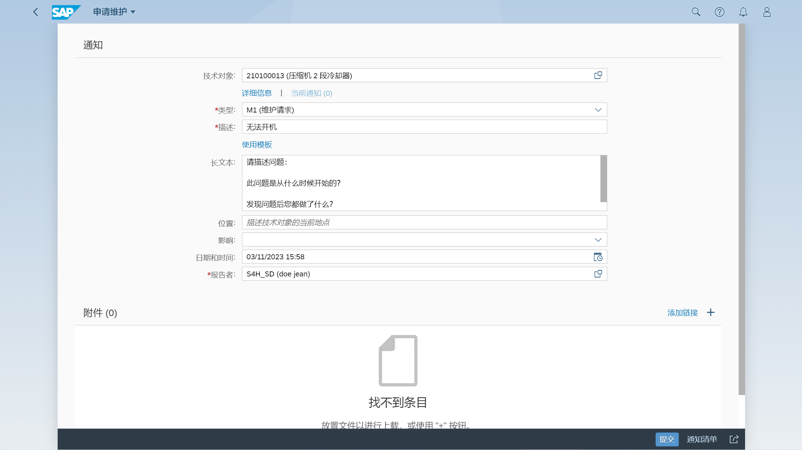

## 监控维护请求
查看请求的清单状态

## 查找维护通知
作为维护计划员, 查找维护通知, 并跳转到更改

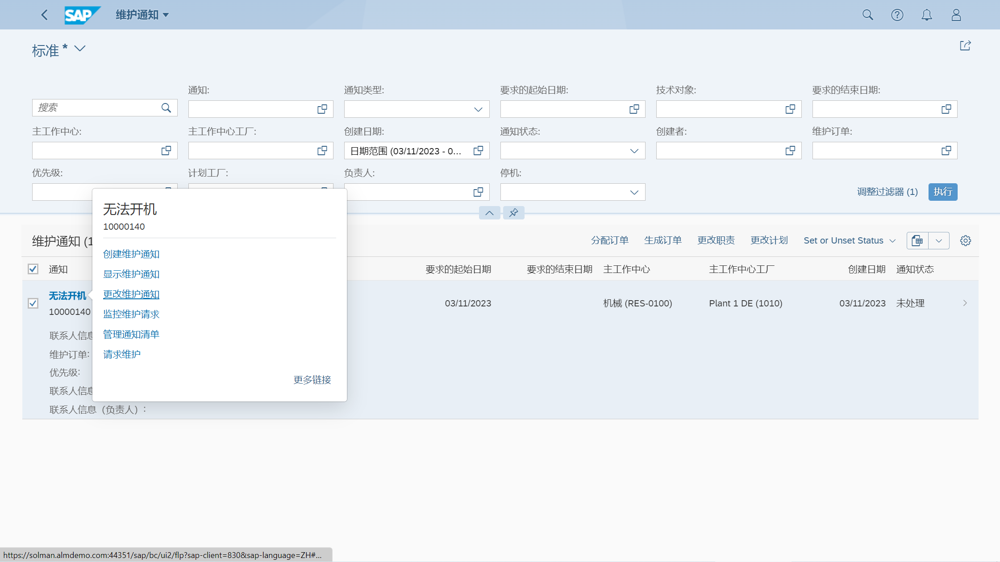

在附加功能里, 未找到更改通知类型选项

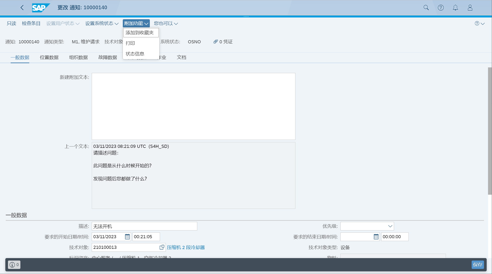

## 创建维护通知
参考故障请求, 创建故障报告

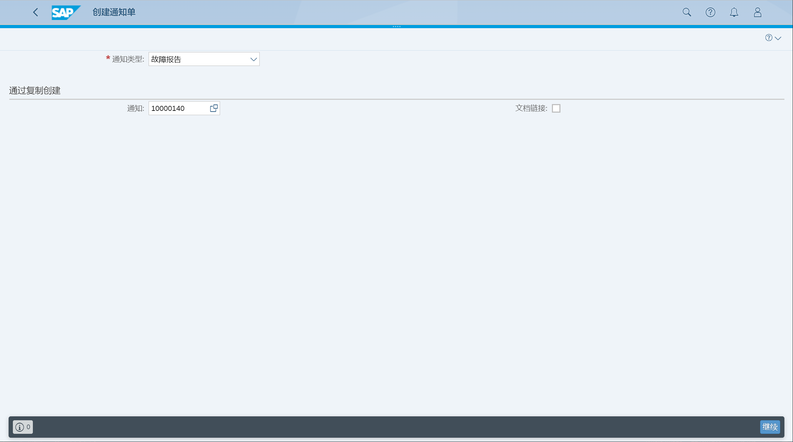

故障报告

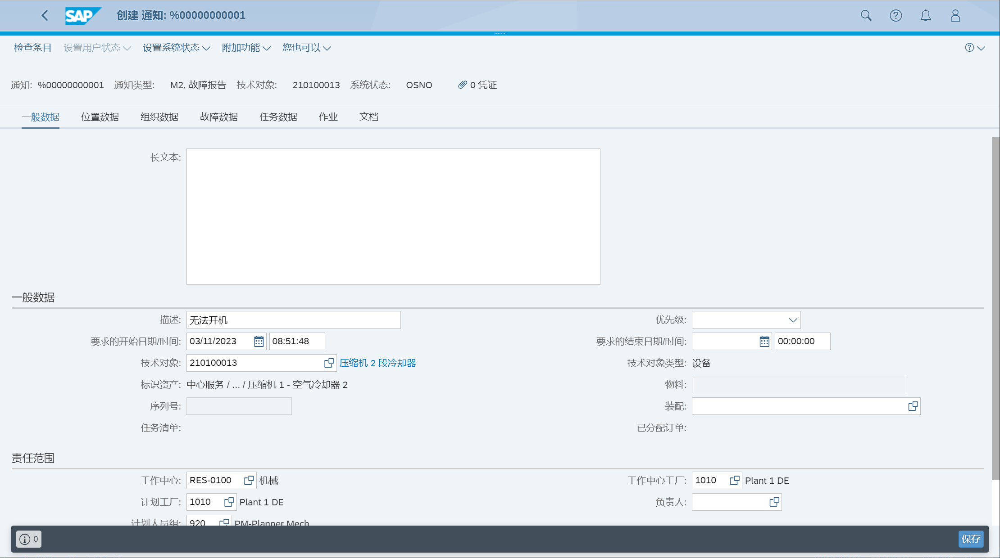

## 创建维护订单
点击生成订单, 选择维护订单类型

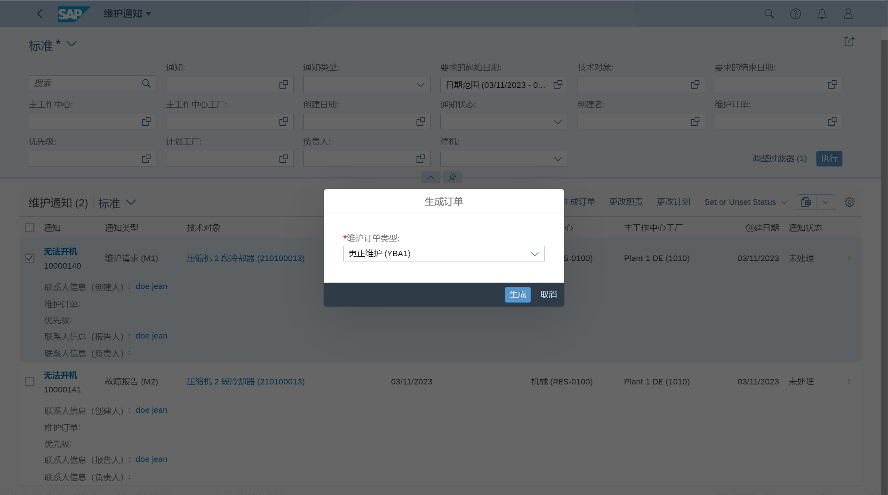

更改维护订单

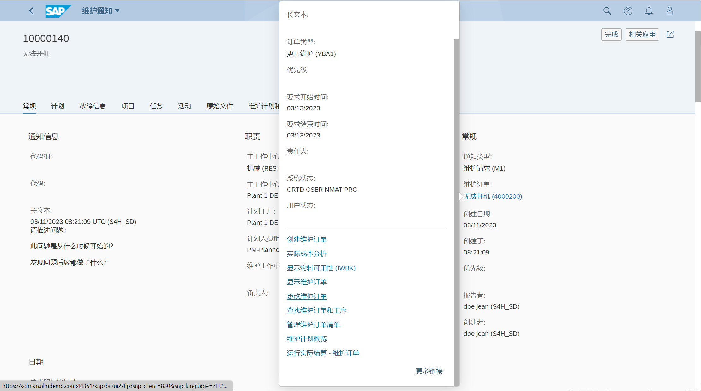

维护系统条件

维护估算成本

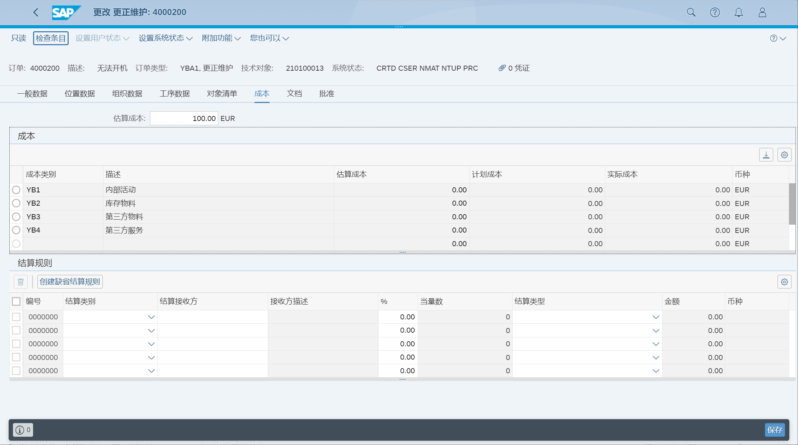

维护工序数据

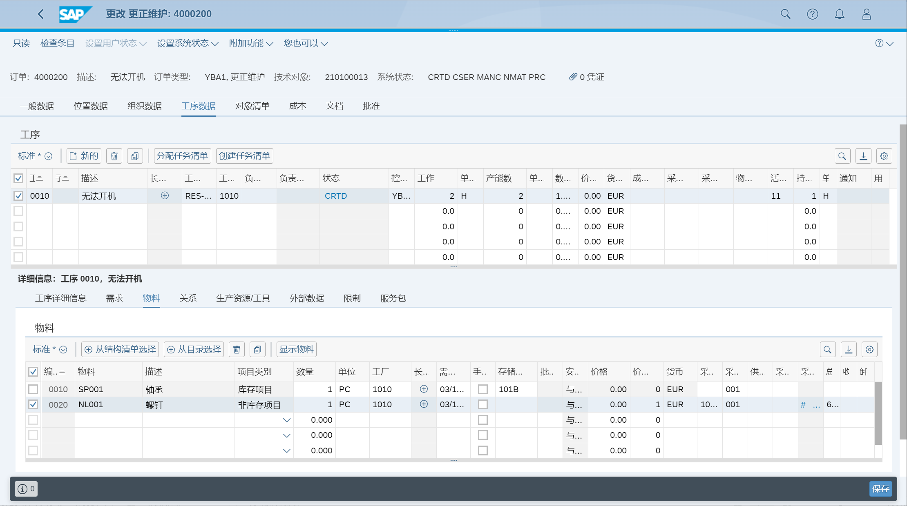

## 下达维护订单
也可以在更改维护订单里, 设置系统状态

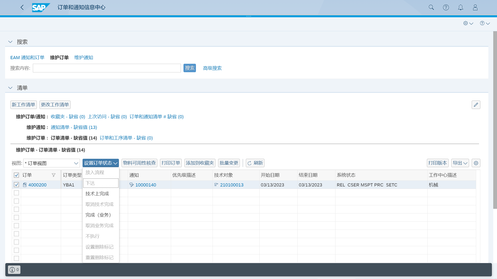

## 采购申请转换到采购订单
作为采购, 点击货源, 为采购申请分配货源供应商

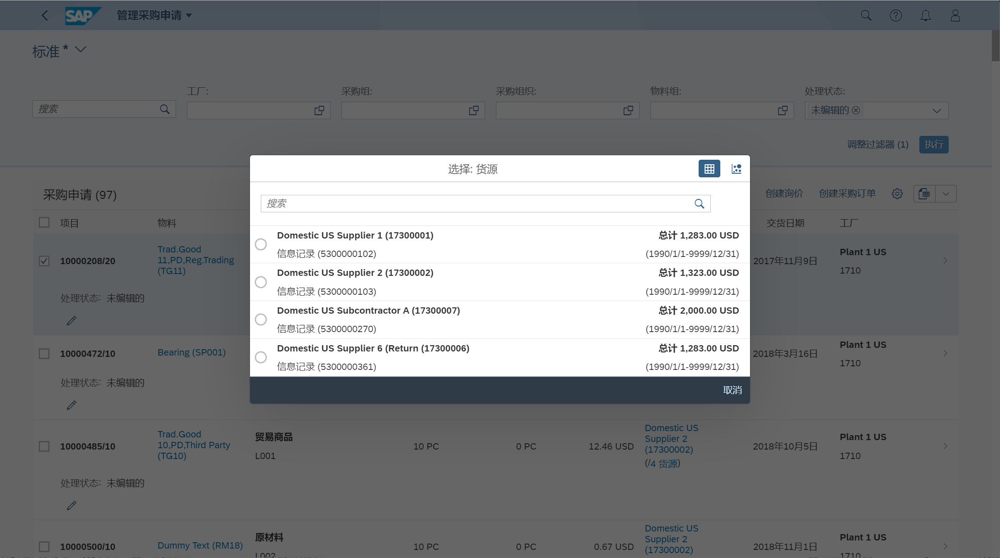

选择采购申请, 创建采购订单

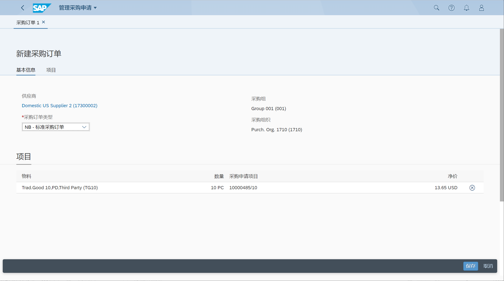

## 过账采购订单收货
作为仓库文员, 过账收货

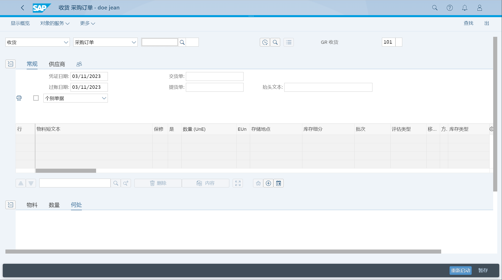

## 维护服务条目表
作为采购, 在服务条目表中报告执行的服务

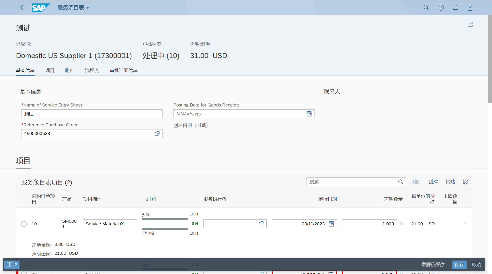

在管理服务条目表的工作流内配置审批, 然后管理者在我的收件箱内批准

## 创建供应商发票
作为应付会计采购, 创建供应商发票

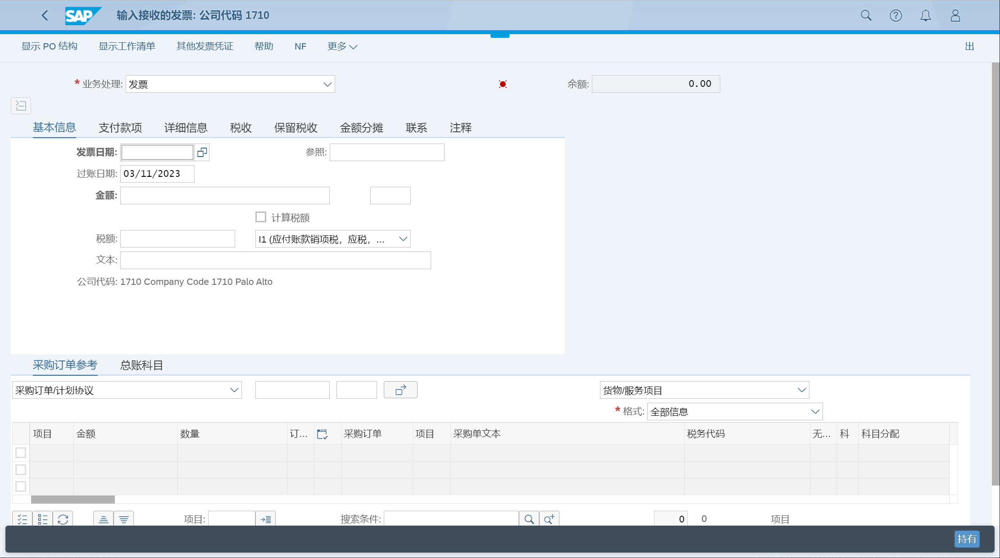

## 打印作业卡
作为维护技术人员, 打印作业卡

在显示作业清单内未找到打印作业卡

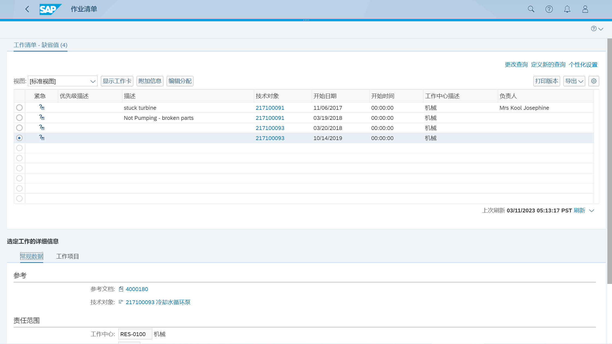

## 确认维护订单

## 确认作业

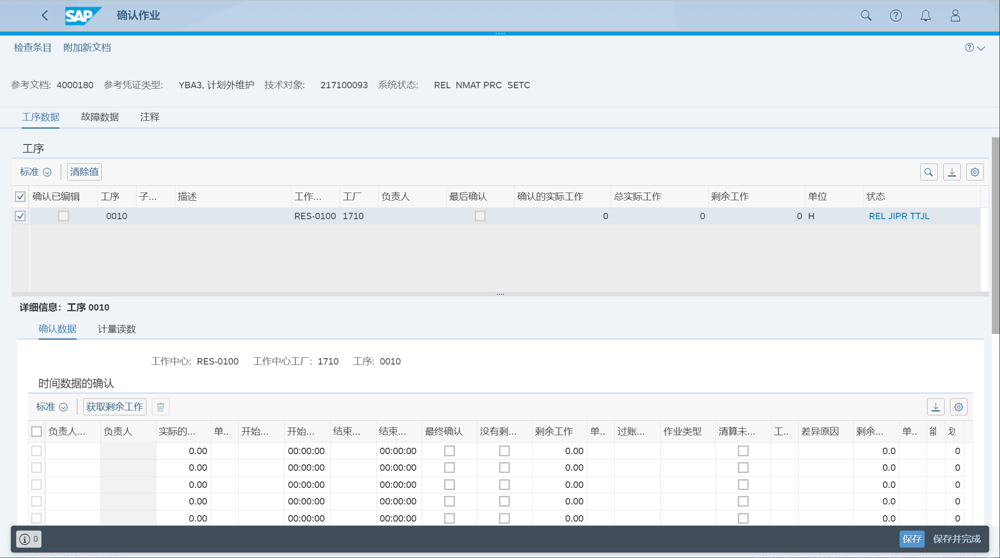

## 技术确认维护订单

## 在资产查看器中显示
显示技术对象

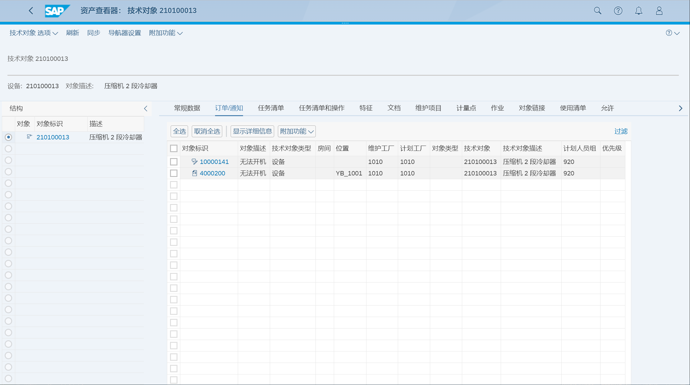