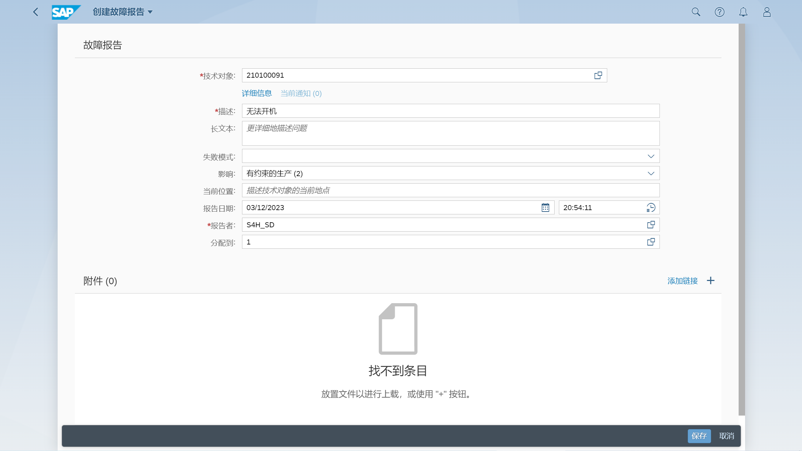
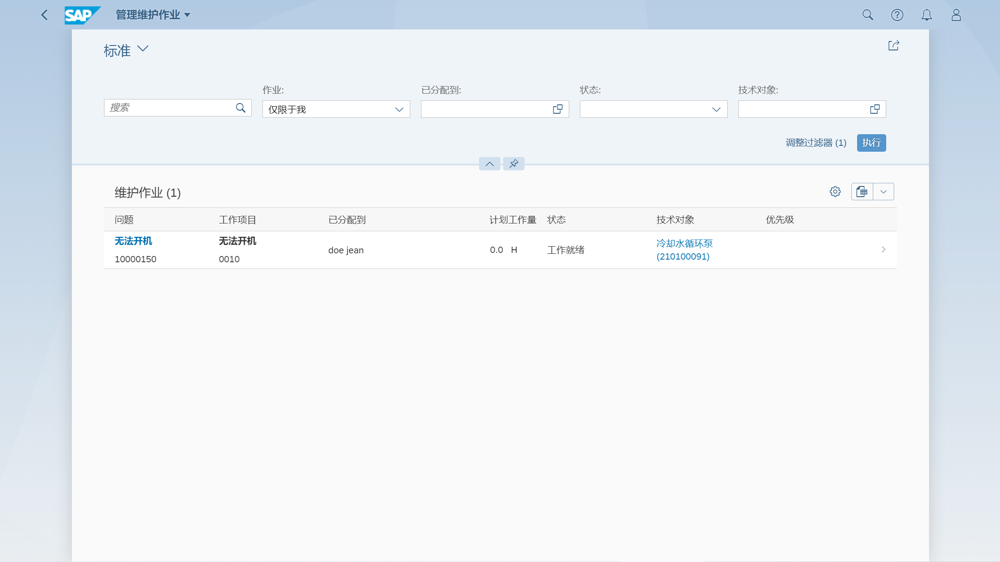
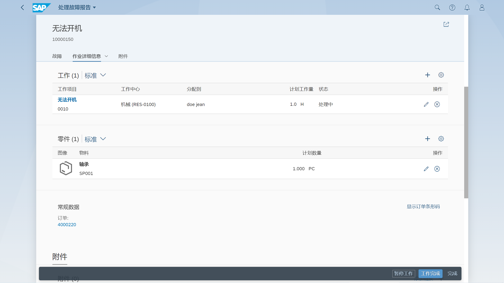
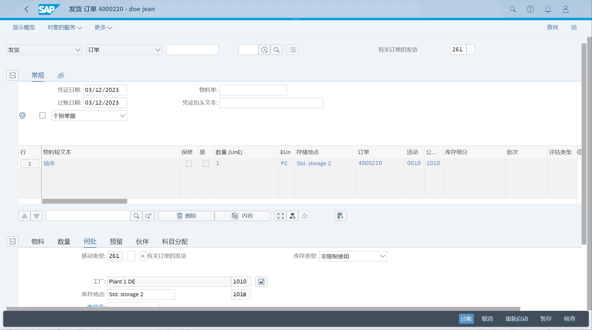

事件后的订单记录, 通过在同一操作中创建和确认订单来记录意外和紧急维护工作
## 角色
> SAP_BR_MAINTENANCE_PLANNER
>
> SAP_BR_MAINTENANCE_TECHNICIAN
>
> SAP_BR_INVENTORY_MANAGER
>
> SAP_BR_WAREHOUSE_CLERK
## App
> Report Malfunction, 报告故障
>
> Repair Malfunction, 修复故障
>
> Post Goods Movement (MIGO), 过账货物移动
>
> Manage Malfunction Reports, 管理故障报告
## 报告故障
会自动生成通知和维护订单

## 修复故障
在修复故障 - 我的作业清单内, 选择故障作业

在处理故障报告详细, 维护作业详细信息

## 过账发货
对维护订单发货过账, 消耗备件

## 完成故障报告
完成后, 点击完成确认