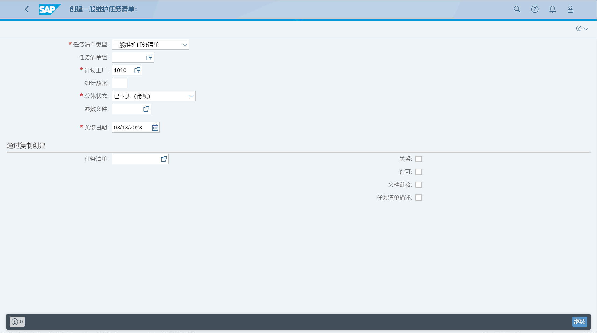
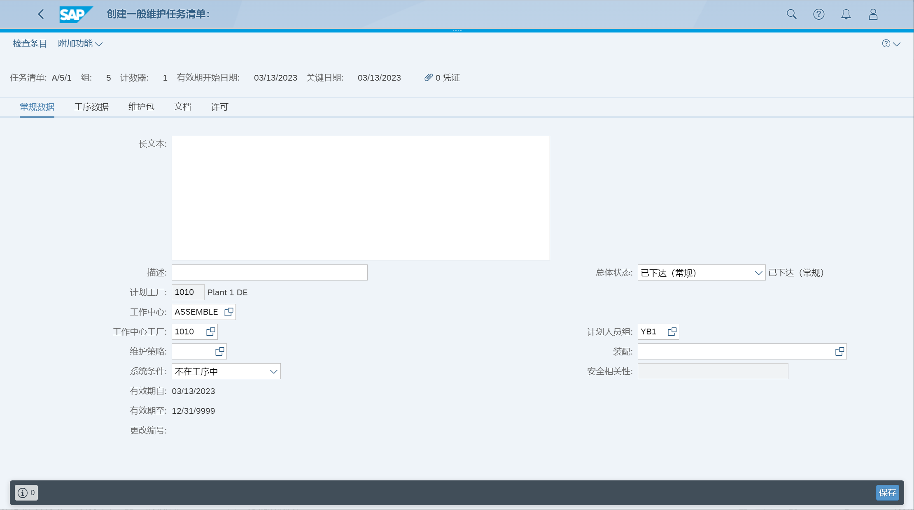
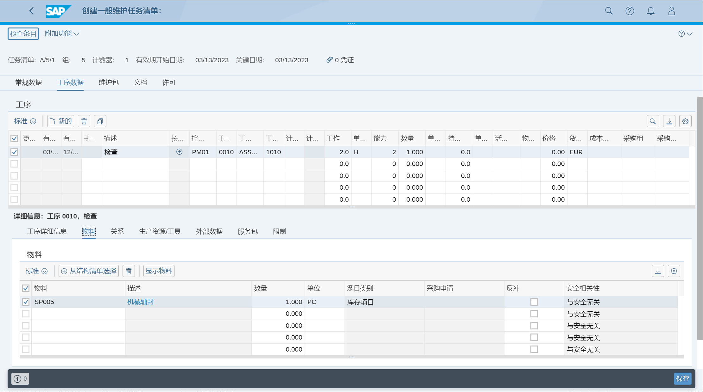

提前计划检查、维护和维修
## 角色
> SAP_BR_MAINTENANCE_PLANNER
>
> SAP_BR_MAINTENANCE_TECHNICIAN
>
> SAP_BR_INVENTORY_MANAGER
## App
> Create Task List, 创建任务清单
>
> Manage Maintenance Items, 创建维护项目
>
> Manage Maintenance Plans, 创建维护计划

## 基于时间的单周期计划
### 创建任务清单

常规数据

工序数据

### 创建维护项目
未找到 App
### 创建维护计划
未找到 App

