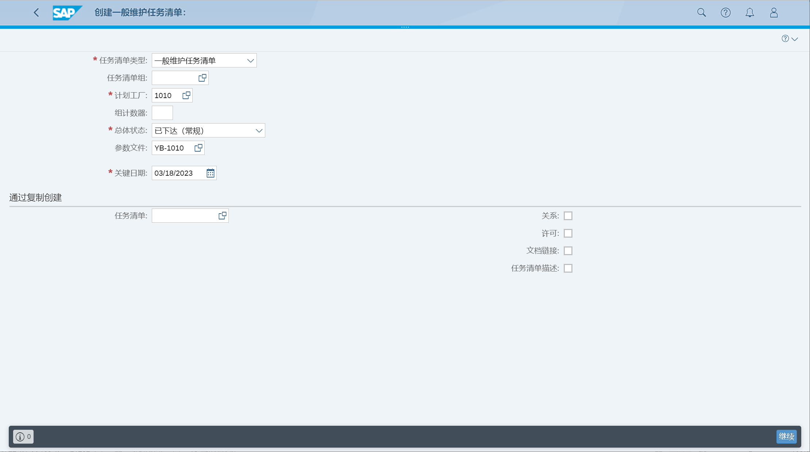
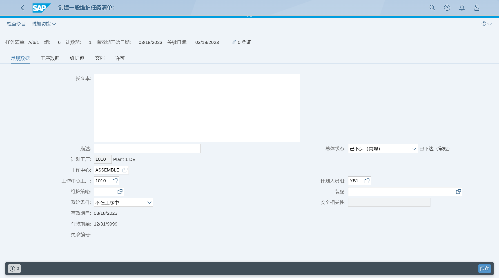
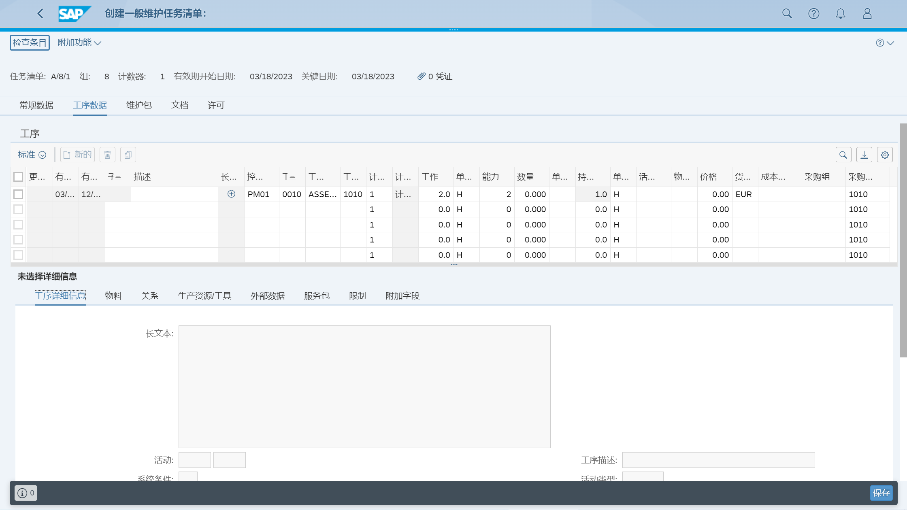

根据资产的性能或使用基于时间的策略, 创建维护计划
## 角色
> SAP_BR_MAINTENANCE_PLANNER
>
> SAP_BR_MAINT_SUPERVISOR
>
> SAP_BR_MAINTENANCE_TECHNICIAN
>
> SAP_BR_WAREHOUSE_CLERK
>
> SAP_BR_PURCHASER
>
> SAP_BR_AP_ACCOUNTANT_PROCUREMT
>
> SAP_BR_EMPLOYEE
>
> SAP_BR_INVENTORY_MANAGER
>
> SAP_BR_BPC_EXPERT
>
> SAP_BR_OVERHEAD_ACCOUNTANT
## App
> Create Task List, 创建任务清单
>
> Manage Maintenance Items, 管理维护项目
>
> Manage Maintenance Plans, 管理维护计划
>
> Mass Schedule Maintenance Plans, 批量计划维护计划
>
> Maintain Maintenance Strategies (IP11), 维护策略
>
> Create Measurement Document (IK11), 创建测量凭证
>
> Screen Maintenance Requests
>
> Manage Maintenance Notifications and Orders
>
> Manage Maintenance Notifications and Orders
>
> My Inbox
>
> Maintenance Backlog Overview
>
> Process Purchase Requisitions - Formerly Manage Purchase Requisitions 
>
> Post Goods Movement (MIGO)
>
> Find Maintenance Order
>
> Perform Maintenance Jobs
>
> Manage Service Entry Sheets
>
> Perform Maintenance Jobs
>
> Maintenance Order Costs
>
> Create Supplier Invoice - Advanced
## 基于时间的单周期计划
### 创建任务清单
创建一般维护任务清单

常规数据

工序数据

### 创建维护项目
### 创建维护计划

## 基于时间的策略计划
## 基于绩效的单周期计划
## 基于绩效的策略计划
## 多计数器计划
## 筛选维护请求
## 创建和计划维护订单
## 提交维护订单供审批
## 批准维护订单
## 释放维护订单
## 维护积压工作
## 采购申请转换采购订单
## 采购订单收货
## 物料过账
## 提交订单计划
## 计划维护订单并提交执行
## 执行维护订单
## 完成主要工作
## 维护服务输入表
## 执行工序过账
## 审查维护成本
## 技术完成维护订单
## 创建供应商发票