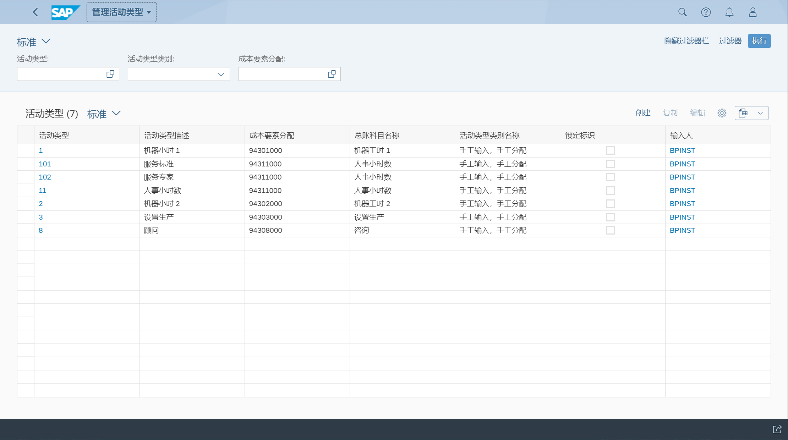
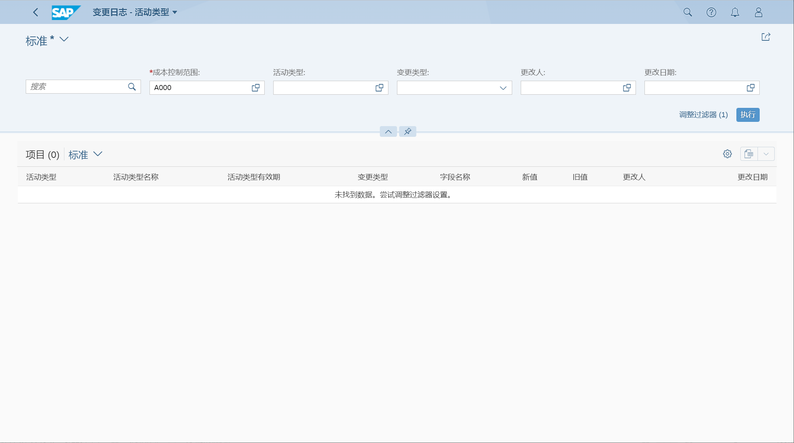
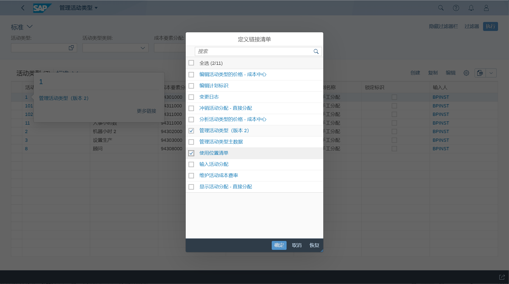

活动类型, 控制区域内成本中心产生的活动
## 角色
> SAP_BR_OVERHEAD_ACCOUNTANT
## App
> Manage Activity Types, 管理活动类型
>
> Manage Global Hierarchies, 管理全局层次结构
>
> Change Log - Activity Types, 变更日志 - 活动类型
## 创建活动类型
创建活动类型, 分配成本要素

## 创建活动类型层次结构
未找到 App
## 变更日志
查询变更日志

## 使用位置清单
点击活动类型, 在更多链接内, 定义链接清单

