维护资产主记录
## 角色
> SAP_BR_AA_ACCOUNTANT
>
> SAP_BR_GL_ACCOUNTANT
## App
> Make Company Code Settings - Asset Accounting-Specific (FAA_CMP), 对公司代码进行设置 - 特定于资产会计
>
> Carry Forward Balances, 结转余额
>
> Balance Carryforward (CXS1), 结转余额
>
> Create Asset (AS01), 创建资产
>
> Display Asset Master Worklist, 显示资产主数据工作清单
>
> Create Asset Subnumber (AS11), 创建资产子编号
>
> Change Documents - For Asset Master Record (S_ALR_87012037), 更改凭证 - 针对资产主记录

启用通用并行记帐时可用
> Manage Fixed Assets, 管理固定资产 
>
> Depreciation Key: Display Details (FAA_DEPRKEY_SHOW), 折旧码 显示详细
## 对公司代码进行设置 - 特定于资产会计
资产会计核算中公司代码的设置

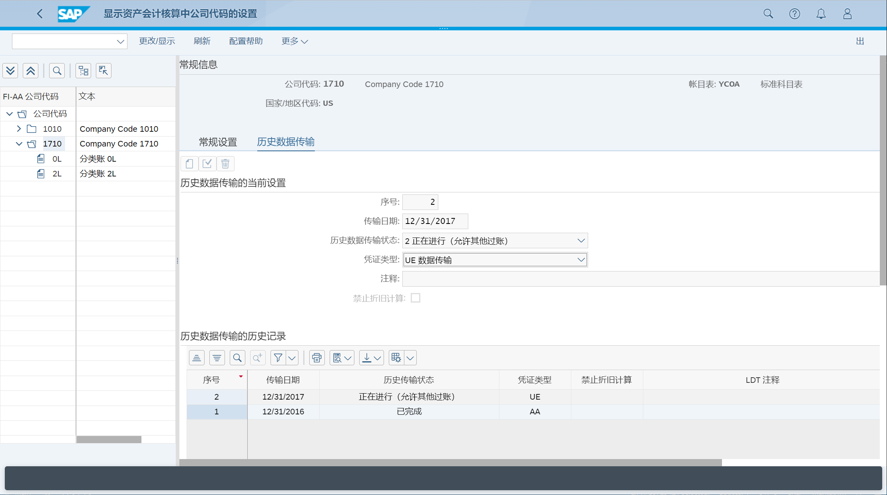

## 结转余额

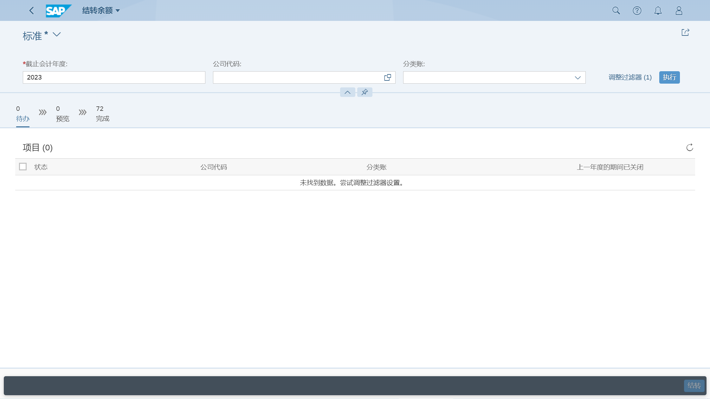

## 创建资产
创建资产

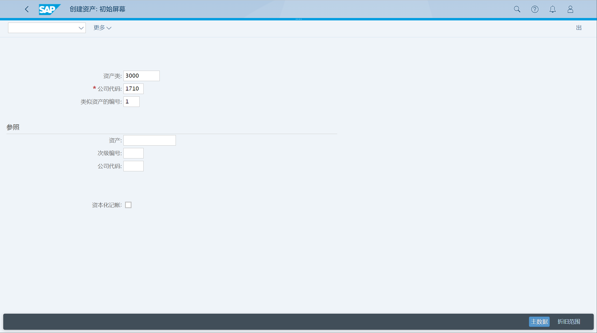

维护常规数据

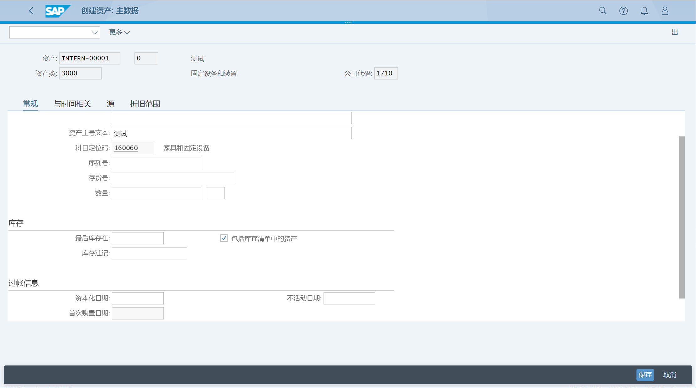

维护时间相关数据, 成本中心

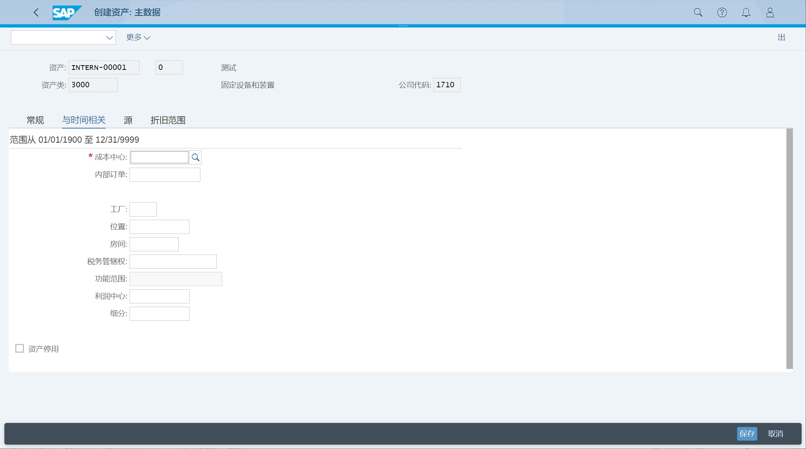

## 更改资产
显示资产清单

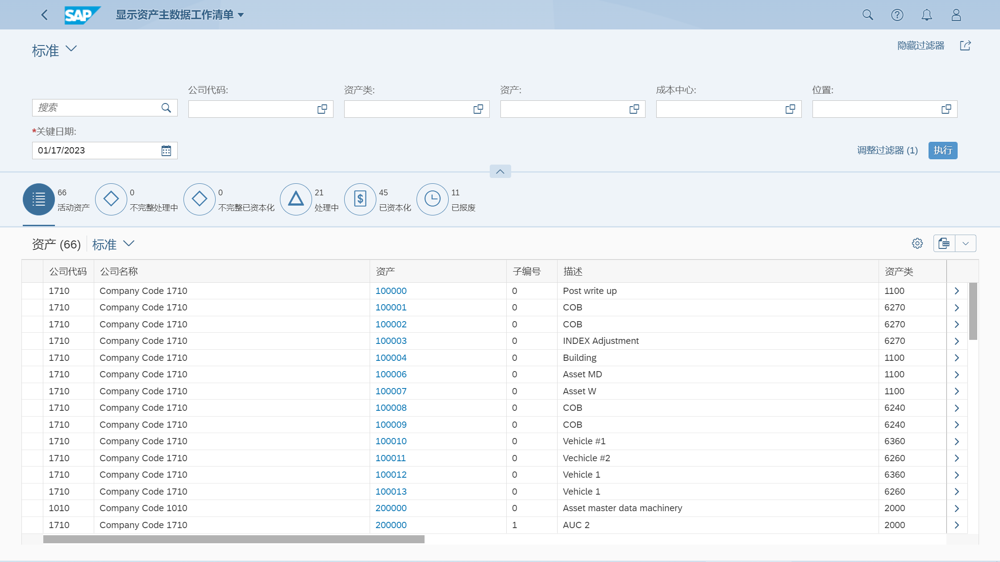

更改资产

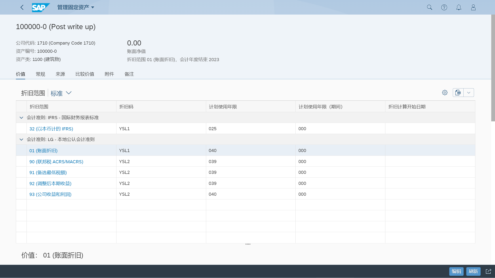

## 显示资产
显示资产清单, 点击显示详细

## 冻结资产
点击资产, 点击更多链接, 弹出定义链接清单, 然后才能点击相应功能

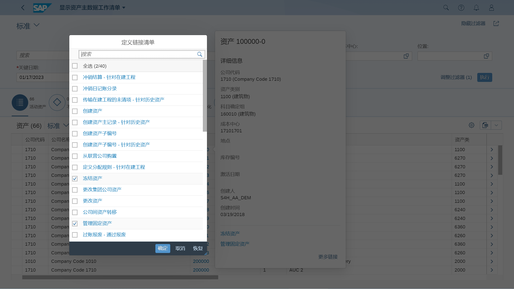

## 删除资产
需要定义链接清单
## 创建资产子编号
创建资产子编号

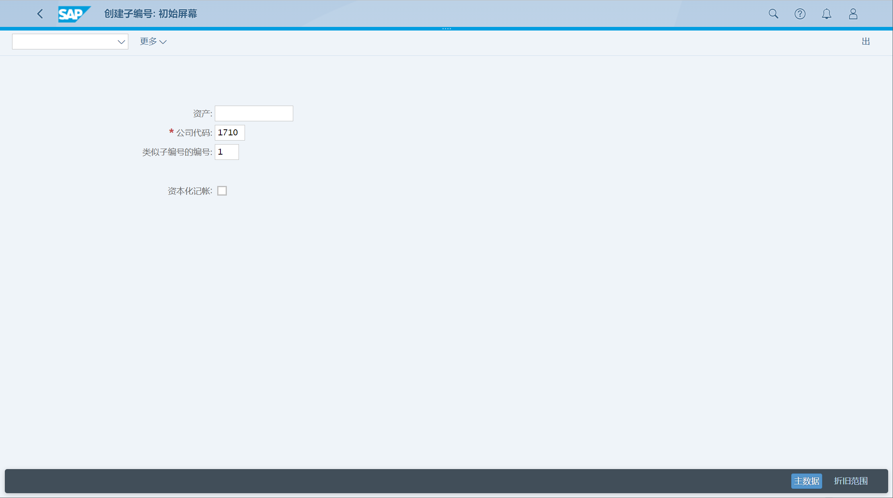

维护常规数据

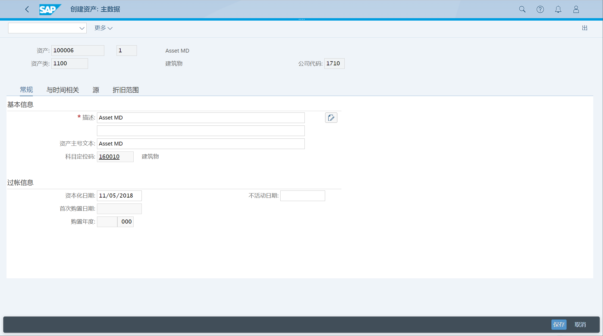

## 折旧码 显示详细
选择折旧表、折旧码

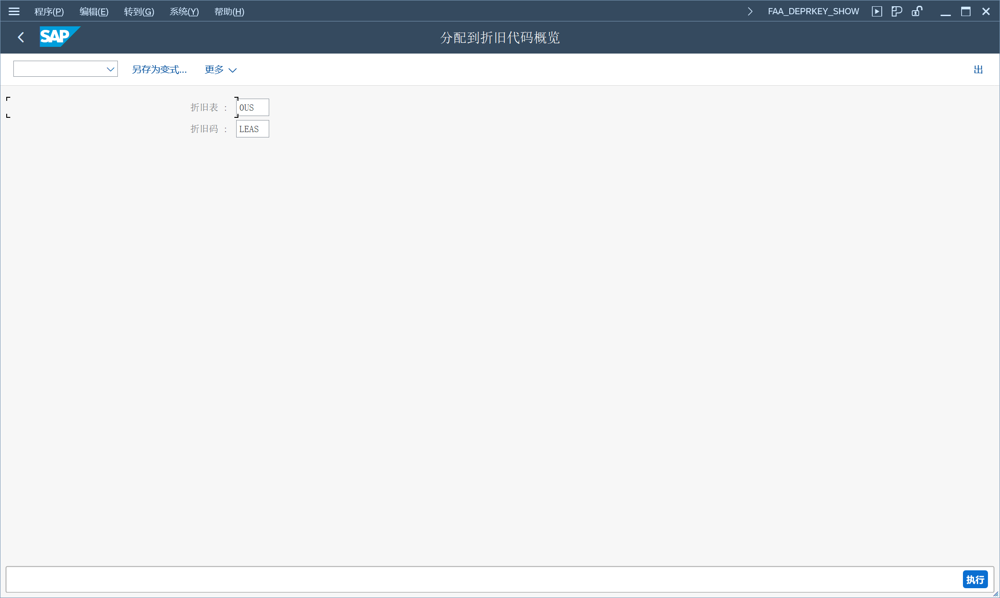

显示详细

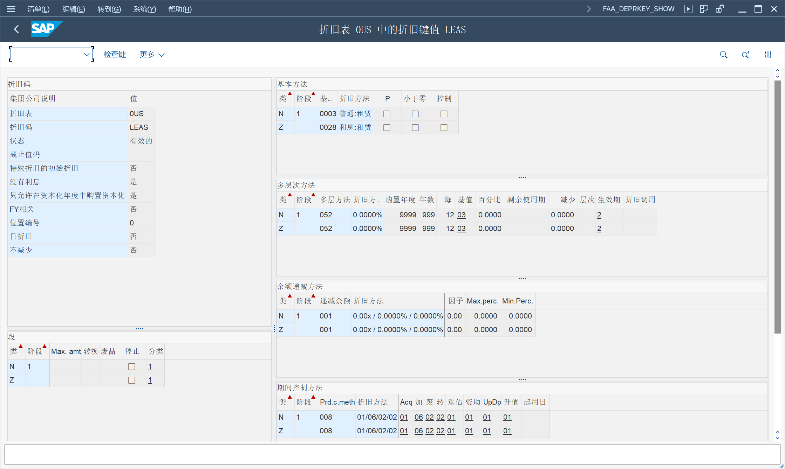