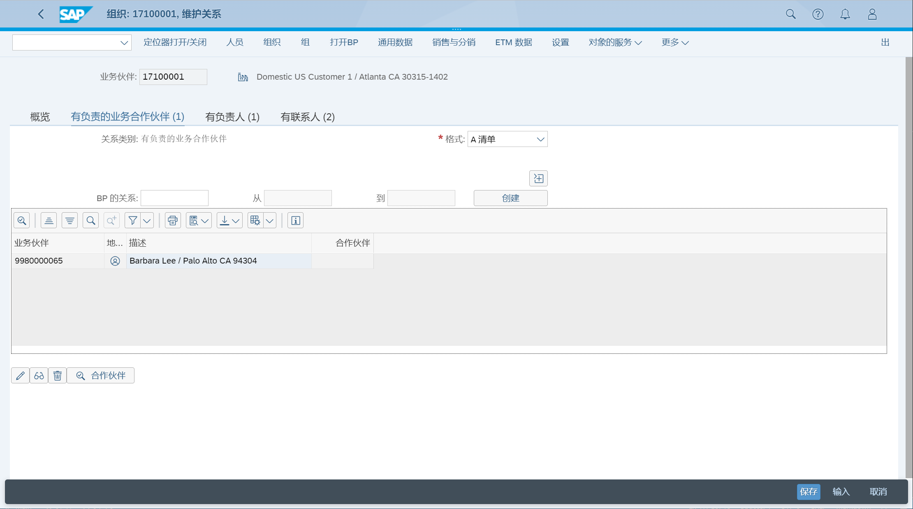

维护服务业务伙伴
## 角色
> SAP_BR_CUSTOMER_SERVICE_MGR
>
> SAP_S4C_UIU_SRV_PRO
>
> SAP_CRM_UIU_FRAMEWORK
## APP
> Maintain Business Partner, 维护业务伙伴
## 维护业务伙伴
BP - 处理业务合作伙伴 
### 分配伙伴角色、关系
分配业务伙伴角色, CRM002 收货方

分配关系, 负责的业务伙伴, 服务员工

