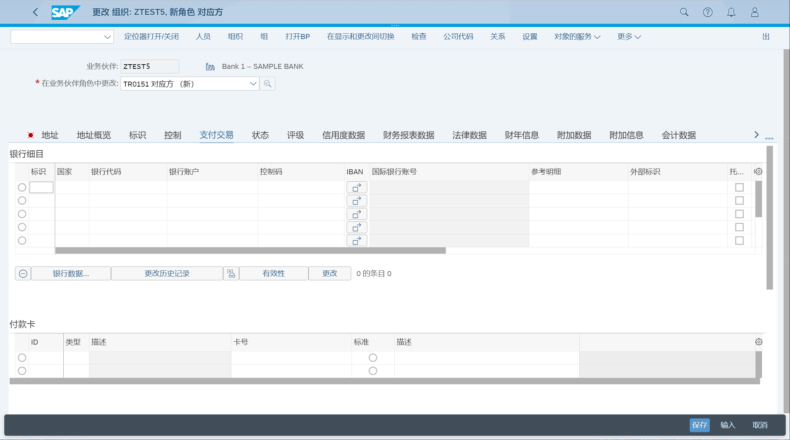

维护资金和风险管理业务伙伴
## 角色
> SAP_BR_TREASURY_SPECIALIST_BOE
>
> SAP_BR_BUPA_MASTER_SPECIALIST
>
> SAP_BR_BPC_EXPERT
## App
> Maintain Business Partner, 维护业务伙伴
## 维护业务伙伴
BP - 处理业务合作伙伴
### 基本数据
选择 "组织" 创建组织基本数据, 输入名称, 分组选择 TR02 财务合伙人, 保存数据

修改业务伙伴角色, TR0151 对应方

在 "法律数据" 页签, 维护注册地区

在 "支付交易" 页签, 维护银行信息

### 维护证券伙伴角色
修改业务伙伴角色, TR0150 发行者, 记录发行人
修改业务伙伴角色, TR0152 存款行, 记录存管银行

### 公司代码数据
选择公司代码, 输入 SI 付款明细数据

选择行项目, 点击 "分配" 按钮, 创建付款明细分配

在 SI 权限页签, 维护权限分配

在 SI 派生流页签, 维护派生流

在 公司代码中的报表数据页签, 维护报表数据

## 维护收件人分配
### 外部收件人
> FTR_EXT_ASSIGN - 维护参数文件 + 外部接收方的 BPG 分配

### 内部收件人
> FTR_INT_ASSIGN - 维护参数文件 + 内部接收方的 BPG 分配