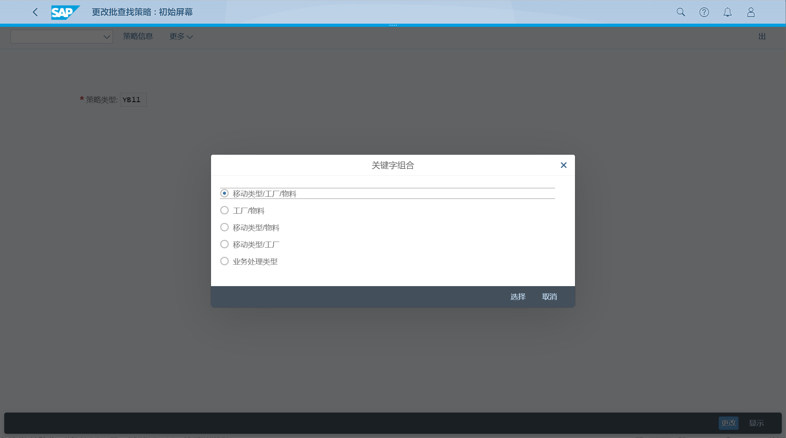

批次管理主数据包括批次确定中的批次规格、排序顺序（排序规则）和批次搜索策略
## 角色
> SAP_BR_BOM_ENGINEER
>
> SAP_BR_BATCH_MASTER_SPCLST
## App
> Manage Characteristics (CT04), 管理特征
>
> Manage Classes (CL02), 管理类
>
> Create Sort Sequence (CU70), 创建排序顺序
>
> Manage Search Strategies - Inventory Management (MBC2), 管理搜索策略 用于库存管理
>
> Manage Search Strategies - Production (COB2), 管理搜索策略 用于生产
>
> Manage Search Strategies - Sales and Distribution (VCH2), 管理搜索策略 用于销售与分销
>
> Manage Derivation Strategies - Sender (DVS2), 管理派生策略
>
> Manage Derivation Strategies - Receiver (DVR2), 管理派生策略
## 创建特征
创建特征, 点击新建按钮

维护特征基本数据

## 创建类
创建类, 点击新建按钮

分配特征

## 创建 排序顺序
创建排序, 点击基本信息

维护排序基本数据, 点击特征

分配特征, 选择排序顺序

## 创建批次搜索策略
选择策略类型, 选择关键字组合

维护详细内容

维护选择标准

维护排序规则

## 创建派生策略
未激活