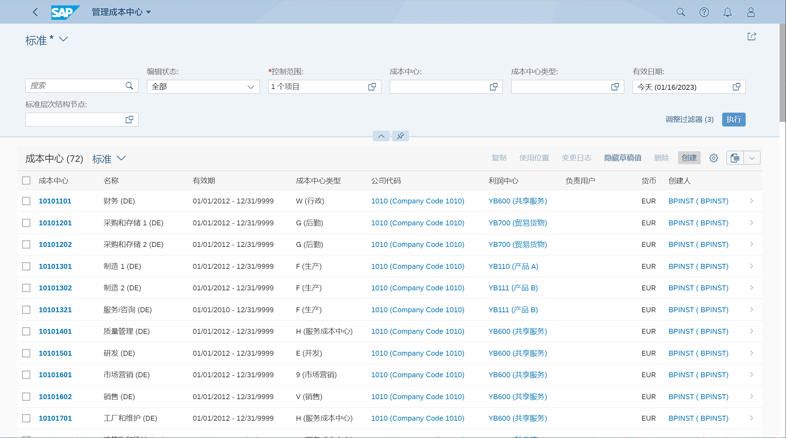
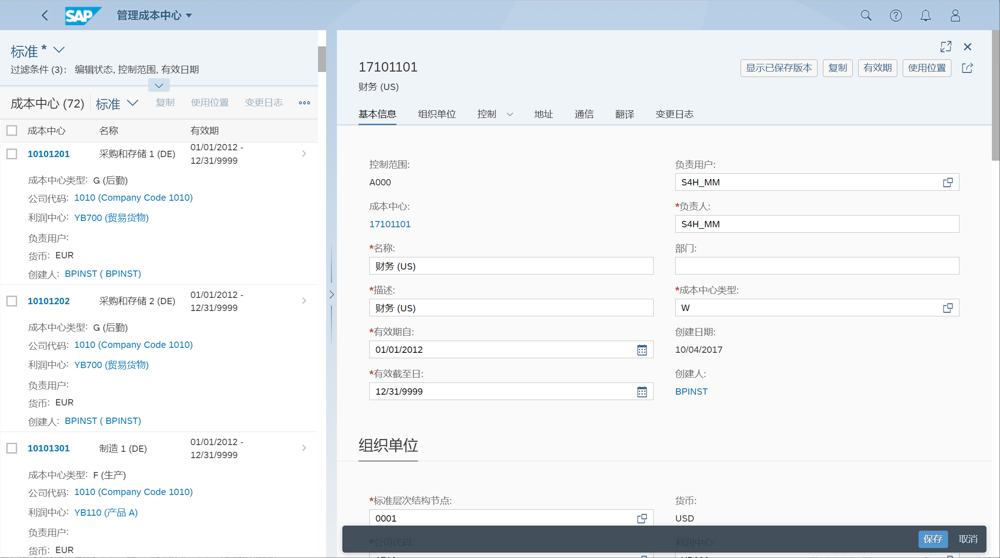
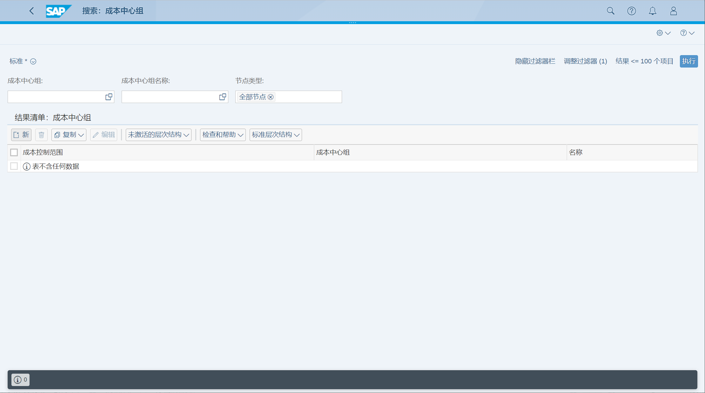
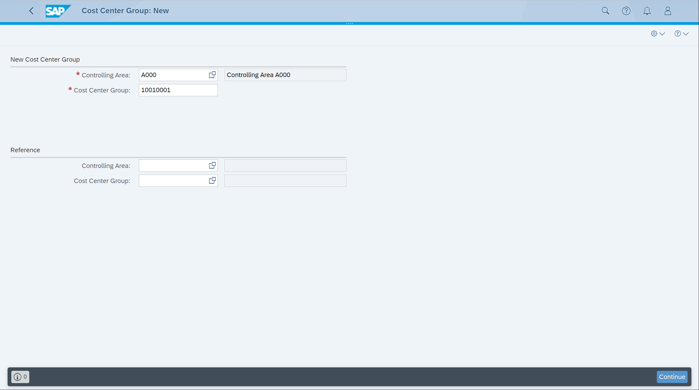
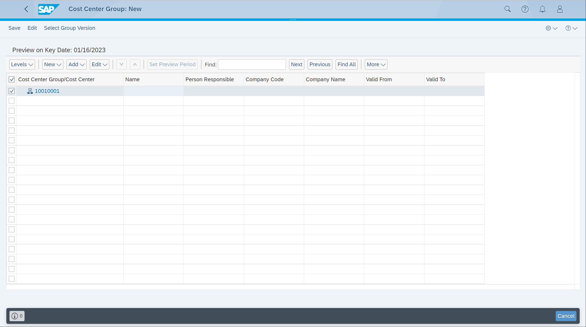
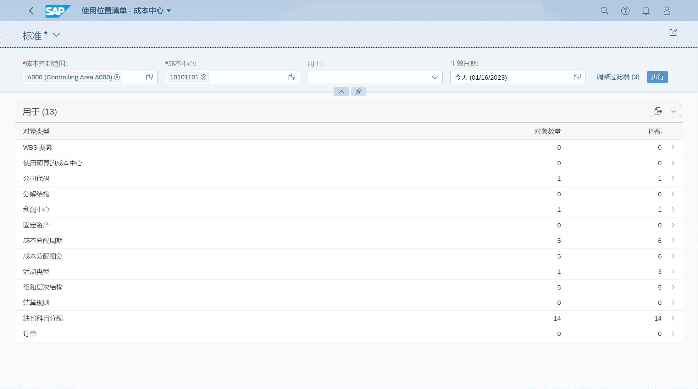

维护成本中心、成本中心组
## 角色
> SAP_BR_OVERHEAD_ACCOUNTANT
## App
> Manage Cost Centers, 管理成本中心
>
> Manage Cost Center Groups, 管理成本中心组
>
> Where-Used List - Cost Centers, 使用位置清单 - 成本中心
## 管理成本中心
输入控制范围, 执行

点击 创建

维护基本信息

维护组织单位, 分配公司代码、利润中心

## 管理成本中心组
点击 创建

输入控制范围、成本中心组

维护成本中心组

## 使用位置清单 - 成本中心
查看成本中心在其他主数据, 如活动类型、利润中心和实际成本分配, 中的使用位置

