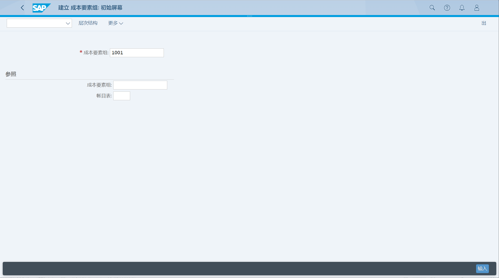
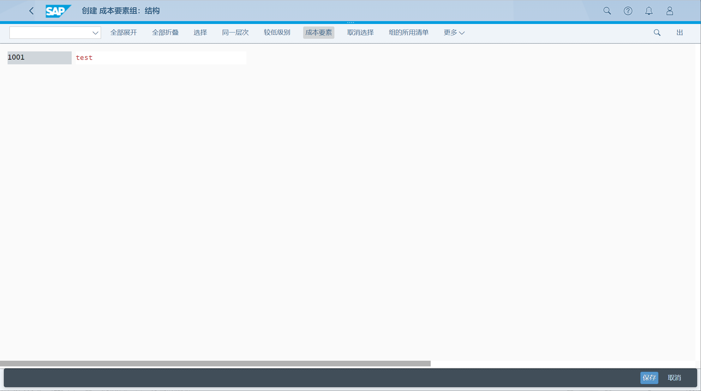

维护成本要素组, 通常用于收集具有类似特征的成本要素
## 角色
> SAP_BR_OVERHEAD_ACCOUNTANT
## App
> Manage Cost Element Groups, 管理成本要素组
>
> Create Cost Element Groups, 创建成本要素组
>
> Display Cost Element Groups, 显示成本要素组
>
> Edit Cost Element Groups, 编辑成本要素组
## 创建成本要素组
创建成本要素组

插入成本要素

