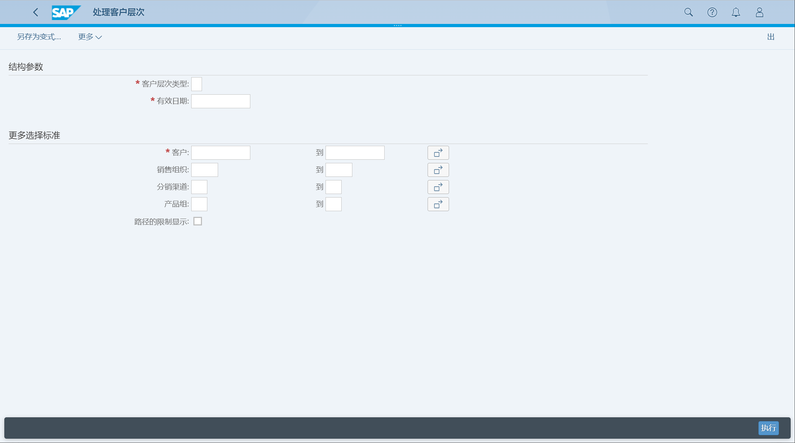
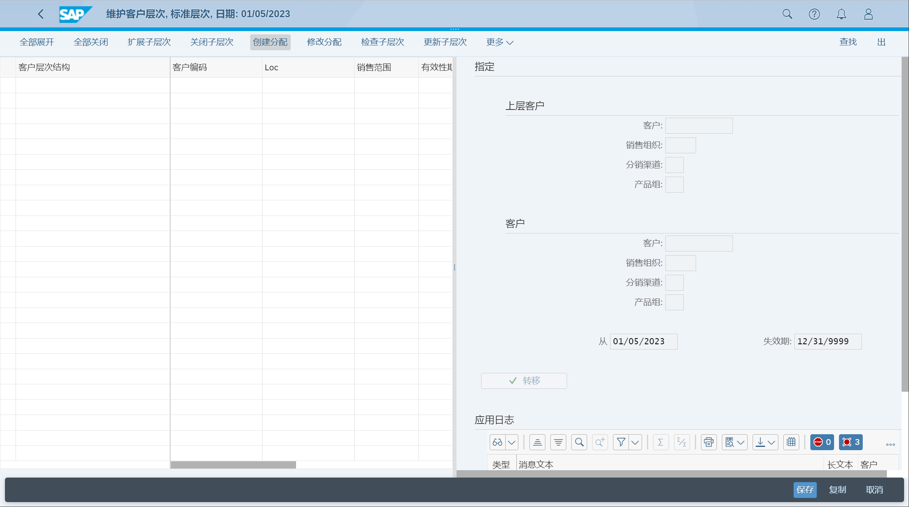

维护客户层次结构
## 角色
> SAP_BR_BUPA_MASTER_SPECIALIST
## App
> Manage Customer Hierarchies, 维护客户层次结构
## 维护客户层次结构
需要提前维护客户数据、销售范围

输入类型参数, 执行

创建客户分配关系

## 配置选项
SM30 维护分配关系
> V_THIT, 客户层次类型
>
> V_THIZU, 允许客户层次帐户组分配
>
> V_THIOZ, 客户层次：允许销售范围分配