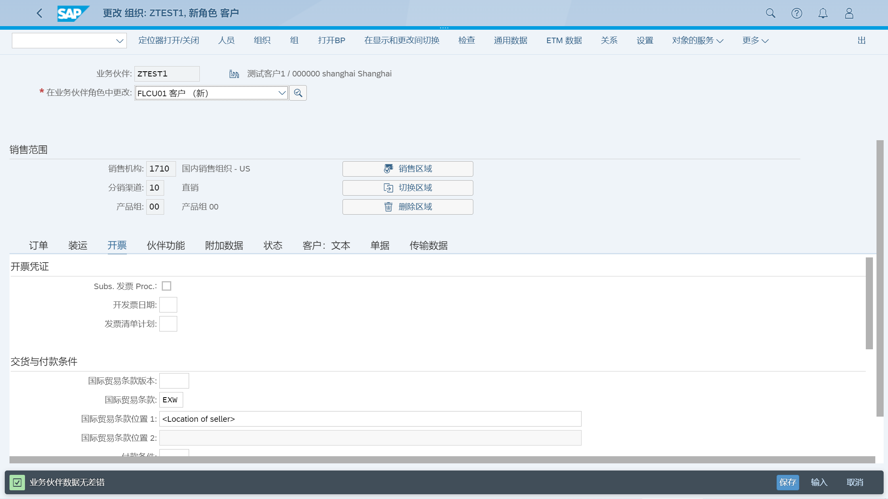
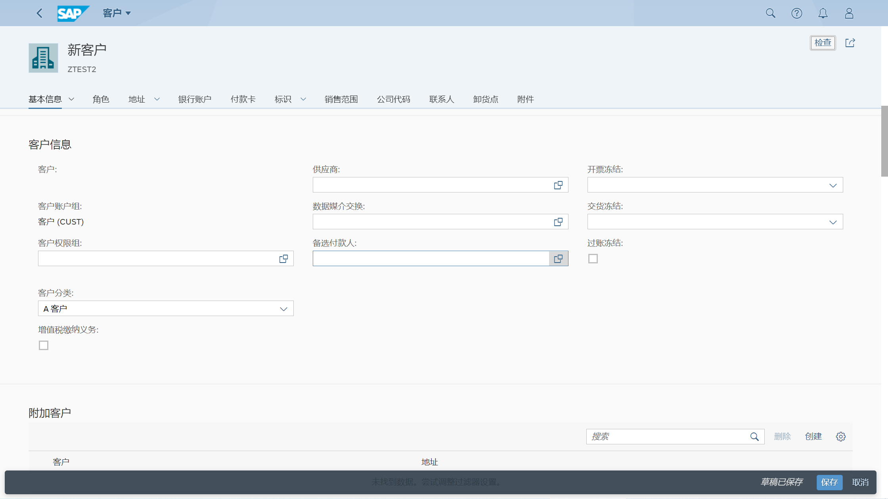

维护客户主数据
## 角色
> SAP_BR_BUPA_MASTER_SPECIALIST
## App
> Maintain Business Partner, 维护业务伙伴
>
> Manage Customer Master Data, 客户主数据
## 维护业务伙伴
BP - 处理业务合作伙伴 
### 基本数据
选择 "组织" 创建组织基本数据, 输入组织名称

输入地址、通信信息, 可以在地址概览页签, 输入不同地址

在标识页签, 输入税号、税分类

在支付交易页签, 输入银行信息, 保存生成编号

### 公司代码数据
修改业务伙伴角色, FLCU00 FI 客户

选择公司代码视图, 输入公司代码、统御科目、排序码

在客户支付交易页签, 输入付款条件

输入自动付款方式

在客户信函页签, 输入会计职员, 保存信息

### 销售区域数据
修改业务伙伴角色, FLCU01 客户

选择销售与分销视图, 输入销售范围数据、货币

在装运页签, 输入交货优先权、交货工厂、装运条件

在开票页签, 输入国际贸易条款

输入客户科目分配组、税分类

伙伴功能页签, 保存信息

切换到客户一般数据页签, 维护客户分类信息

## 客户主数据
### 基本数据
点击 "创建" 按钮, 选择 "组织" 创建组织基本数据, 输入信息后, 点击确定

跳转到客户创建基本信息界面, 维护客户分类

维护角色、地址

维护银行信息、税号, 保存生成编号

### 公司代码数据
选择 "公司代码" 点击创建

跳转到公司代码界面, 维护公司代码、信函数据

维护财务会计数据, 点击 "应用", 保存信息

### 销售区域数据
选择 "销售范围" 点击创建

跳转到销售范围界面, 维护销售范围数据, 点击 "应用", 保存信息

