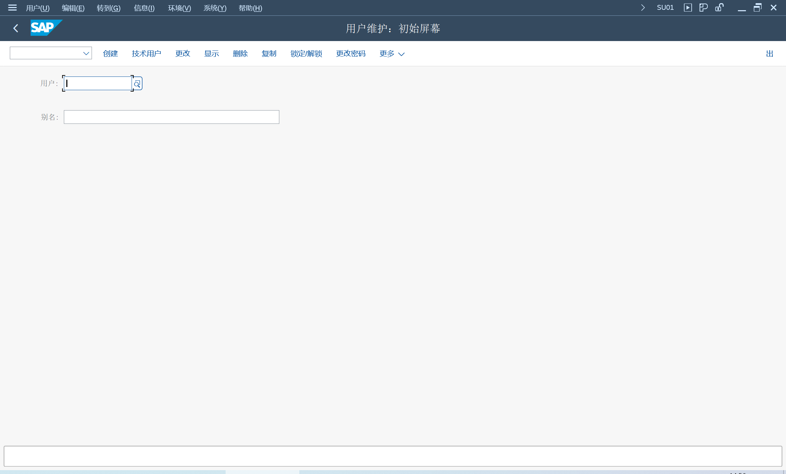
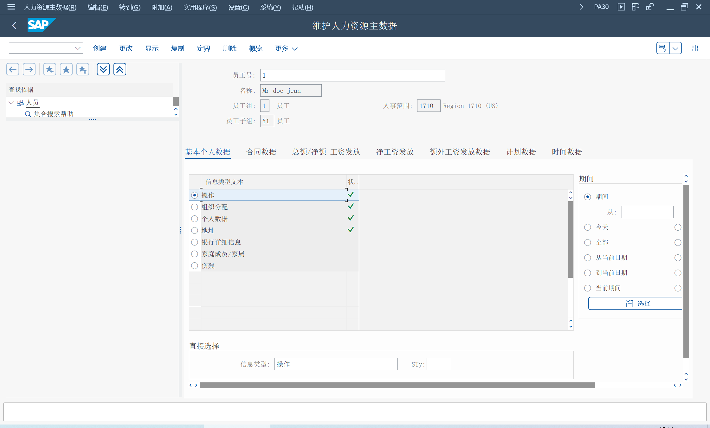
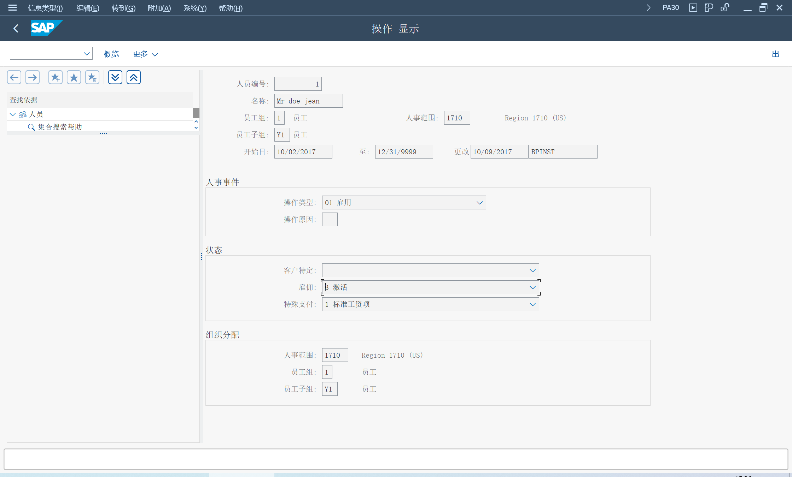
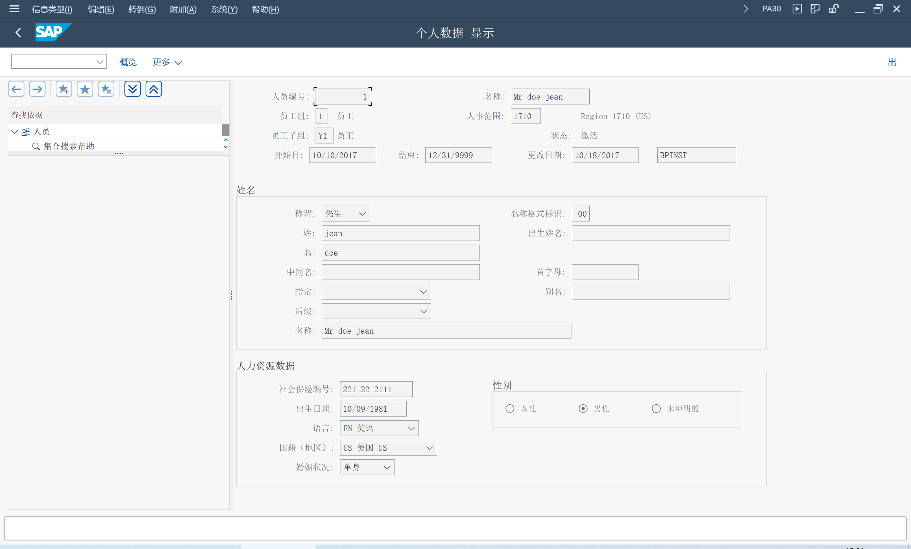
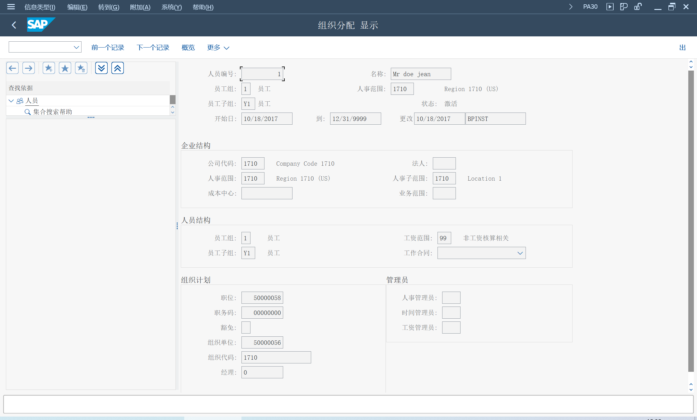
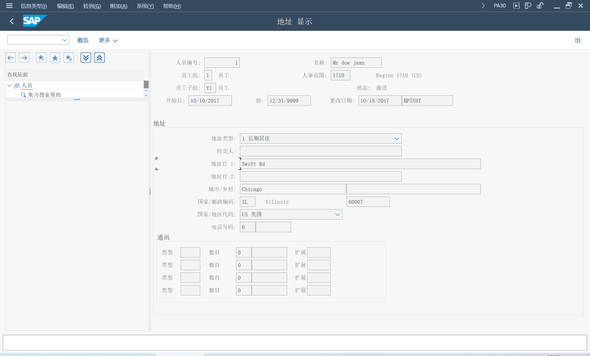
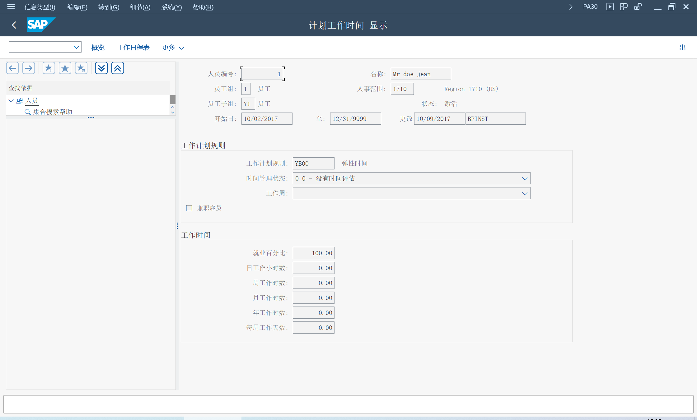
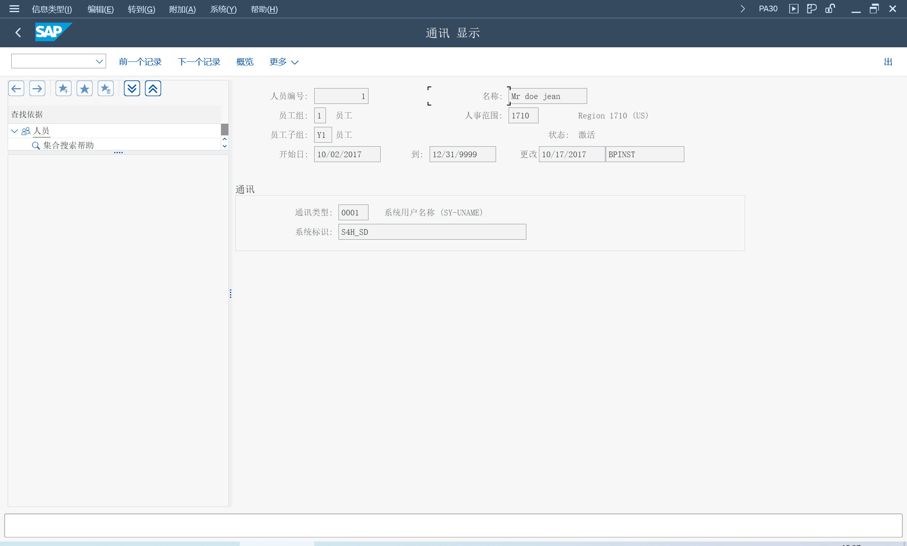
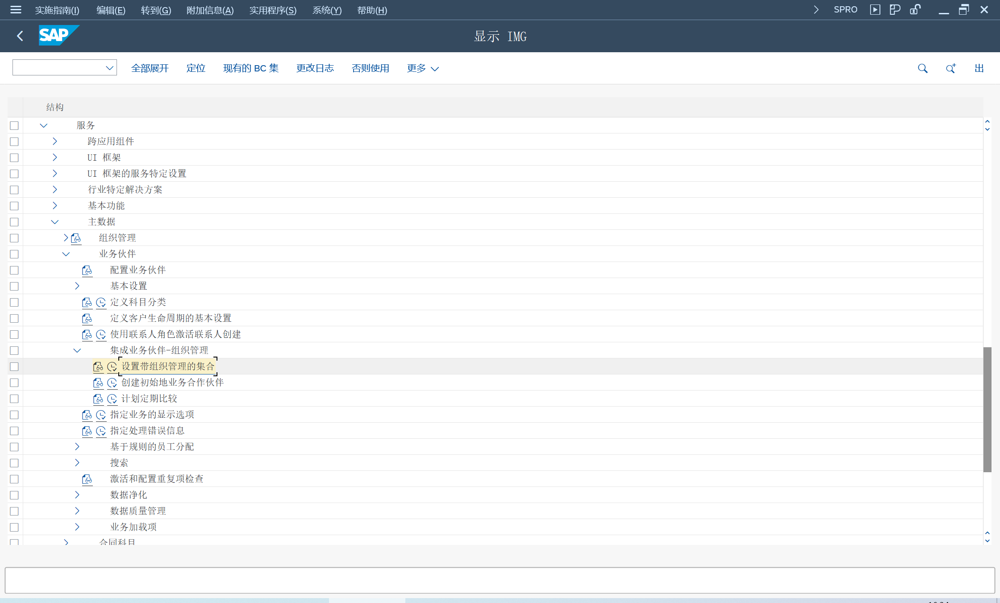

## Transaction
> SU01 - 用户维护 
>
> PA30 - 维护人力资源主数据 
>
> BP - 处理业务合作伙伴 
## 创建系统用户
创建系统用户

## 创建员工
选择信息类型, 0000 操作, 点击创建按钮

维护操作, 雇佣数据

维护信息类型, 0002 人员数据

维护信息类型, 0001 组织分配, 为服务员工分配成本中心, 分配职位

维护信息类型, 0006 地址

维护信息类型, 0007 计划工作时间

维护信息类型, 0009	银行详细信息

维护信息类型, 0105  通讯, 分配用户

## 业务伙伴集成设置

设置全局 HR 集成
> HRALX/HRAC to 'X'

组织单位集成
> HRALX/OBPON to 'ON'

员工集成
> HRALX/PBPON to 'ON'

组织分配集成
> PLOGI/ORGA to 'X'

## 业务伙伴同步
创建员工时, 系统会自动创建业务伙伴, BUP003 员工

BP 标识数据会维护人员编号、用户名

SE38, 执行手工同步
> /SHCM/RH_SYNC_BUPA_EMPL_SINGLE