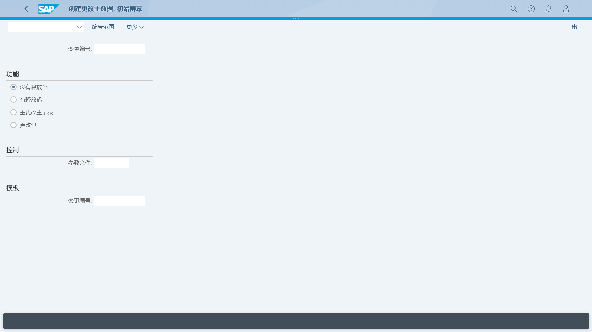
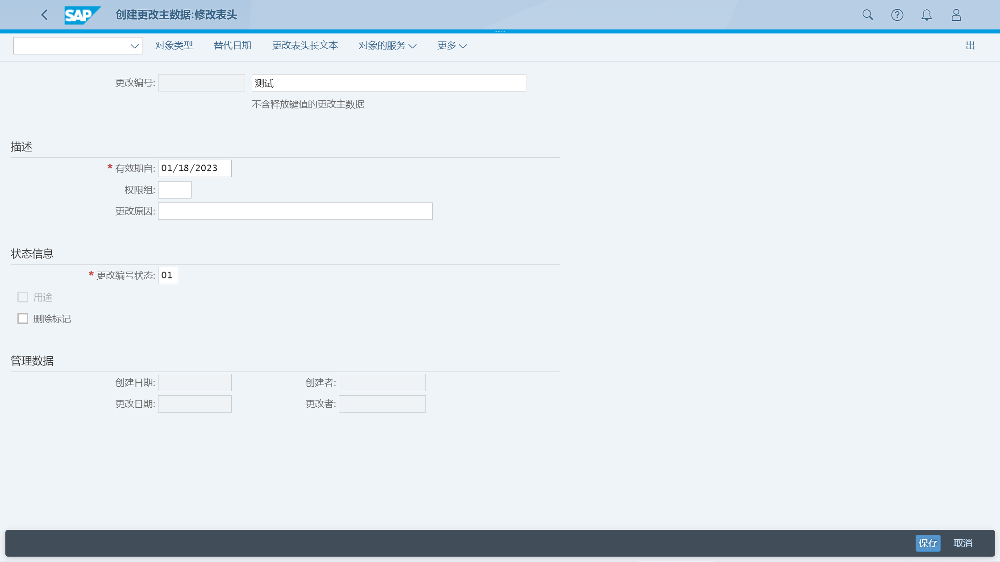
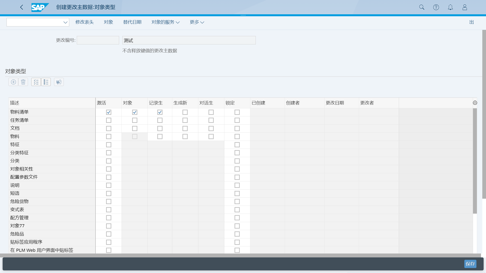
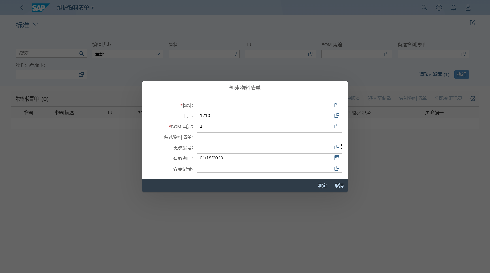
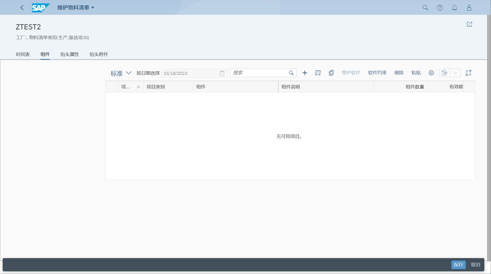

物料清单, BOM
## 角色
> SAP_BR_PRODN_ENG_DISC
## App
> Create Change Master (CC01), 创建更改主数据
>
> Maintain Bill Of Material - Create, change & display BOMs, 维护物料清单
## 创建更改主数据
创建更改主数据

维护生效状态信息

选择对象类型

## 维护物料清单
### 创建生产物料清单
创建物料清单, BOM 用途 1

维护组件内子项

### 创建销售物料清单
BOM 用途 5