维护包装物料
## 角色
> SAP_BR_PRODMASTER_SPECIALIST
## App
> Create Material, 创建物料
>
> Manage Product Master Data, 管理产品主数据
## 创建物料
### 基本数据
创建物料, 选择包装, 选择视图 基本数据

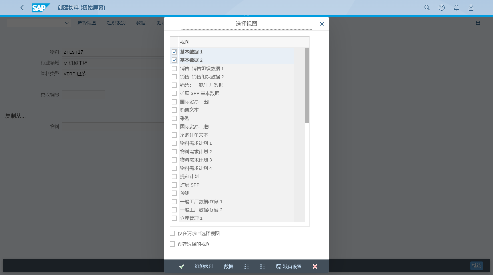

在 基本数据1, 输入基本计量单位、普通项目类别组, 量纲数据

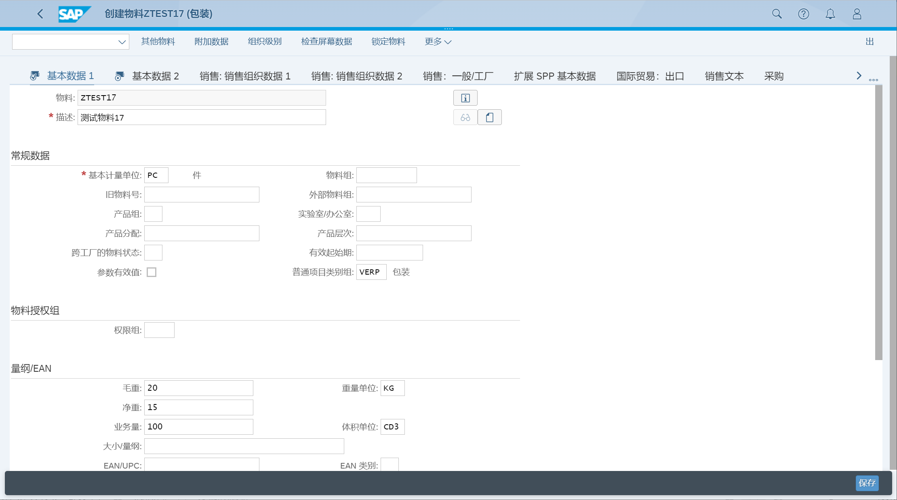

### 销售数据
创建物料, 选择包装, 选择视图 销售一般工厂数据

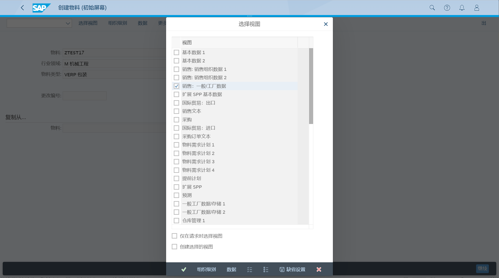

选择组织级别, 输入销售范围

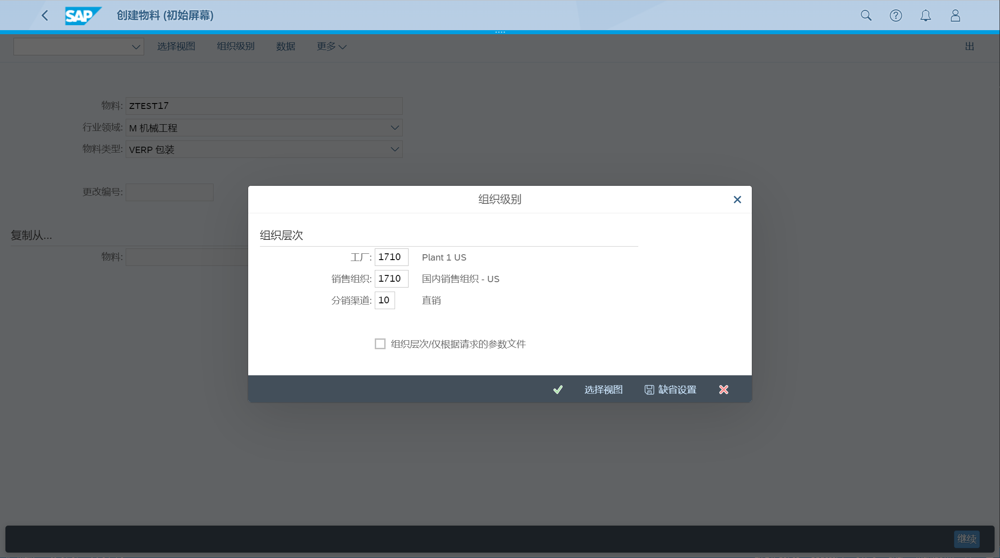

在 销售：一般/工厂, 维护可用性检查, 在装运数据, 维护运输组、装载组, 在包装的物料数据, 维护允许的包装参数, 在一般工厂参数, 维护利润中心

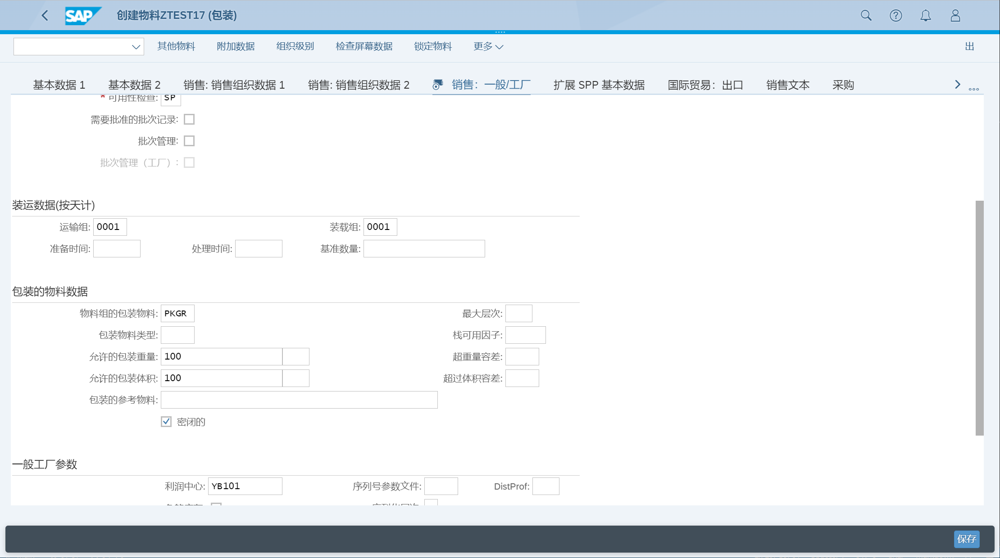

如果需要维护国际贸易的控制代码, 选择国际贸易：出口页签
### 仓库管理
创建物料, 选择包装, 选择视图 仓库管理

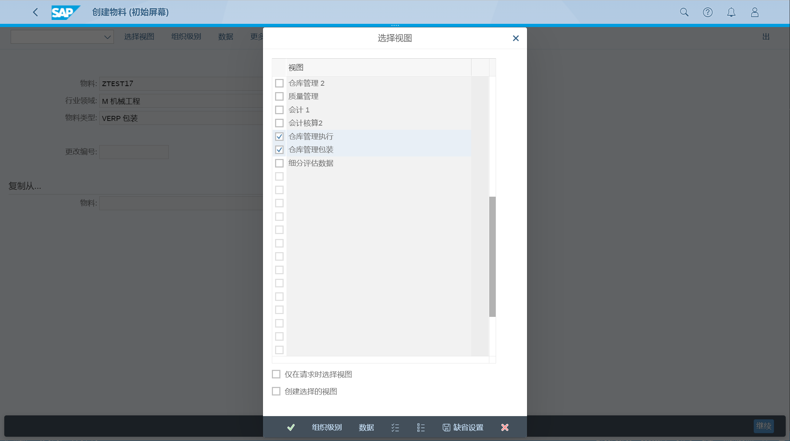

在 仓库管理执行, 维护标准处理单元类型

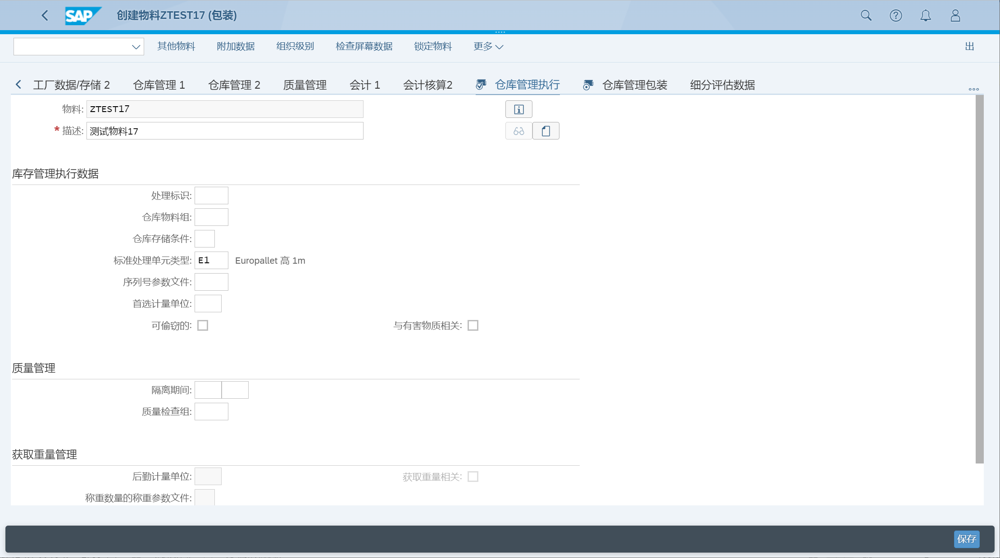

在 仓库管理包装, 维护处理单元类型

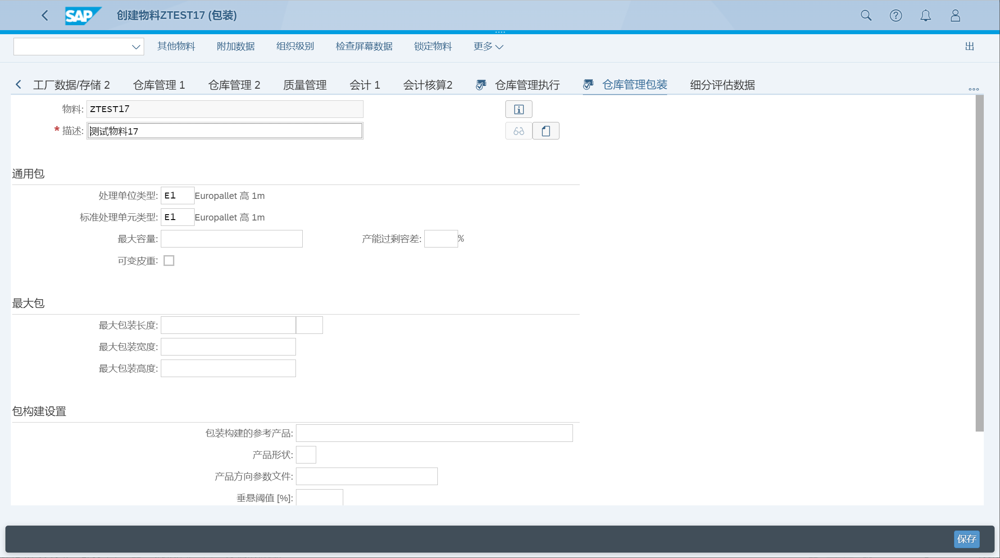

## 管理产品主数据
### 基本数据
点击创建按钮, 创建主数据记录, 选择产品类型、产品组、基本单位, 确定

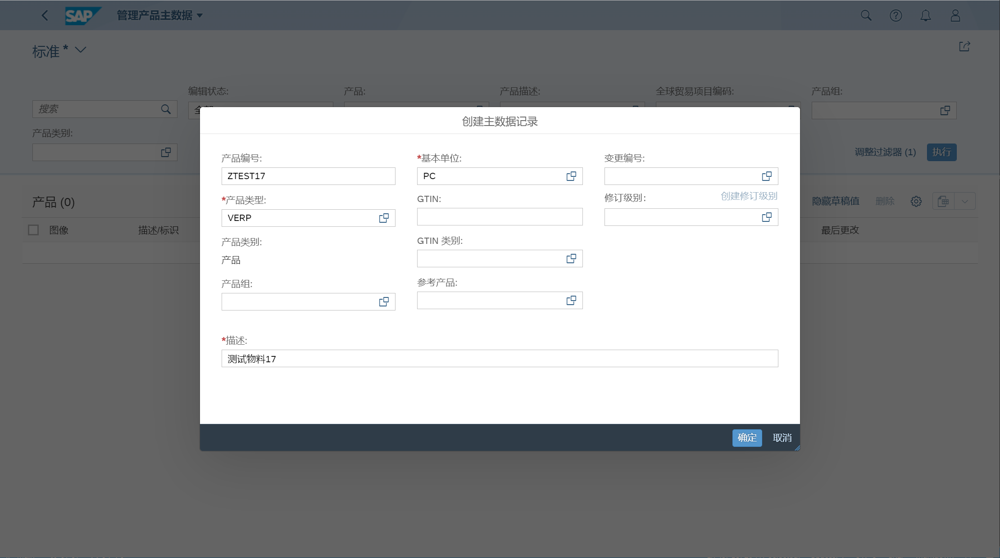

在 基本信息, 维护产品组, 维护多语言描述

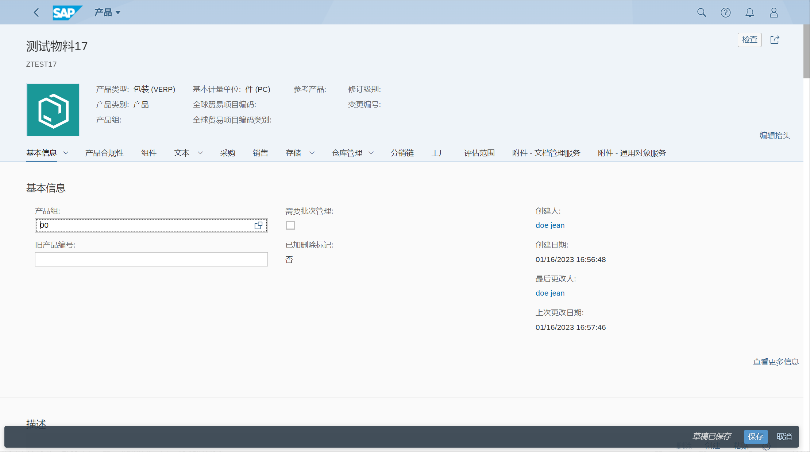

在基本计量单位, 维护毛重、净重, 点击保存

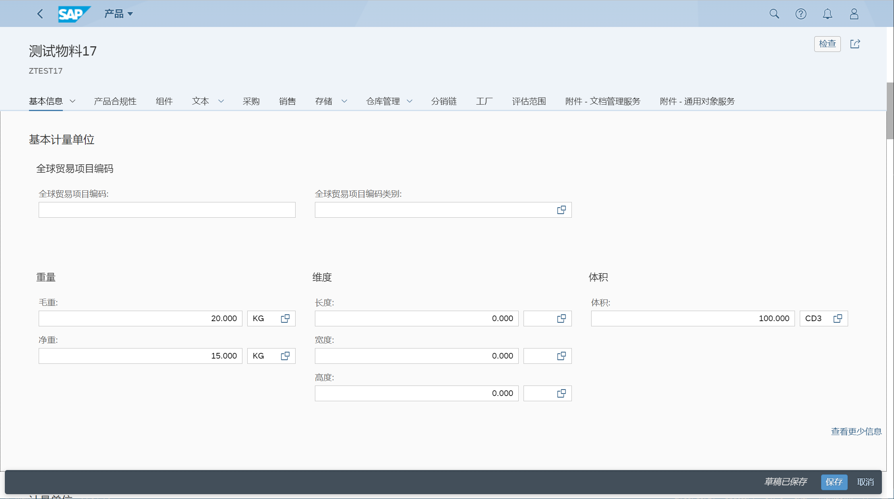

### 销售数据
编辑产品, 选择 销售 页签

维护运输组、允许的包装参数

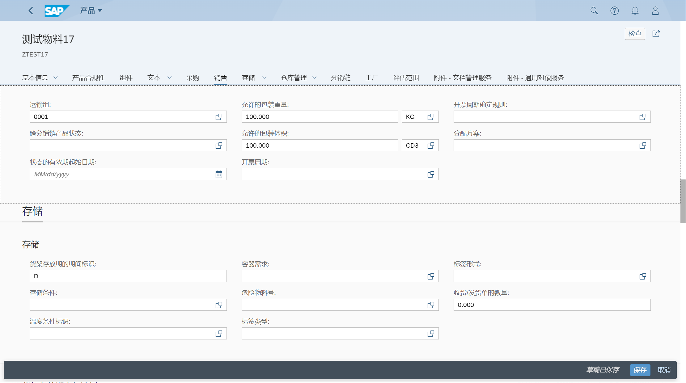

### 仓库管理
编辑产品, 选择 仓库管理 页签

维护标准处理单元类型、处理单元类型

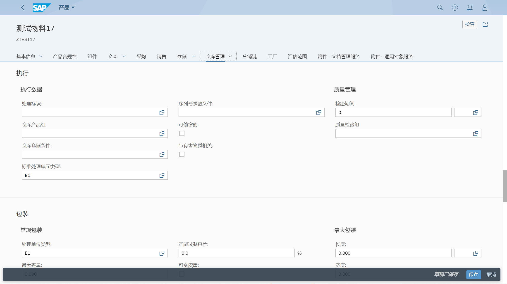