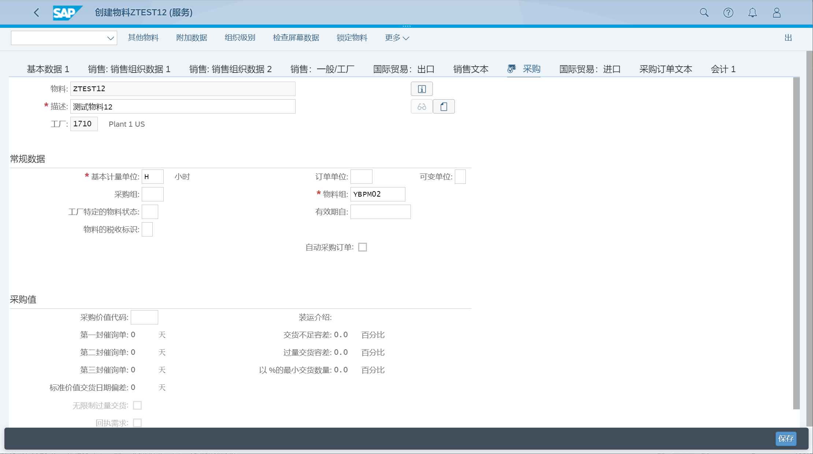

维护物料主数据
## 角色
> SAP_BR_PRODMASTER_SPECIALIST
## App
> Create Material, 创建物料
>
> Manage Product Master Data, 管理产品主数据
## 创建物料
### 基本数据
创建物料, 选择服务, 选择视图 基本数据

在 基本数据1, 输入基本计量单位、物料组、产品组、普通项目类别组

### 销售数据
创建物料, 选择服务, 选择视图 销售数据

选择组织级别, 输入销售范围

在 销售：销售组织数据1, 维护基本计量单位、交货工厂, 维护税分类

在 销售：销售组织数据2, 维护项目类别组、物料科目分配组

在 销售：一般/工厂, 维护利润中心

如果需要维护国际贸易的控制代码, 选择国际贸易：出口页签

### 采购数据
创建物料, 选择服务, 选择视图 采购

选择组织级别, 输入工厂

在 采购, 维护基本计量单位、物料组

### 会计数据
创建物料, 选择服务, 选择视图 会计

选择组织级别, 输入工厂

在 会计1, 一般评估数据, 维护评估分类

## 管理产品主数据
### 基本数据
点击创建按钮, 创建主数据记录, 选择产品类型、产品组、基本单位, 确定

在 基本信息, 维护产品组, 维护多语言描述

### 销售数据
编辑产品, 选择 分销链 页签, 创建

维护销售数据

维护分组条件、税分类

### 采购数据
编辑产品, 选择 采购 页签, 维护采购价值代码

### 会计数据
编辑产品, 选择 评估范围 页签, 创建

维护估计范围、评估类, 价格

