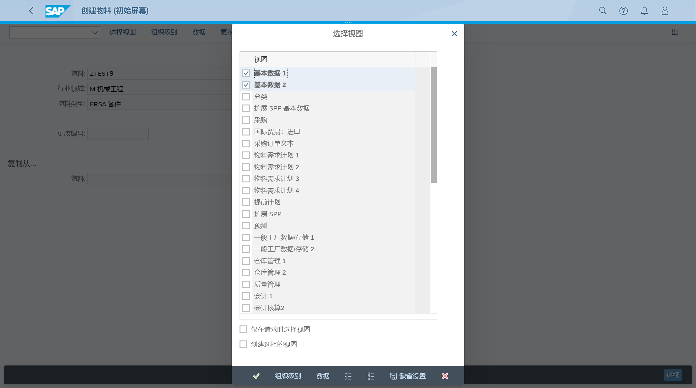
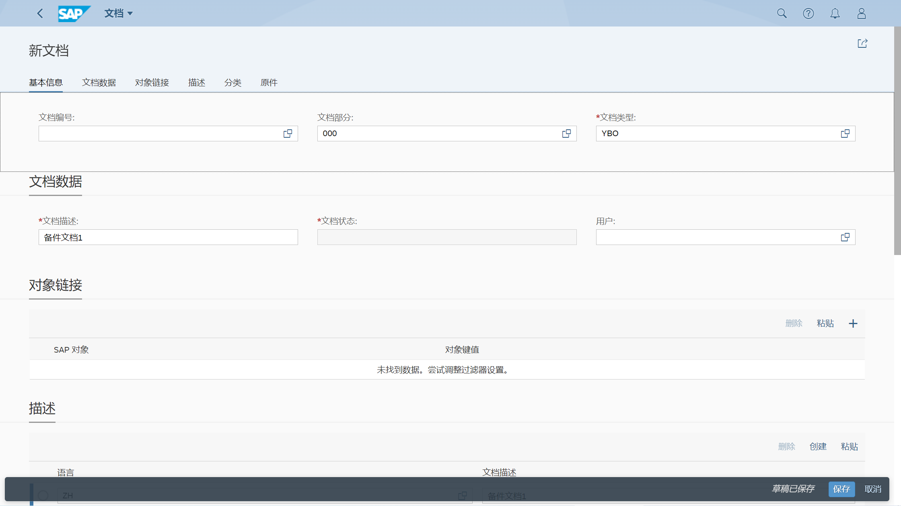

维护物料主数据
## 角色
> SAP_BR_PRODMASTER_SPECIALIST
>
> SAP_BR_DESIGN_ENGINEER
## App
> Create Material, 创建物料
>
> Manage Documents, 管理文档
>
> Change Material, 更改物料
## 创建物料
### 基本数据
创建物料, 选择备件, 选择视图 基本数据

在 基本数据1, 输入基本计量单位、物料组、产品组、普通项目类别组, 量纲数据

回车跳转到 基本数据2, 点击保存
<!--
### 销售数据
-->
### 采购数据
创建物料, 选择备件, 选择视图 采购

选择组织级别, 输入工厂

在 采购, 维护基本计量单位、采购组、物料组

在其他数据/供应商数据, 维护收货处理时间

如果需要维护国际贸易的控制代码, 选择国际贸易：进口页签

### MRP 数据
创建物料, 选择备件, 选择视图 物料需求计划

选择组织级别, 输入工厂、库存地点

在 物料需求计划1, 维护MRP类型、MRP控制者, 在批量数据, 维护批量程序

在 物料需求计划2, 维护采购类型、生产存储地点、缺省供应区域, 计划交货时间、收货处理时间、计划边际码

在 物料需求计划3, 维护可用性检查、总计补货提前时间

在 物料需求计划4, 维护 独立/集中 需求标识, 在重复制造/装配/展开策略, 维护重复制造、重复制造参数文件

### 工厂存储数据
创建物料, 选择备件, 选择视图 一般工厂数据

选择组织级别, 输入工厂、库存地点

在 工厂数据/存储1, 维护收货单据数、批次管理

在 工厂数据/存储2, 维护利润中心

### 会计数据
创建物料, 选择备件, 选择视图 会计

选择组织级别, 输入工厂

在 会计1, 一般评估数据, 维护评估分类, 在价格和值, 维护价格和价格控制

## 管理文档
### 创建文档
选择 创建

维护文档类型、描述

上传文档原件

## 更改物料
### 添加文档链接
选择基本数据

选择附加数据

在文档数据页签, 添加文档链接

