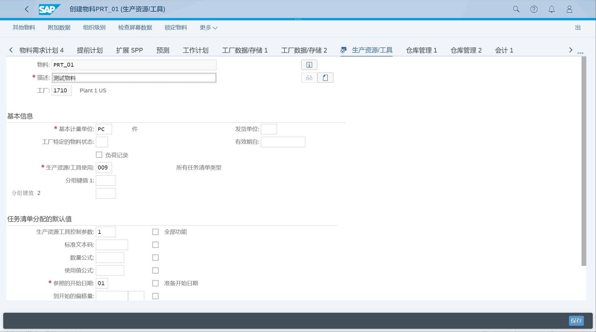
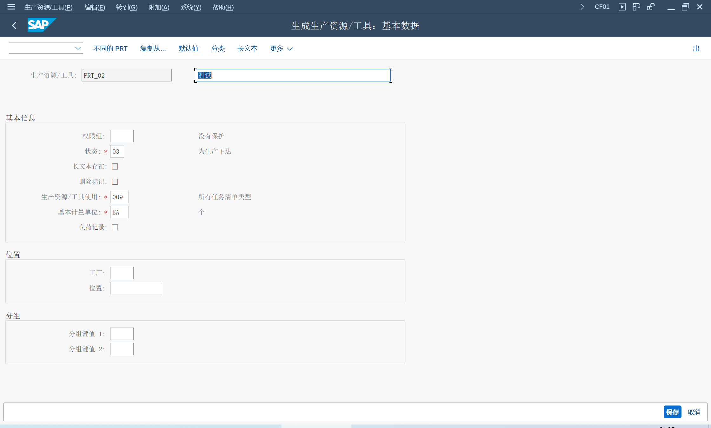
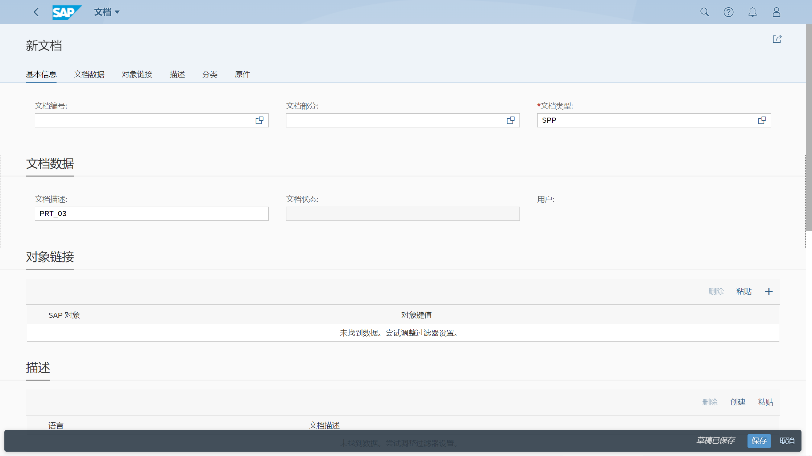
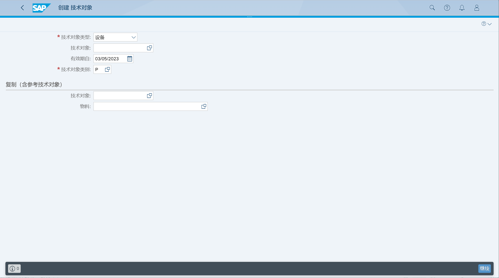

创建生产资源/工具主数据
## 角色
> SAP_BR_PRODN_ENG_DISC
>
> SAP_BR_PRODN_SUPERVISOR_DISC
>
> SAP_BR_PRODMASTER_SPECIALIST
>
> SAP_BR_DESIGN_ENGINEER
>
> SAP_BR_MAINTENANCE_PLANNER
## App
> Create Material (MM01), 创建物料
>
> Create PRT (CF01), 创建生产资源/工具
>
> Manage Documents, 管理文档
>
> Create Technical Object, 创建技术对象
>
> Change Routing (CA02), 更改工艺路线
>
> Change Production Order (CO02), 更改生产订单
## 创建生产资源工具
物料

杂项

文档

设备

## 在工艺路线分配
## 在生产订单分配

