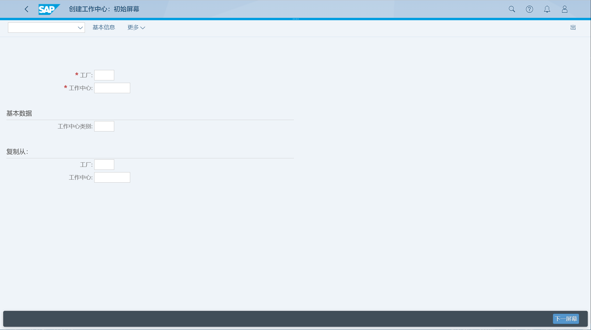
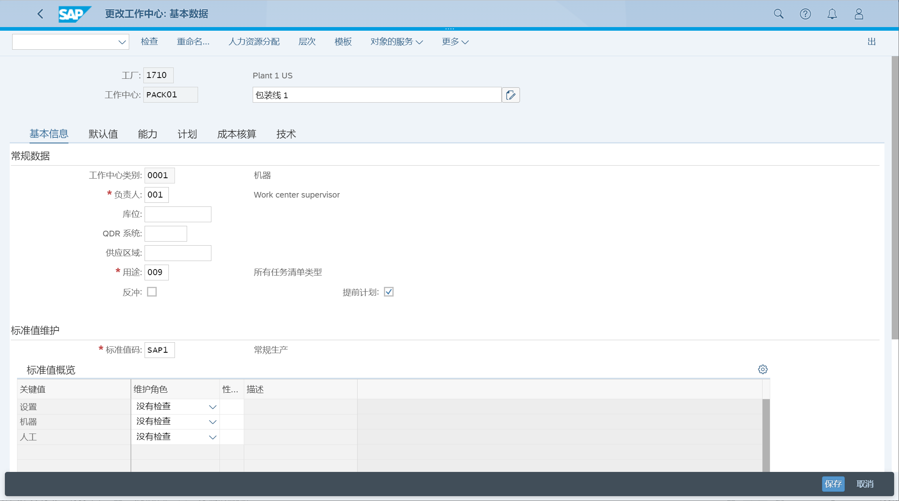
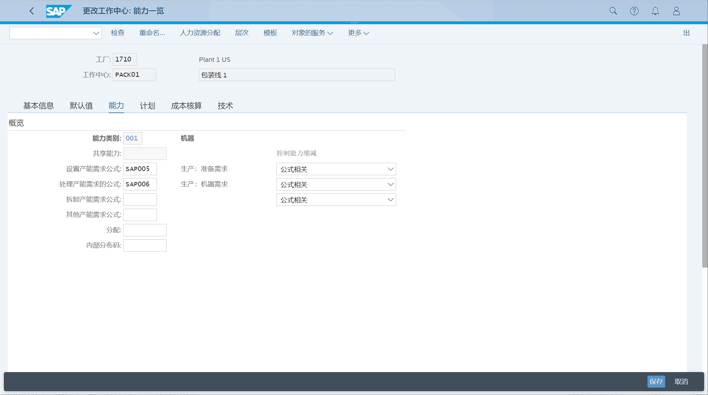
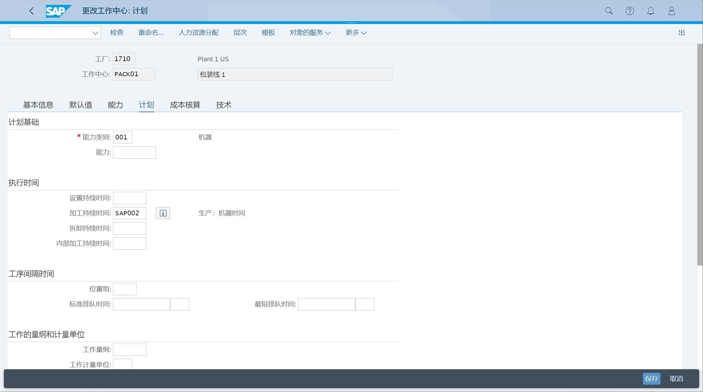
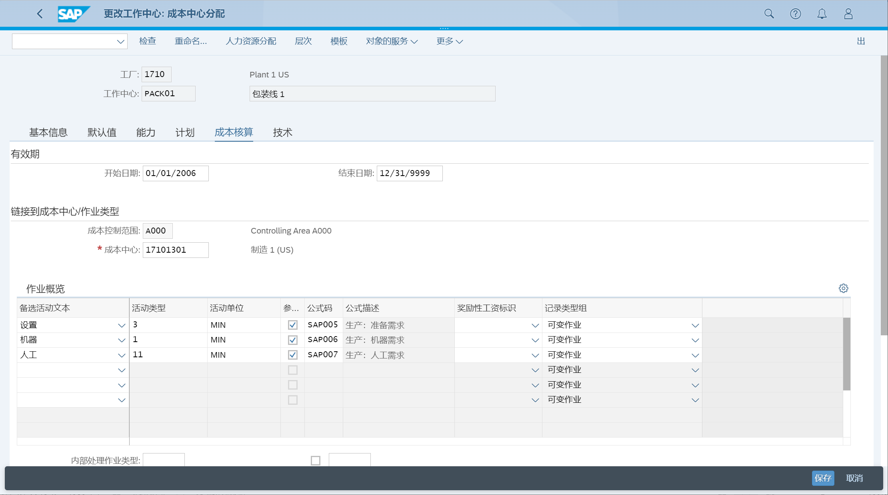

工作中心保存用于容量规划、调度、成本计算信息
## 角色
> SAP_BR_PRODN_ENG_DISC
## App
> Manage Work Centers, 管理工作中心
>
> Manage Work Center Groups, 管理工作中心组
## 创建工作中心
创建工作中心, 选择工作中心类别 0001 机器

维护基本信息

维护能力

维护计划, 执行时间数据

维护成本核算, 成本中心数据

## 管理工作中心组
未找到应用