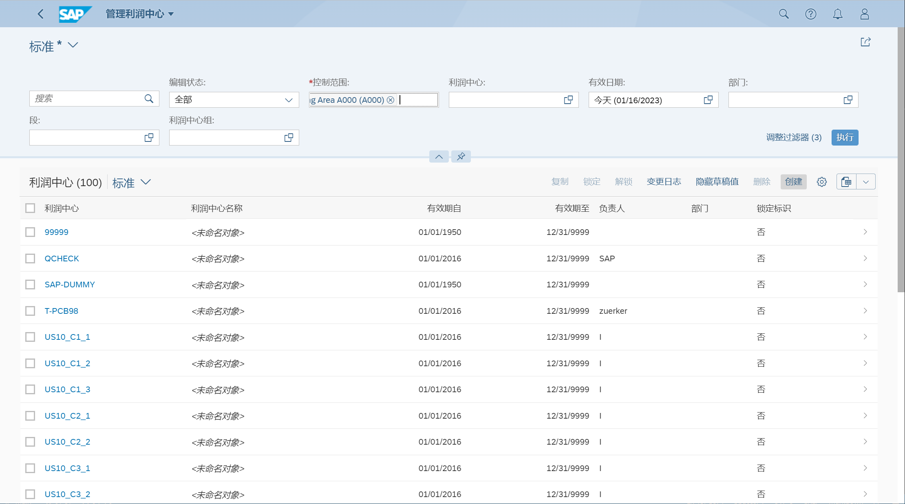
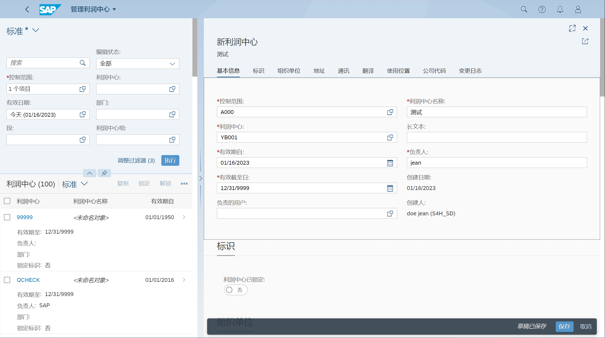
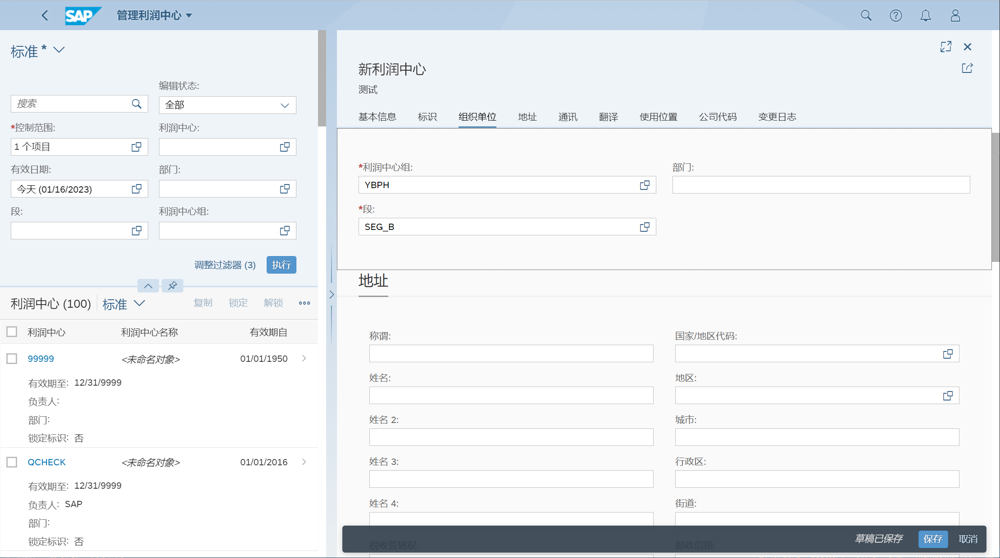
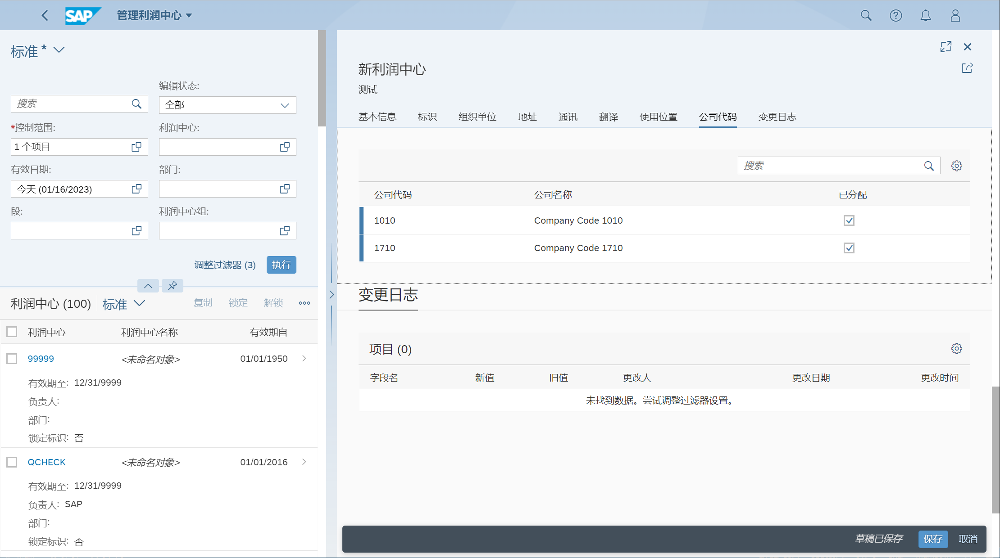
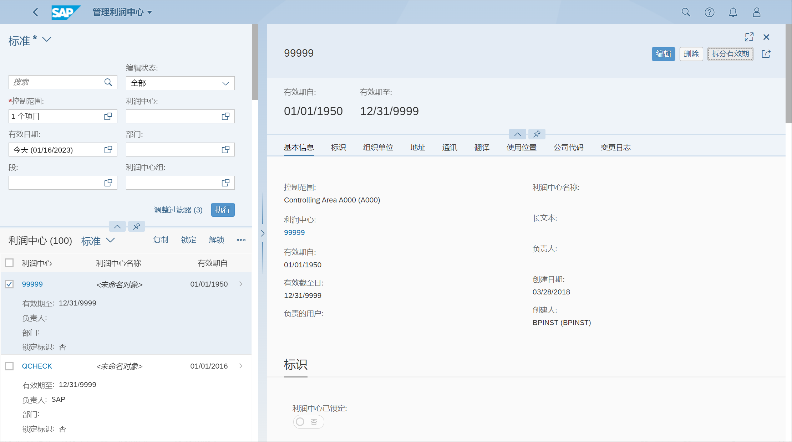
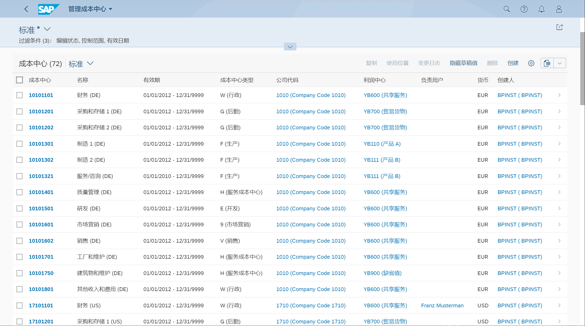
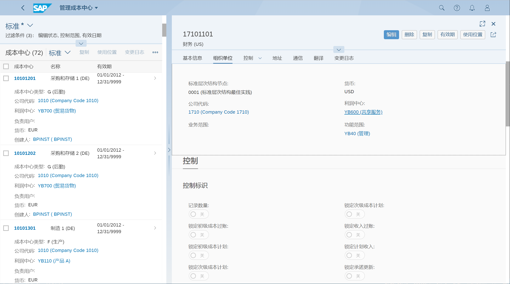

维护利润中心
## 角色
> SAP_BR_DIVISION_ACCOUNTANT
>
> SAP_BR_OVERHEAD_ACCOUNTANT
## App
> Manage Profit Centers, 管理利润中心
>
> Manage Cost Centers, 管理成本中心
## 管理利润中心
输入控制范围, 执行

点击 创建

维护利润中心基本信息

维护利润中心组、段

维护公司代码分配

拆分有效期, 然后需要维护时间相关的基本信息

## 管理成本中心
输入控制范围, 执行

选择成本中心, 编辑, 将利润中心分配给成本中心

