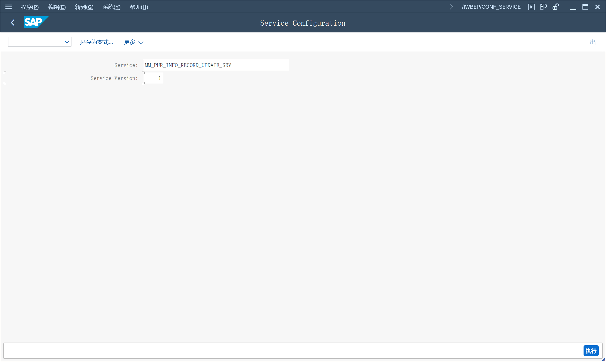
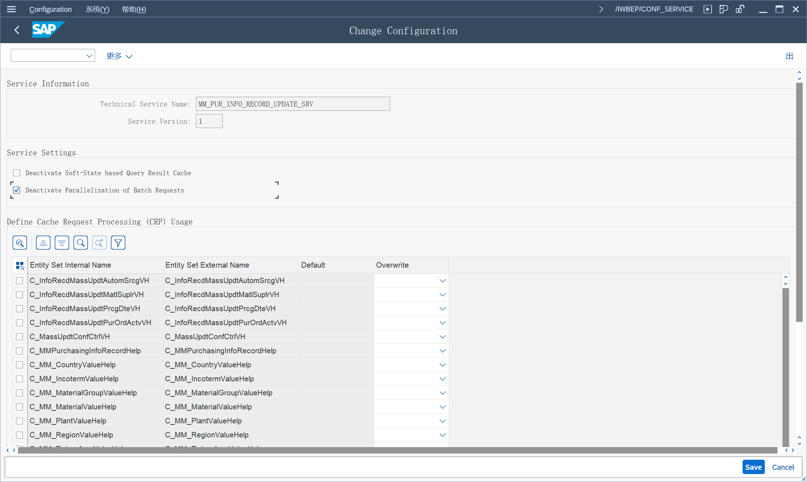
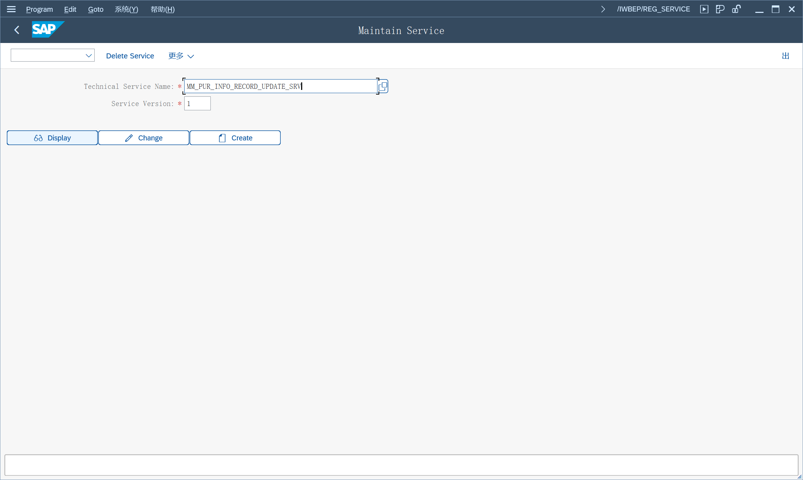
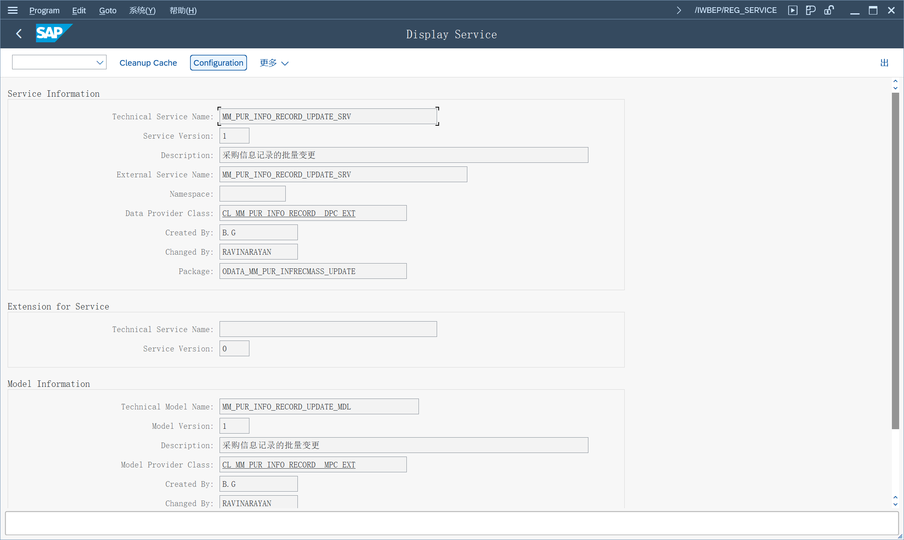
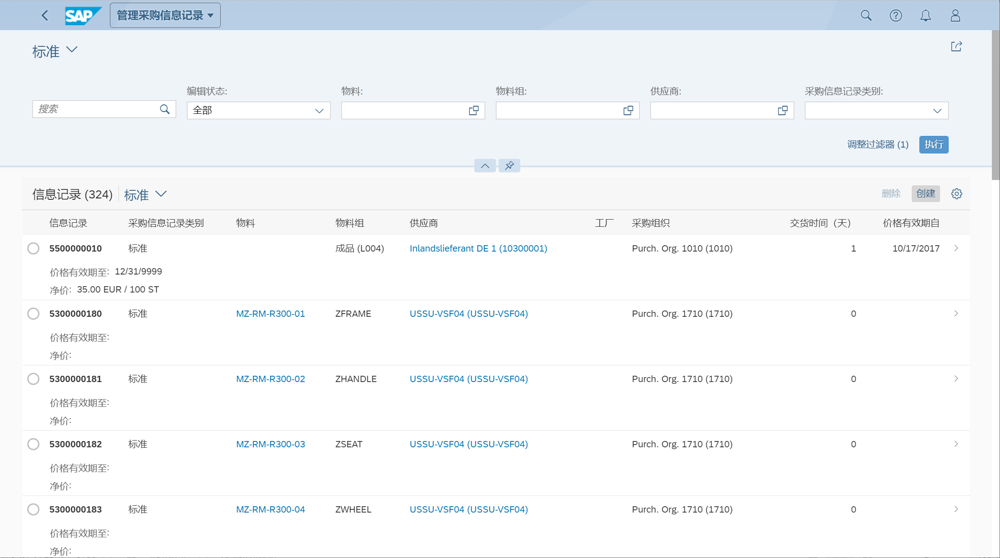
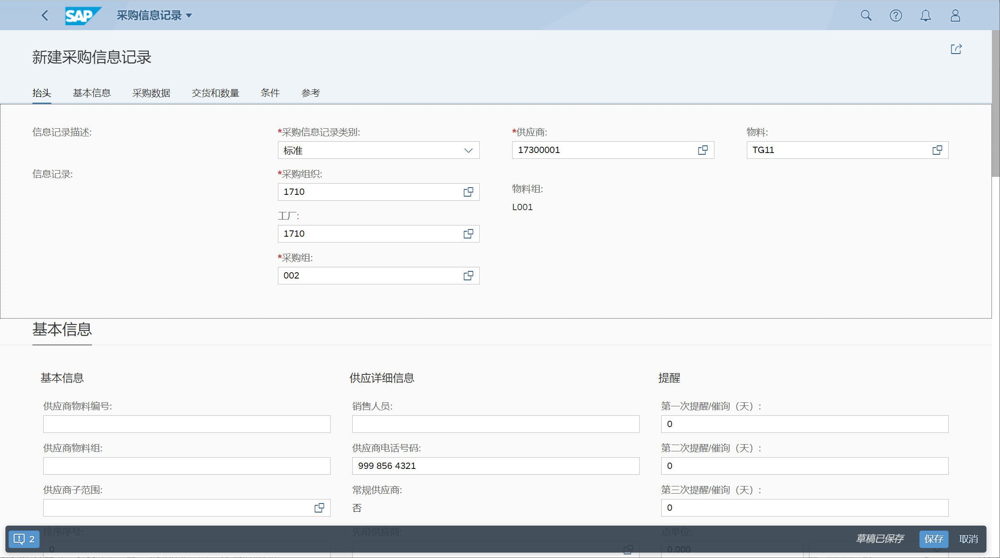
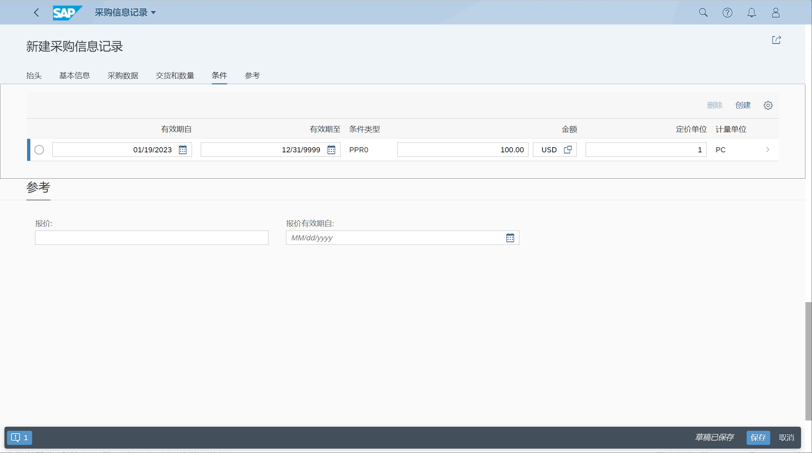
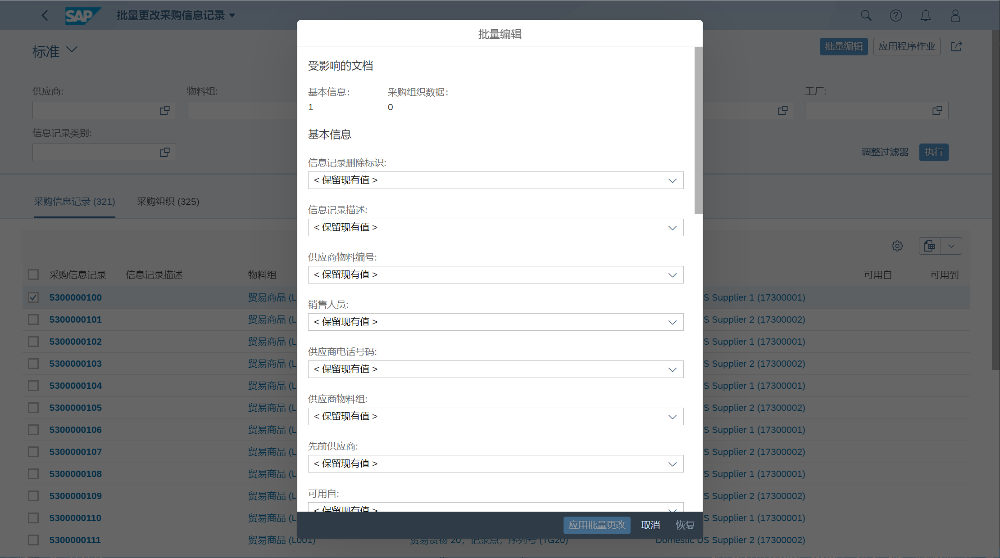
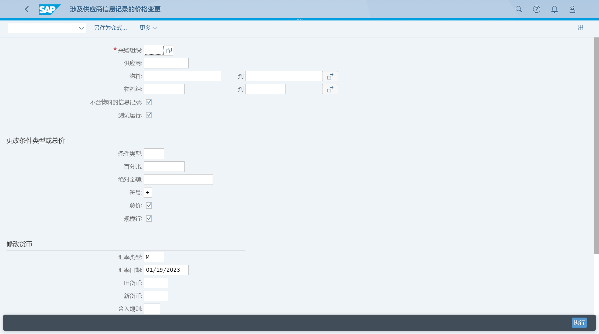

采购信息记录
## 角色
> SAP_BR_PURCHASER
## App
> Manage Purchasing Info Records, 管理采购信息记录
>
> Mass Changes to Purchasing Info Records, 采购信息记录的批量变更
>
> Price Changes: Info Records, 价格变化,信息记录
## 服务配置
输入 /n/IWBEP/CONF_SERVICE
> MM_PUR_INFO_RECORD_UPDATE_SRV

停用后端系统上当前服务的批处理请求的并行化

或 SPRO, 维护服务

输入服务名称

显示服务详细

点击 配置, 停用后端系统上当前服务的批处理请求的并行化

## 管理采购信息记录
### 创建采购信息记录 标准
选择创建

输入基本信息, 选择采购信息记录类别

维护采购数据、交货条款

维护价格条件

### 创建采购信息记录 寄售
### 创建采购信息记录 分包
### 创建采购信息记录 管道
## 采购信息记录 批量更改
选择信息记录, 点击批量更改

## 采购信息记录 批量更改价格
更改条件类型或总价, 修改货币

