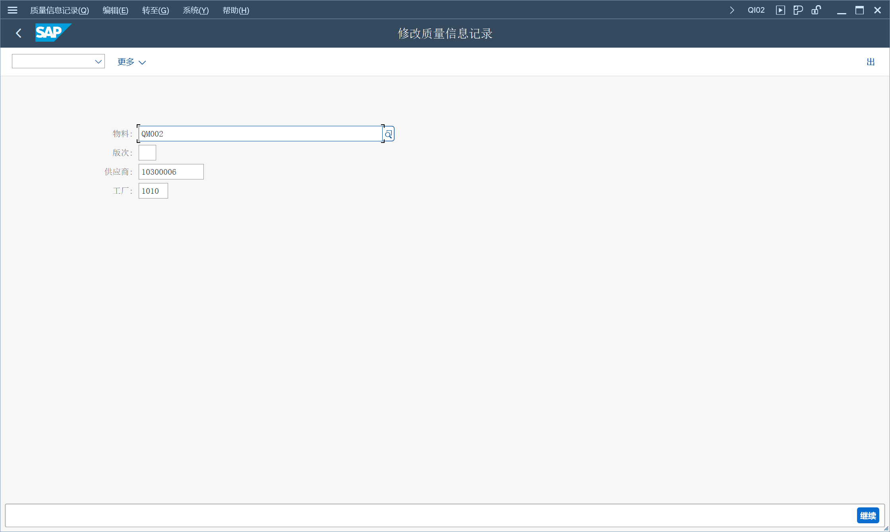
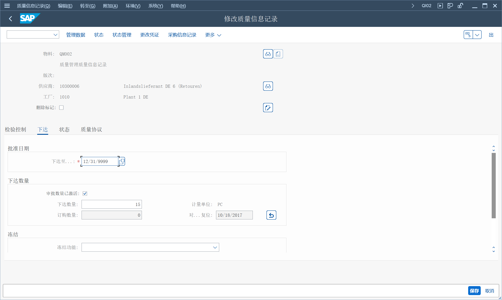
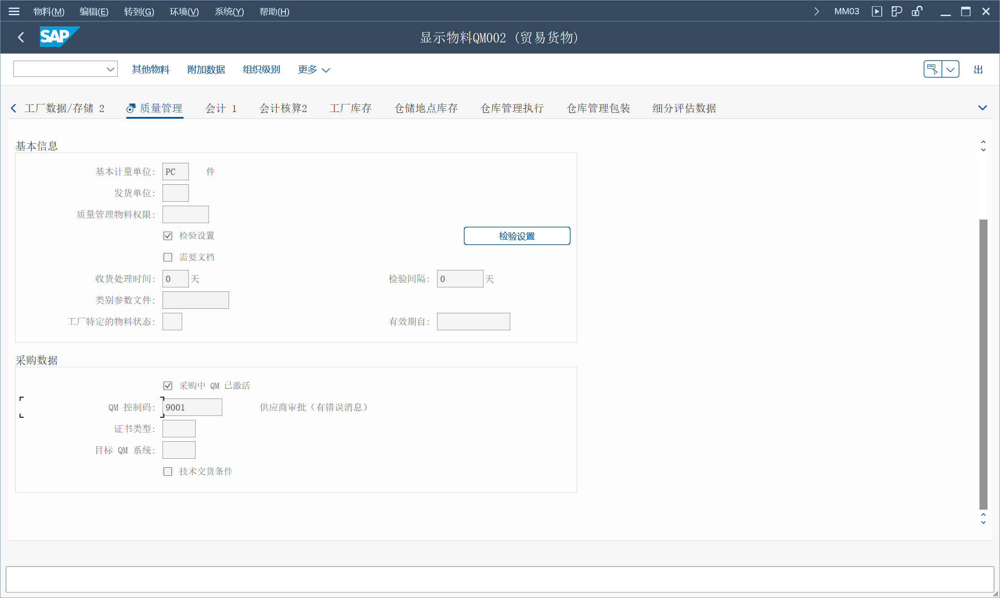

## 角色
> SAP_BR_QUALITY_PLANNER
## App
> Create Quality Info Record - Procurement (QI01), 创建质量信息记录 - 采购
>
> Manage Quality Info Records, 管理质量信息记录
>
> Assign QM Control Keys for Procurement - Process Manually (QI05)
## 创建质量信息记录 - 采购
输入物料、供应商和工厂

设置日期和数量

## 创建质量信息记录
未找到App
## 为采购分配质量管理控制码

质量管理视图

