检验计划必须包含有关待检查特性、应如何检查以及应检查多少样品的一些细节
## 角色
> SAP_BR_QUALITY_PLANNER
>
> SAP_BR_QUALITY_TECHNICIAN
## App
> Edit Code Groups (QS41), 编辑代码组
>
> Edit Selected Sets (QS51), 编辑所选集
>
> Create Inspection Method (QS31), 创建检验方法
>
> Create Master Inspection Characteristic (QS21), 创建主检验特征
>
> Create Sampling Scheme (QDP1), 创建取样方案
>
> Create Sampling Procedure (QDV1), 创建取样程序
>
> Create Dynamic Modification Rule (QDR1), 创建动态修改规则
>
> Create Inspection Plan (QP01), 创建检验计划
>
> Manage Inspection Plans, 管理检验计划
>
> Manage Inspection Lots, 管理检验批次
## 编辑代码组
使用代码组对可能的质量缺陷进行分类

输入目录, 选择相应的代码组

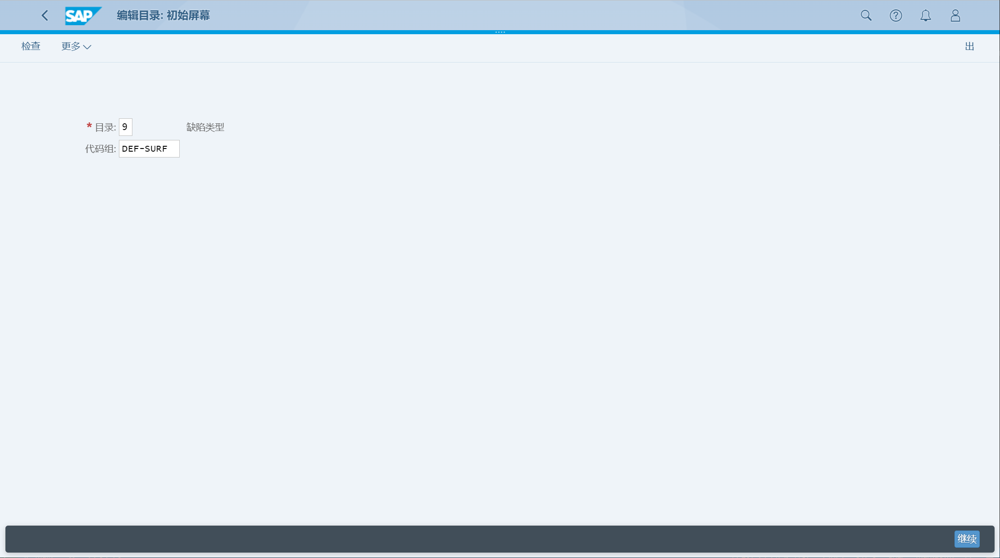

查看详细的缺陷原因代码

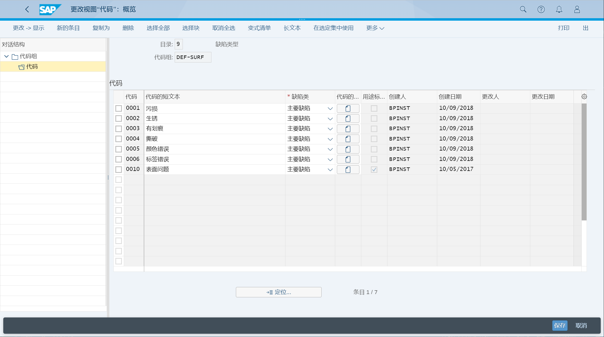

## 编辑所选集
选定的集合组合了工厂级别的不同代码组和代码

输入目录, 选择集

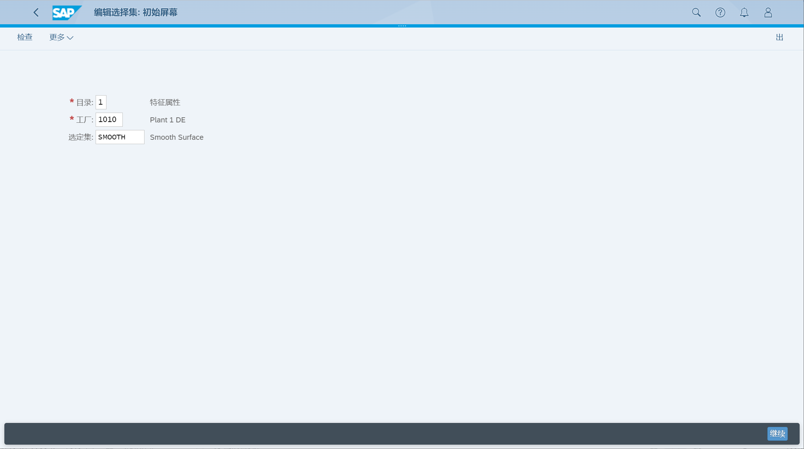

查看集内的代码组、代码

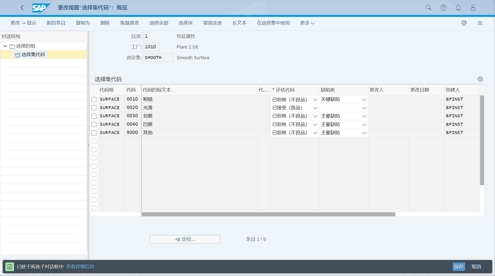

## 创建检验方法
检验方法

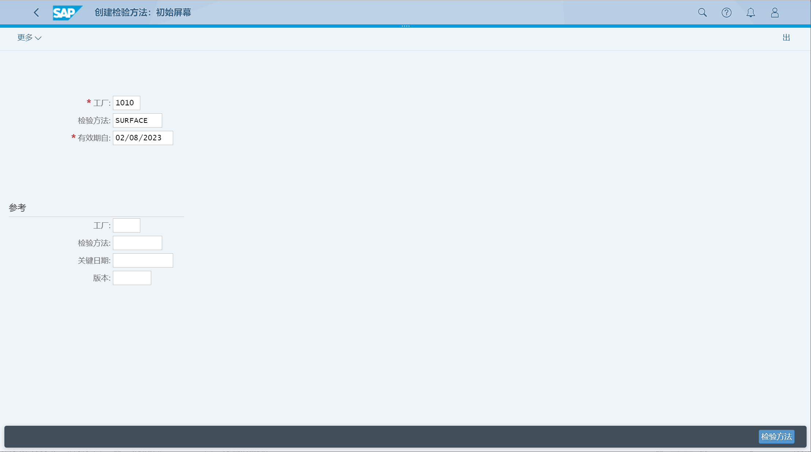

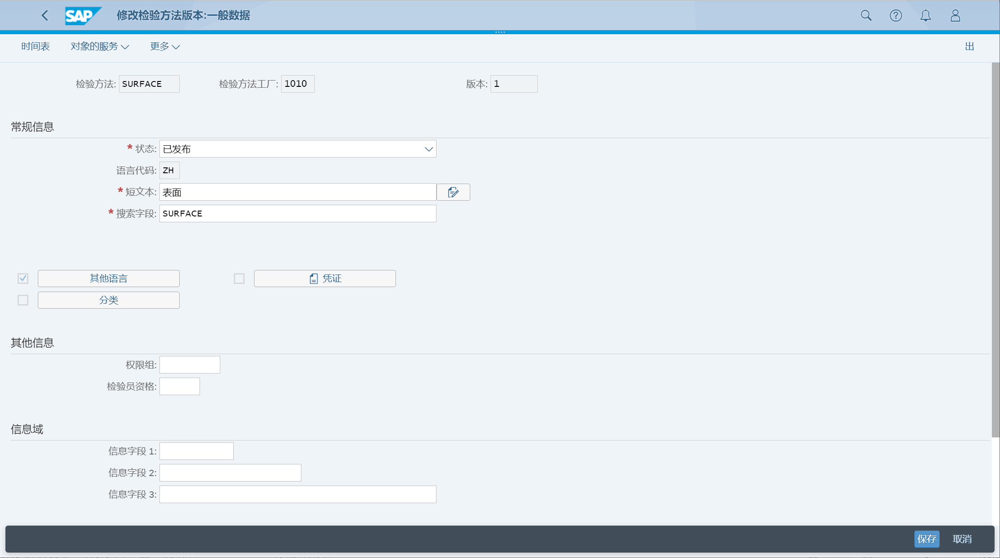

## 创建主检验特征
主检验特征

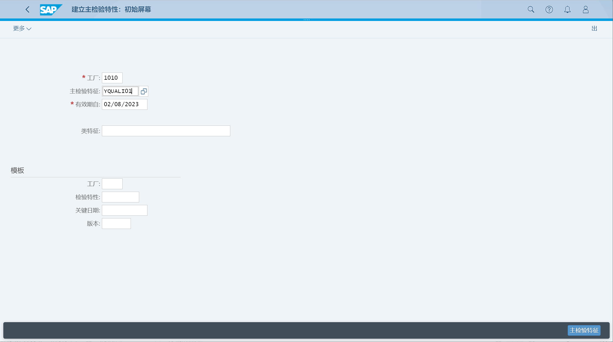

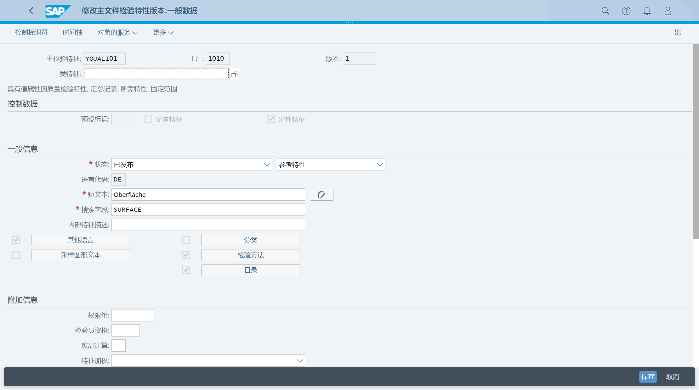

## 创建取样方案
取样方案

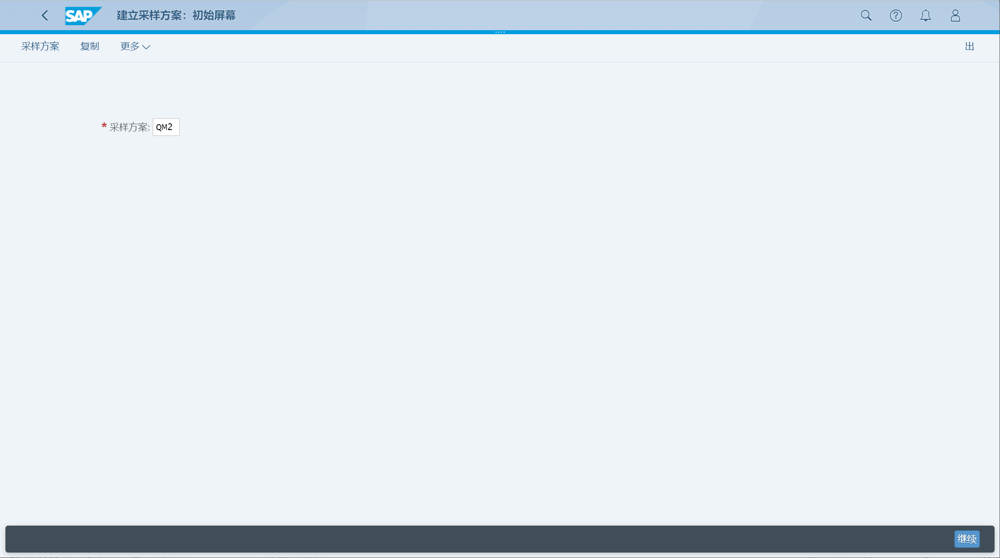

表头数据

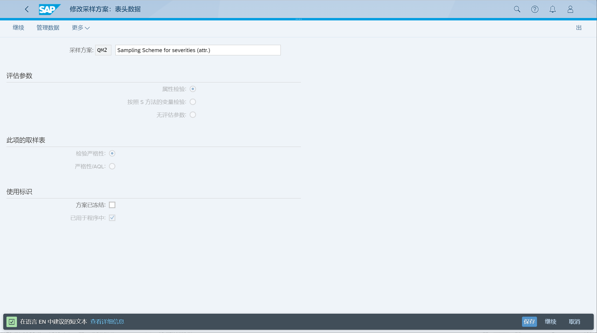

参数

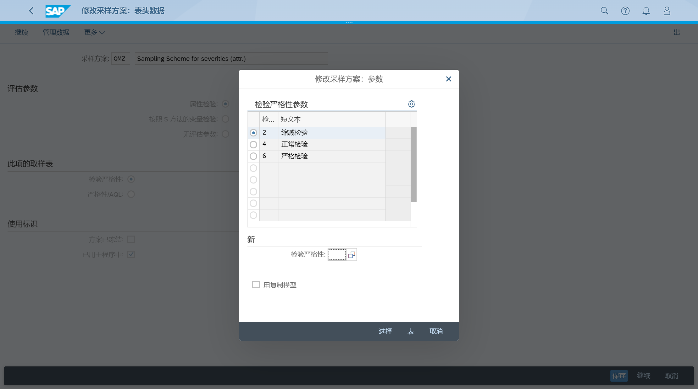

取样计划

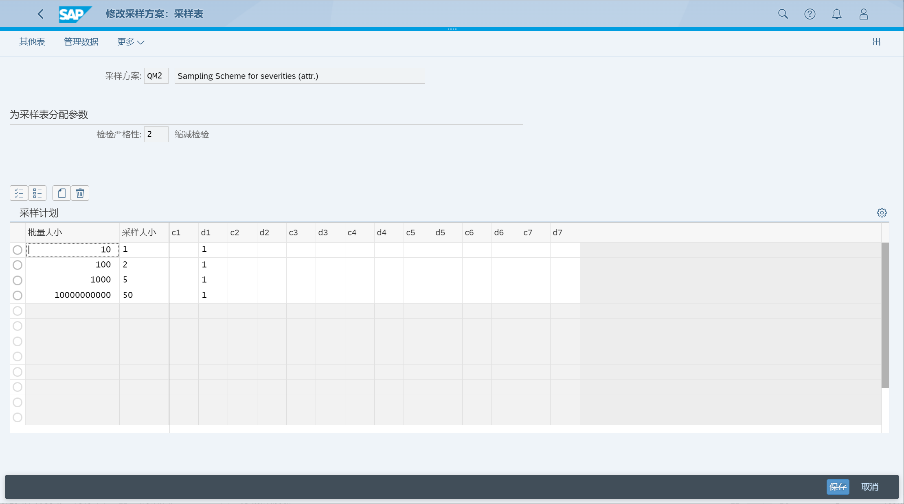

## 创建取样程序
取样程序

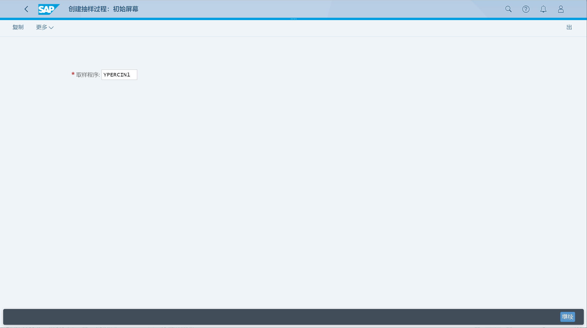

分配取样类型

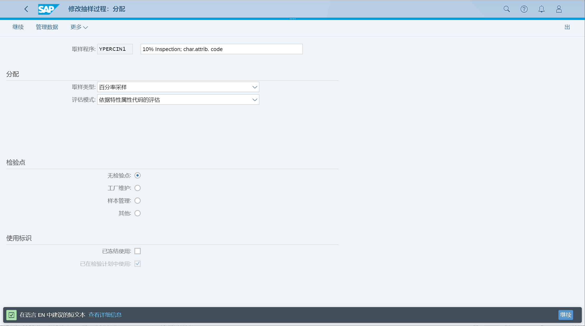

取样计划

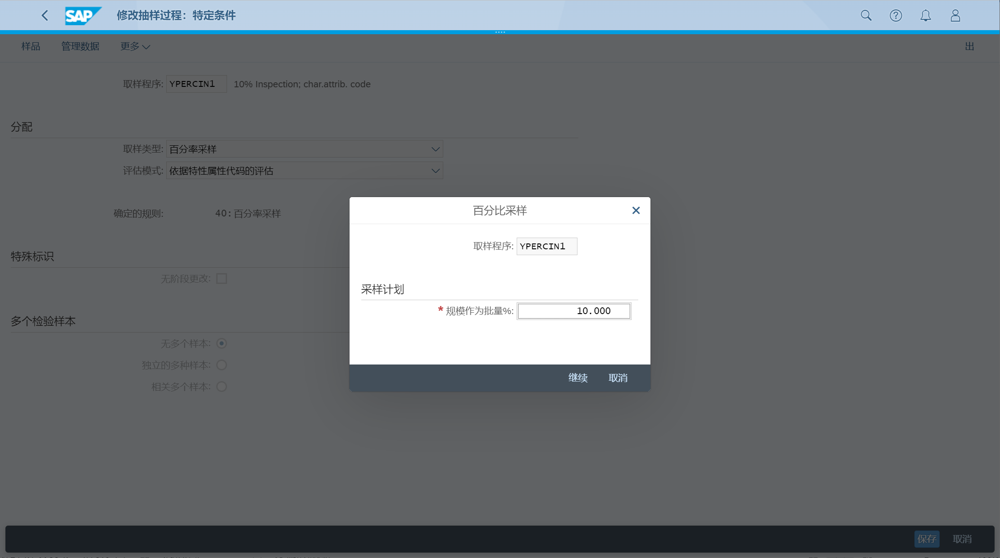

## 创建检验计划
检验计划, 输入物料、工厂

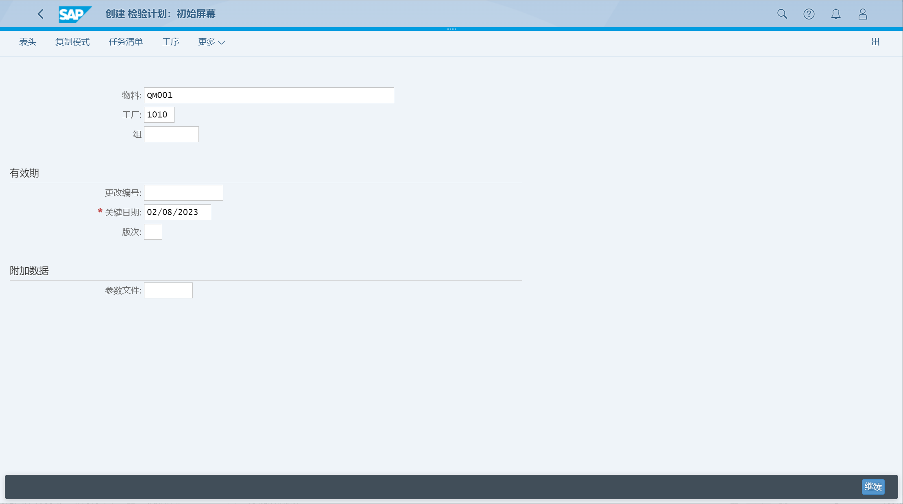

选择工序, 点击检验特性

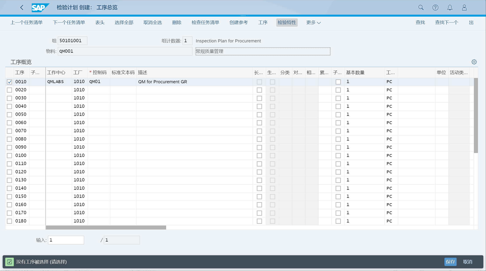

维护检验特性, 取样程序

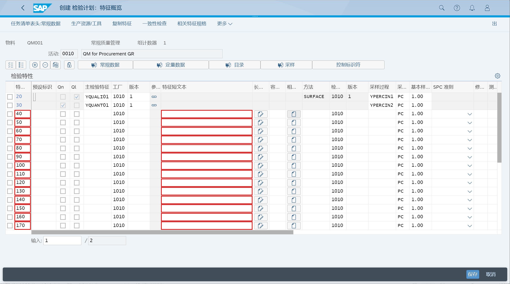

## 管理检验计划
未找到 App
## 管理检验批次
显示检验批次

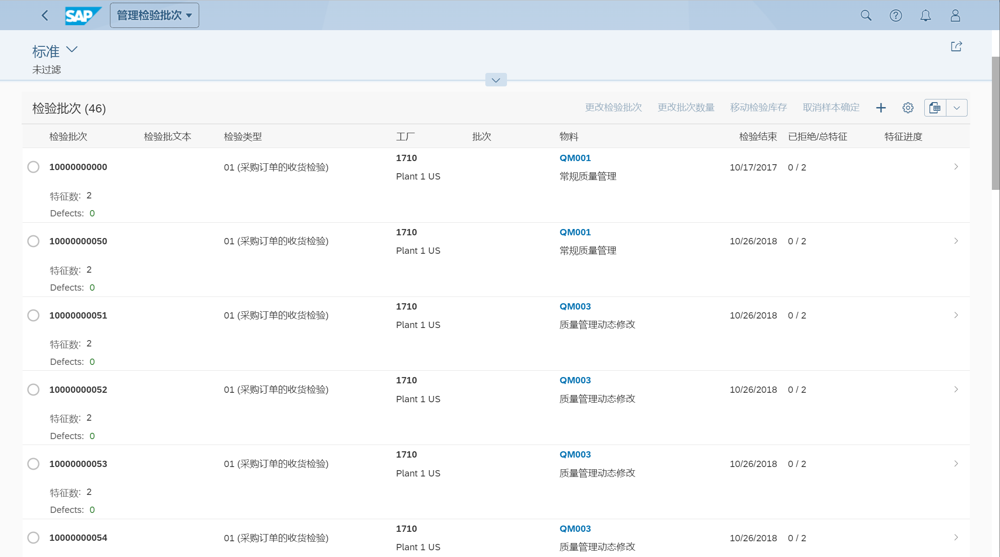