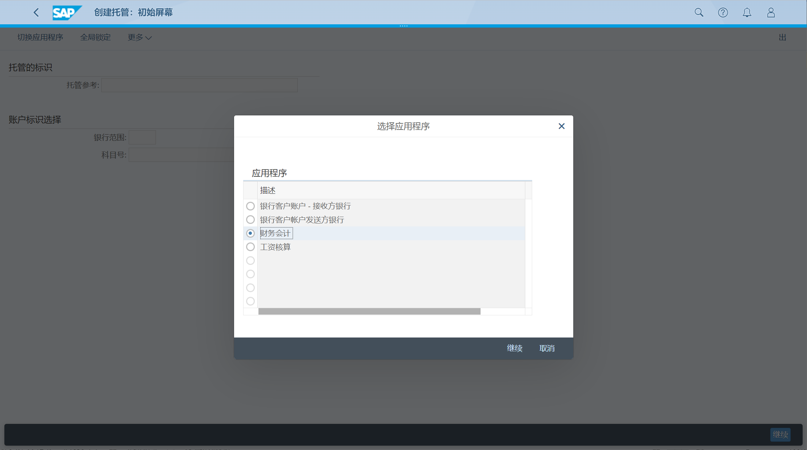
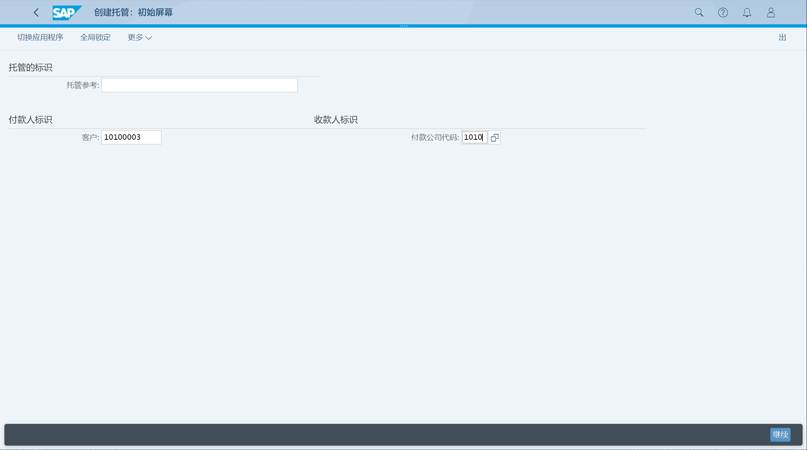
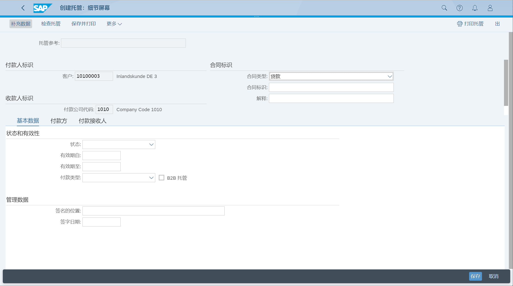
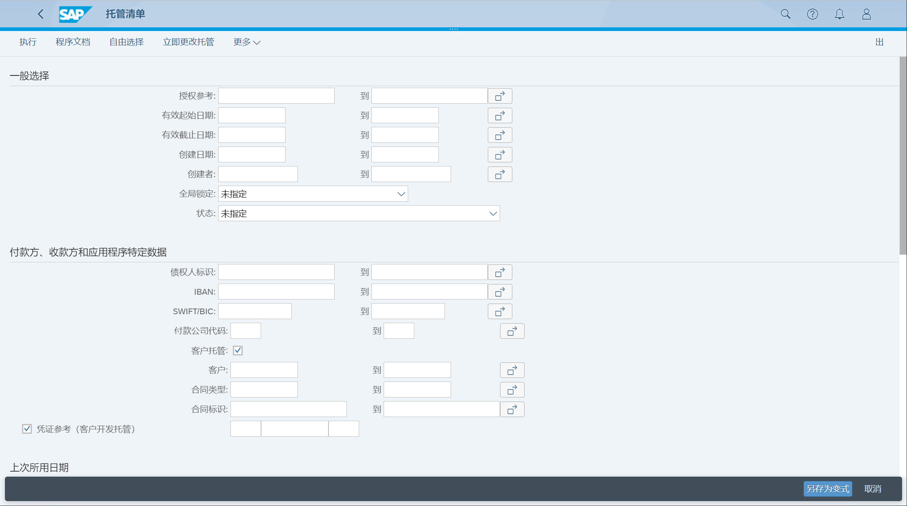

单一欧元支付区授权
## 角色
> SAP_BR_AR_ACCOUNTANT
## App
> Create SEPA Mandates (FSEPA_M1), 创建 SEPA 要求
>
> Display SEPA Mandates (FSEPA_M3), 显示 SEPA 要求
>
> Display SEPA Mandate Lists (FSEPA_M4_FIN), 显示 SEPA 要求清单
>
> Manage SEPA Mandates
## 创建托管
选择 切换应用程序, 选择 财务会计

输入付款人标识, 客户、公司代码

在细节屏幕, 选择补充数据, 自动填充地址、银行数据

在付款方页签, 维护银行数据

## 显示托管清单
执行显示清单

## 管理托管
未找到 App