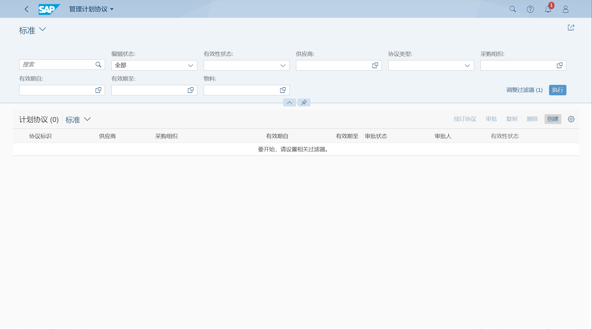
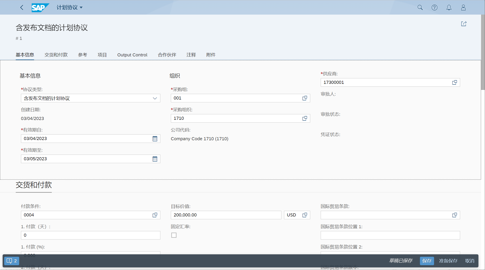
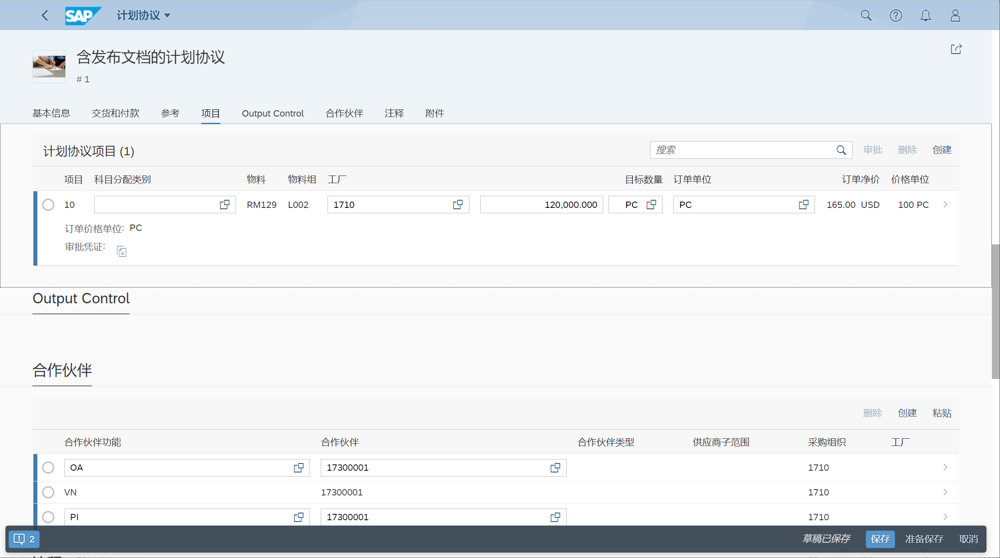
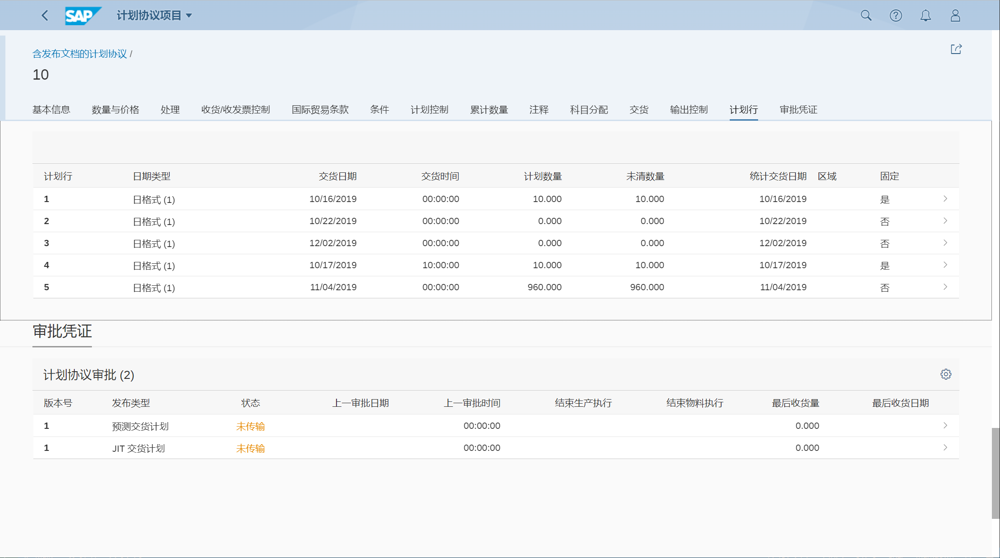

计划协议是与供应商签订的一份长期协议
## 角色
> SAP_BR_PURCHASER
## App
> Manage Purchase Scheduling Agreements, 管理计划协议
>
> ME31L - 创建计划协议 
## 创建计划协议
在管理计划协议列表, 点击创建

选择 含发布文档的计划协议 LPA, 目标价值

添加项目, 行项目类别可选择 K 寄售、L 转包

计划协议 LP, 则只有计划行

