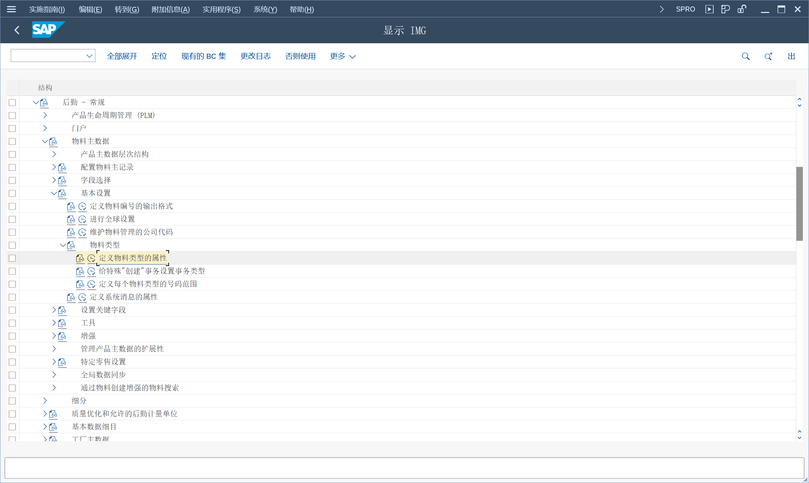
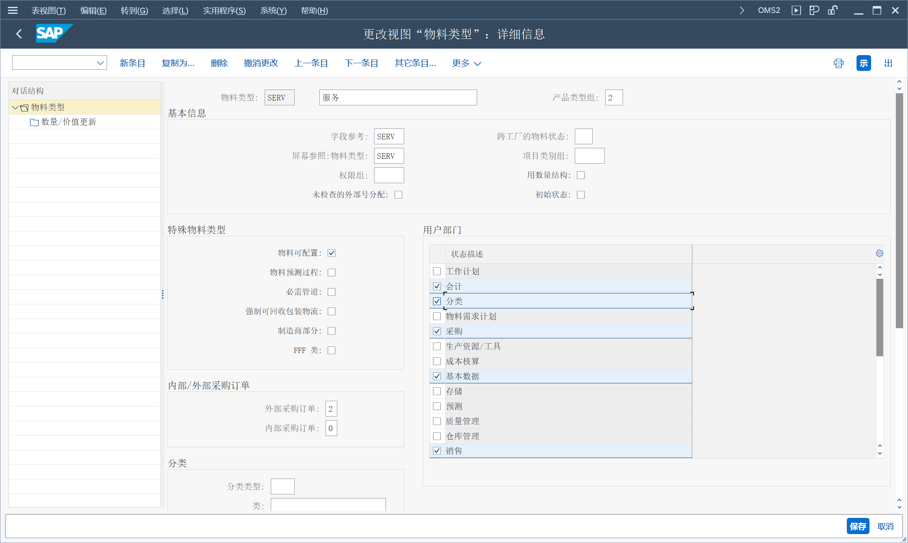

维护可配置服务产品主数据记录（包括价格）
## 角色
> SAP_BR_PRODUCT_CONFIG_MODELER
>
> SAP_BR_PRODMASTER_SPECIALIST
>
> SAP_BR_PRICING_SPECIALIST
## App
> Manage Characteristics (CT04), 管理特征
>
> Manage Classes (CL02), 管理类
>
> Create Material, 创建物料
>
> VC Modeling Environment, 变式配置建模环境
>
> Set Material Prices - Sales, 设置物料价格 - 销售
## 定义物料类型的属性
定义物料类型的属性

维护物料可配置、分类

产品类型组 2, 会提示服务产品无配置 CMD_PRODUCT_TYPE 003
## 创建特征
未找到 App, 角色需要添加磁贴组对象 SAP_PLM_BCG_CLF
> CT04 - 特性
## 创建分类
未找到 App, 角色需要添加磁贴组对象 SAP_PLM_BCG_CLF
> CL02 - 类

分配特征到类
## 创建可配置服务产品
创建物料 SRV_CONTR_CONFIG, 维护可配置标识、变式
## 创建配置文件
变式配置建模环境
维护物料 SRV_CONTR_CONFIG, 配置参数文件, 维护变式特征值
## 设置物料价格
维护物料 SRV_CONTR_CONFIG, 维护变式价格条件 VASE 