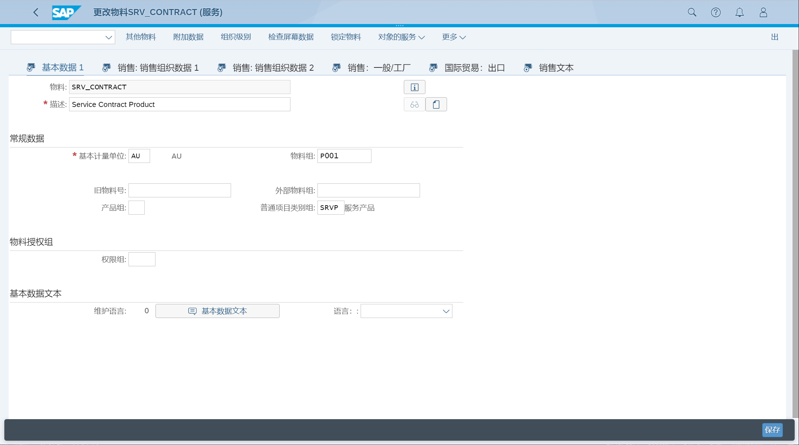
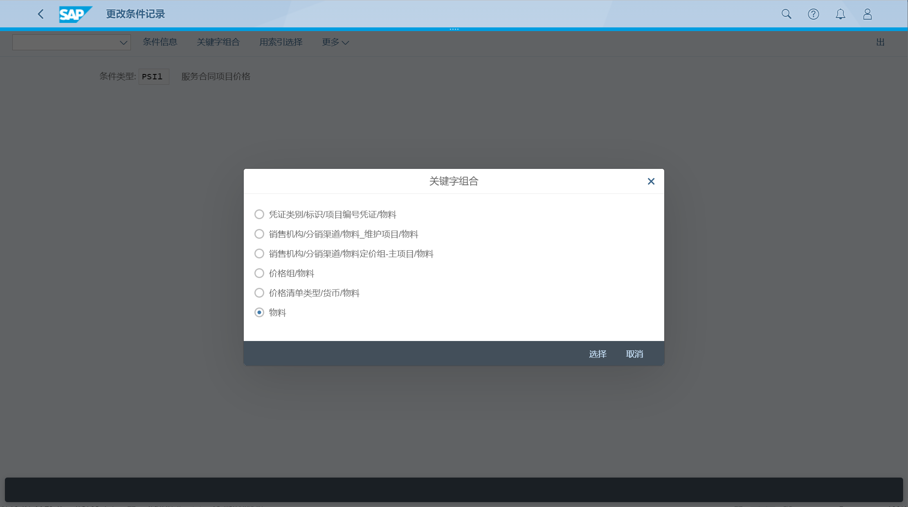
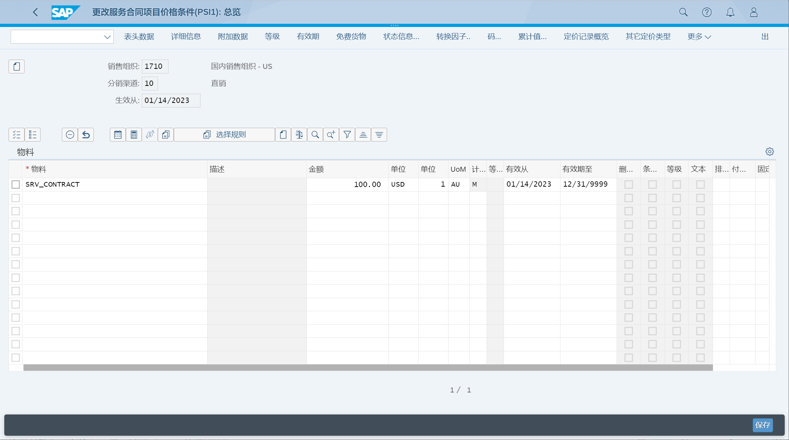
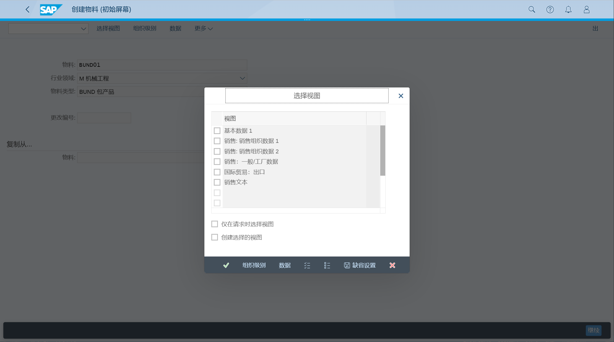
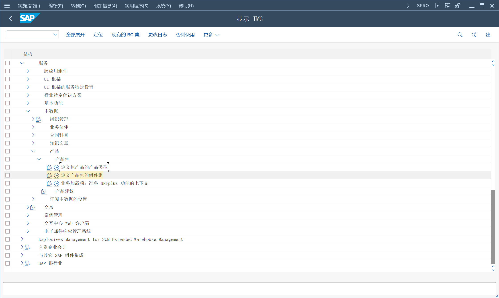

维护服务产品主数据记录（包括价格）
## 角色
> SAP_BR_PRODMASTER_SPECIALIST
>
> SAP_BR_PRICING_SPECIALIST
>
> SAP_BR_CUSTOMER_SERVICE_MGR
## App
> Create Material, 创建物料
>
> Set Material Prices - Sales, 设置物料价格 - 销售
>
> Manage Product Bundles, 管理产品包
## 创建服务产品
创建服务产品 
> SRV_CONTRACT
>
> SRV_CTR_RENEWAL
>
> SRV_02
>
> CSSRV_01

## 设置物料价格
条件记录

设置物料价格

## 创建产品包
创建包产品

设置物料价格

管理产品包（未找到 App)

产品包的组件组

