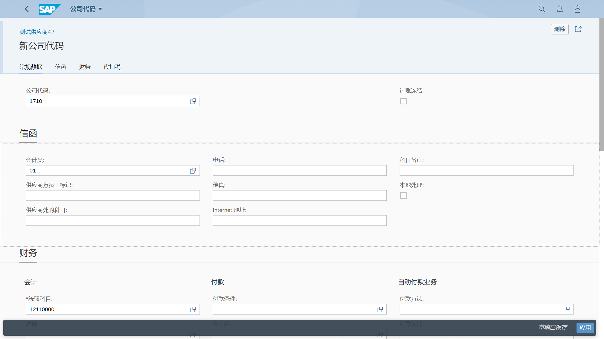

维护供应商主数据
## 角色
> SAP_BR_BUPA_MASTER_SPECIALIST
## App
> Maintain Business Partner, 维护业务伙伴
>
> Manage Supplier Master Data, 供应商主数据
## 维护业务伙伴
BP - 处理业务合作伙伴 
### 基本数据
选择 "组织" 创建组织基本数据, 输入组织名称

输入地址、通信信息, 可以在地址概览页签, 输入不同地址

在标识页签, 输入税号、税分类

在支付交易页签, 输入银行信息, 保存生成编号

### 公司代码数据
修改业务伙伴角色, FLVN00 供应商（财务会计）

选择公司代码视图, 输入公司代码、统御科目、排序码

在供应商支付交易页签, 输入付款条件

输入自动付款方式

在供应商信函页签, 输入会计职员, 保存信息

### 采购数据
修改业务伙伴角色, FLVN01 供应商

选择采购视图, 输入采购组织数据、货币、付款条件

维护装运条件, 保存数据

## 供应商主数据
### 基本数据
点击 "创建" 按钮, 选择 "组织" 创建组织基本数据, 输入信息后, 点击确定

跳转到供应商创建基本信息界面

维护角色、地址

维护银行信息、税号, 保存生成编号

### 公司代码数据
选择 "公司代码" 点击创建

跳转到公司代码界面, 维护公司代码、信函数据

维护财务会计数据, 点击 "应用", 保存信息

### 采购组织据
选择 "采购组织" 点击创建

跳转到采购组织界面, 维护采购组织数据, 点击 "应用", 保存信息

