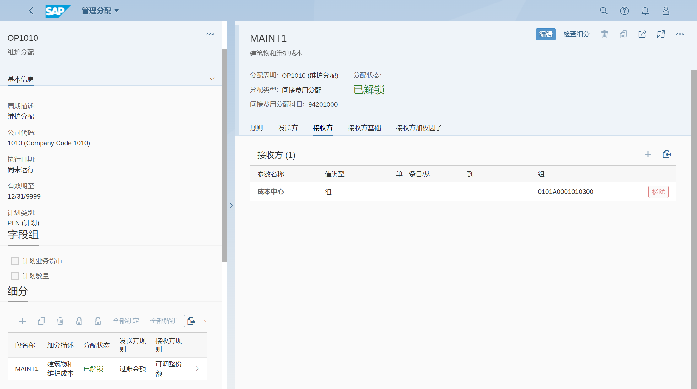

通用分配主数据, 对间接成本控制中的成本中心进行计划和实际评估/分配
## 角色
> SAP_BR_OVERHEAD_ACCOUNTANT
>
> SAP_BR_DIVISION_ACCOUNTANT
## App
> Manage Allocations, 管理分配
## 计划分配
创建分配, 分配上下文, 选择 成本中心

创建细分段

维护规则

发送方成本中心

接收方成本中心

## 实际分配
> 实际/计划：实际
## 计划利润中心分配
创建分配, 分配上下文, 选择 利润中心
## 实际利润中心分配
创建分配, 分配上下文, 选择 利润中心
> 实际/计划：实际