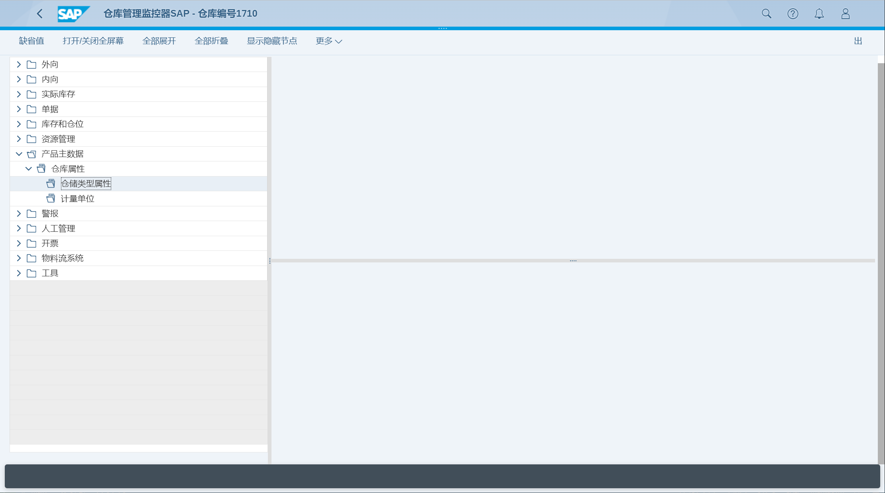
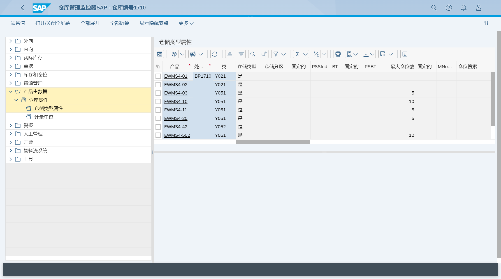
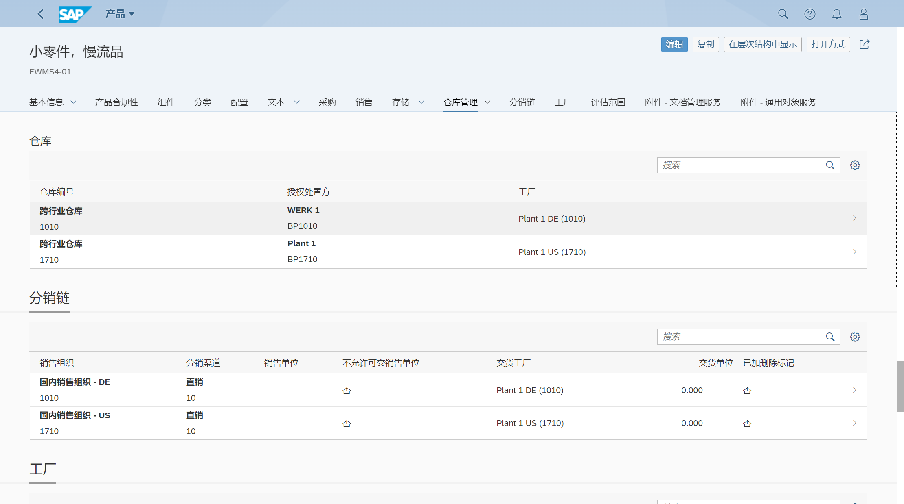
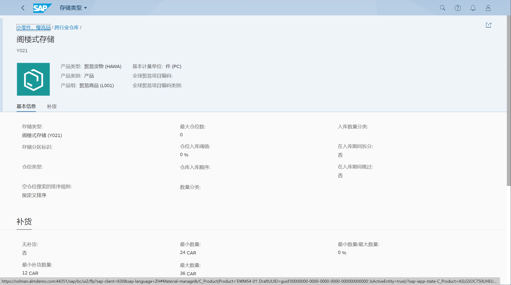

物料/产品主数据创建仓库相关属性
## 角色
> SAP_BR_WAREHOUSE_CLERK_EWM
>
> SAP_BR_PRODMASTER_SPECIALIST
## App
> Warehouse Monitor (/SCWM/MON), 仓库监控
>
> Manage Product Master Data, 管理产品主数据
## 维护仓库属性
打开仓库监控器, 进入产品主数据 -> 仓库属性 -> 仓储类型属性

维护仓储类型属性

打开管理产品主数据, 打开仓库管理

维护仓库编号

维护存储类型

维护仓储类型属性

