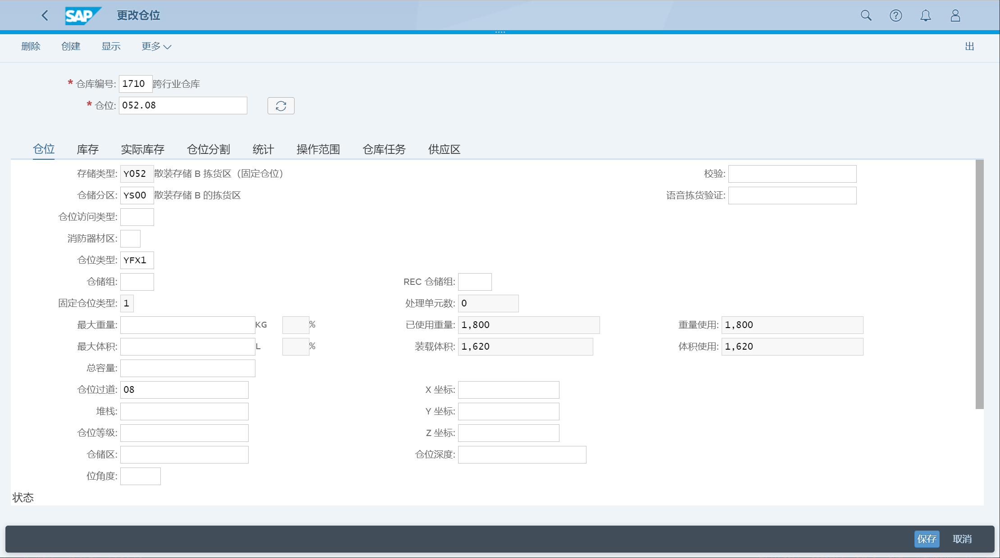

维护仓位
## 角色
> SAP_BR_WAREHOUSE_CLERK_EWM
## App
> Create Storage Bins (/SCWM/LS01), 创建仓位
>
> Edit Storage Bins (/SCWM/LS02), 更改仓位
>
> Display Storage Bins (/SCWM/LS03), 显示仓位
>
> Mass Edit Storage Bins (/SCWM/LS11), 批量更改仓位
>
> Assign Fixed Bins (/SCWM/BINMAT)
## 创建仓位
新建仓位, 维护存储类型

## 更改仓位

## 分配固定仓位

