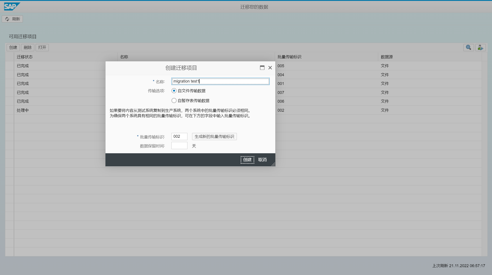
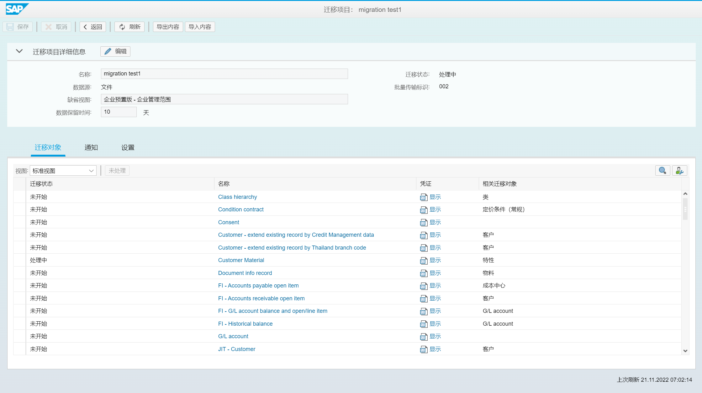
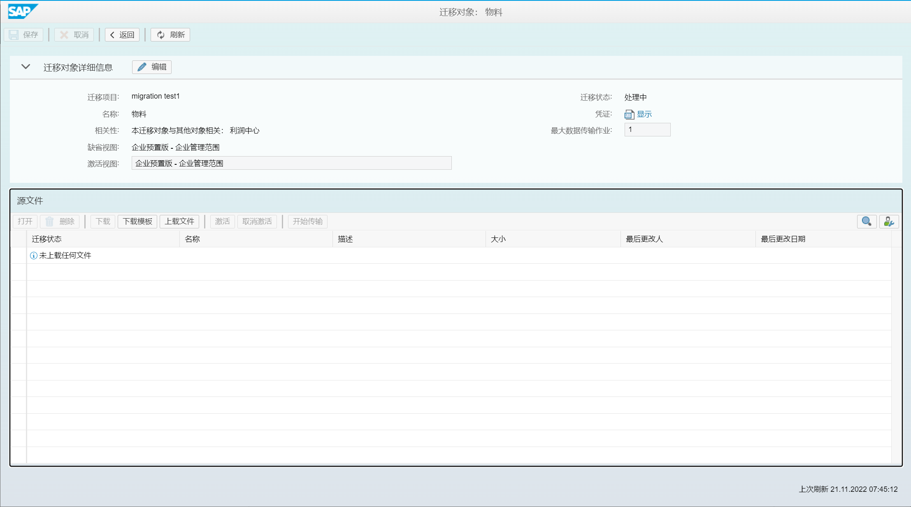
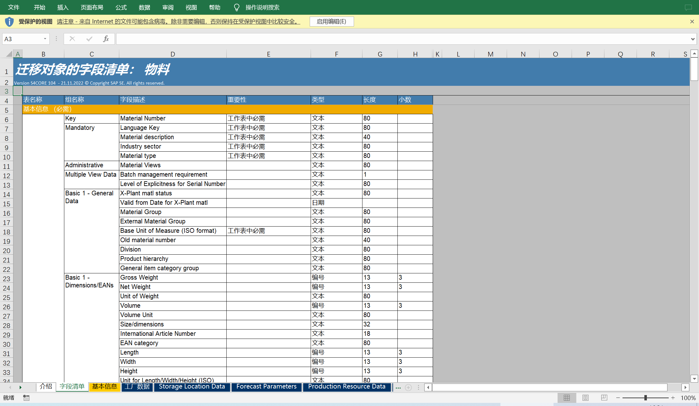
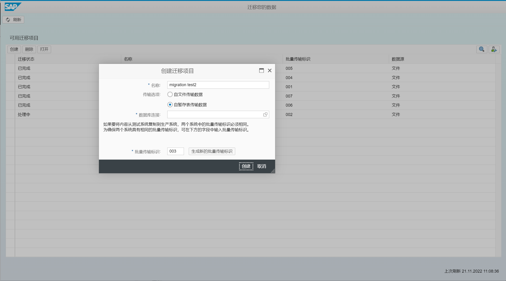
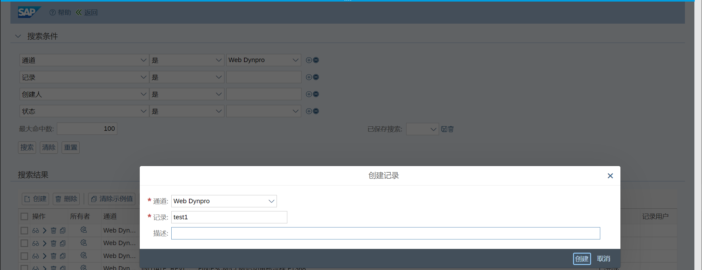
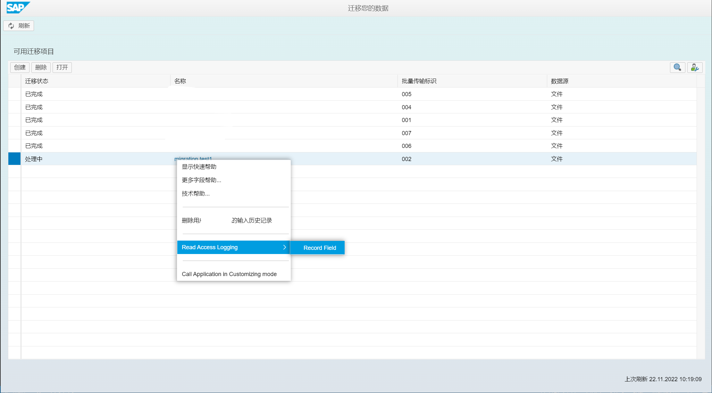

参考 [Data Migration](http://help.sap.com/S4_OP_DM)
[可用的迁移对象](http://help.sap.com/S4_OP_MO)

# 迁移数据 - 迁移主控室 Fiori
2020版, 之后可用

没有测试过
## 使用临时表迁移数据
FAQ [2733253](https://launchpad.support.sap.com/#/notes/2733253)

创建迁移项目、选择迁移对象、下载 XML / CSV 模板文件、传输数据到临时表

准备临时表、映射任务、模拟迁移、迁移

创建校正文件
## 直接从 SAP 系统迁移数据
使用基于 ABAP 的迁移和复制技术的 Note 分析器
[3016862](https://launchpad.support.sap.com/#/notes/3016862)

系统兼容性信息
[3209755](https://launchpad.support.sap.com/#/notes/3209755)

更新迁移主控室
[2870546](https://launchpad.support.sap.com/#/notes/2870546)
> CNV_PE_MC_LOAD_OBJECTS

创建迁移项目, 选择不同的迁移方案场景, 选择源系统的 RFC 连接

从源系统中选择数据, 公司代码、选择迁移对象、准备映射任务、模拟迁移、迁移

## 迁移对象建模器
LTMOM 
## 读取访问日志记录配置
用于监视和记录对敏感数据的读取访问
> SRALMANAGER

Channel: OData (Version 2.0)
> Migration Instance ID
>
> Migration Object ID
>
> Mapping Task ID
>
> Mapping Task Status
>
> Mapping Task Status ID
>
> Migration Instance Title
>
> Migration Instance Item field 1
>
> Migration Instance Item field 2
>
> ...

# 迁移主控室 LTMC
已弃用, 1909版之前可用

使用基于 ABAP 的迁移和复制技术的 Note 分析器
[3016862](https://launchpad.support.sap.com/#/notes/3016862)
> DMC_NOTE_ANALYZER

## 使用文件传输数据
设置上传文件大小
> icm/HTTP/max_request_size_KB

### 创建迁移项目
打开迁移主控室
> LTMC - 迁移主控室

创建迁移项目, 输入项目名称, 还可以指定临时数据保留时间

可以将迁移项目从一个系统传输到另一个系统, 需要在目标系统中创建一个相同类型的项目, 且传输标识 ID 确保相同。

### 使用迁移对象
将特定业务对象的数据迁移到 SAP S/4HANA。

如果迁移对象不符合业务需求, 可以查看预交付迁移对象的限制和可扩展性, 并对其进行调整 [2481235](https://launchpad.support.sap.com/#/notes/2481235)

单击迁移对象名称 "物料", 将相关的迁移对象复制到项目中

### 分配文件
选择 "下载模板", 使用 Microsoft Excel 打开 xml 文件, 填写数据。

仅支持 Microsoft Excel XML 电子表格 2003 文件, 15 位数字字段 [2718516](https://launchpad.support.sap.com/#/notes/2718516)

选择 "上传文件", 在源文件列表下, 可以打开文件检查

确认后, 选择文件, 点击 "激活"

### 数据传输
选择 "开始传输", 验证数据、值映射、模拟导入、执行导入

## 使用临时表传输数据
FAQ [2733253](https://launchpad.support.sap.com/#/notes/2733253)

维护数据库连接
> DBCO

SM30 维护连接名称, 允许使用连接进行迁移
> DMC_C_WL_DBCO_OP

### 创建迁移项目
打开迁移主控室
> LTMC - 迁移主控室

创建迁移项目, 输入项目名称, 选择源系统数据库连接, 还可以指定临时数据保留时间

可以将迁移项目从一个系统传输到另一个系统, 需要在目标系统中创建一个相同类型的项目, 且传输标识 ID 确保相同。

### 使用迁移对象
初次打开迁移对象时, 系统会自动在源系统中, 创建数据库表, 称为临时表, 显示在 "迁移对象详细信息" 屏幕

临时表命名格式
> /1LT/DS\<System ID>\<Numeric Identifier>

### 使用临时表
在 "迁移对象详细信息" 屏幕, 单击临时表的名称, 打开并检查表结构

填充数据库中的临时表数据, 并确保关键字段和必填字段包含有效数据

在 "临时表详细信息" 屏幕, 查看数据记录

### 数据传输
选择 "开始传输", 验证数据、值映射、模拟导入、执行导入

## 迁移对象建模器
LTMOM 

SE37 新建 Function 函数

> Function 不能包含 COMMIT WORK or ROLLBACK WORK
>
> 使用 BAPIRET2 返回消息结构, 参考 DMC_MIG_MAT_BOM
>
> 提供测试运行标识, 参考 DMC_MIG_ACC_DOCUMENT_POST

创建迁移对象, 选择功能函数, 源结构维护字段, 结构映射, 字段映射, 分配映射规则。然后ltmc下载源结构的模板

## 读取访问日志记录配置
用于监视和记录对敏感数据的读取访问
> SRALMANAGER

打开 "记录", 创建

选择 "开始记录", 按钮, 选择用户

右键选择需要记录的字段

Channel: Web Dynpro
> Name [Migration Object Name] 
>
> Migration Project
>
> Name [File Name]
>
> File Name
>
> Staging Table

打开 "配置", 点击 "创建", 选择记录创建配置, 保存并激活

转到 "监控器" 选项卡, 读取访问日志