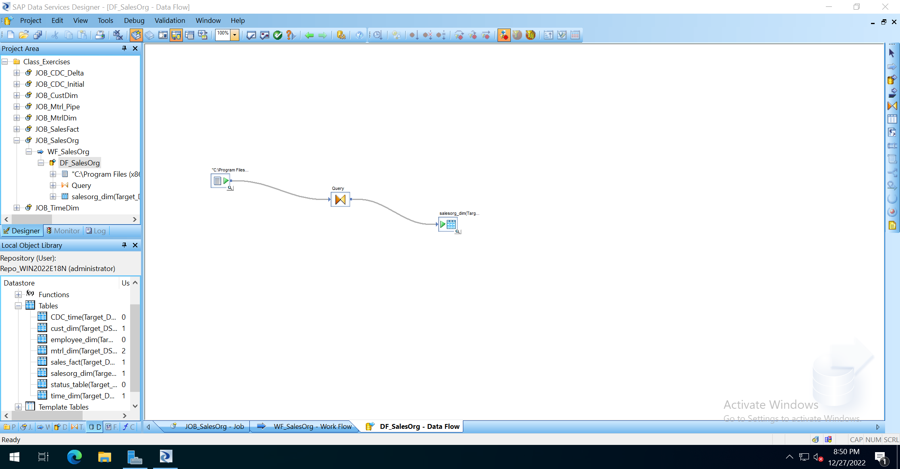

参考教程
[Tutorial](https://help.sap.com/docs/SAP_DATA_SERVICES?locale=en-US)
> \SAP BusinessObjects\Data Services\Tutorial Files

# 数据准备
安装 DS 时, 已安装使用了 SAP SQL ANYWHERE 数据库。

若使用 SAP SQL ANYWHERE 数据库, 

需要安装 Client 文件 51049954.zip, 安装后, 打开 SQL Central
> scjview.exe

以后需要使用 SQL Central 运行数据库文件, 可以在里面配置自动运行的服务

若使用 Microsoft SQL Server, 则可以直接使用 Microsoft SQL Server Management Studio

创建源数据库, 导入数据模型
> ODS
>
> ODS_Sybase.sql

创建目标数据库, 导入数据模型
> Target
>
> Target_Sybase.sql

配置系统 ODBC DSN 连接, 指定默认数据库
> ODS_DSN
>
> Target_DSN

# 创建数据存储并导入元数据
## 创建源存储库
在本地对象库中, 选择 Datastores, 右键菜单选择 New 创建数据存储
> 数据存储名称：ODS_DS
>
> 数据存储类型：Database
>
> 数据库类型：ODBC
>
> 选择 ODS_DSN, 输入连接信息

## 创建目标存储库
在本地对象库中, 选择 Datastores, 右键菜单选择 New 创建数据存储
> 数据存储名称：Target_DS
>
> 数据存储类型：Database
>
> 数据库类型：ODBC
>
> 选择 Target_DSN, 输入连接信息

## 导入元数据
选中数据存储, 右键选择打开。将会显示数据库中的表, 选中需要的表, 右键选择导入, 就可以在数据存储的 Tables 节点看到导入的表。

# 从平面文件填充表
使用 sales_org.txt 文件中的数据, 填充销售组织维度表
## 定义文件格式
指定一组描述平面文件结构的属性

打开对象库, 格式选项卡, 右键菜单选择新建 文件格式。

选择文件, 格式编辑器

## 创建新项目
创建新项目, 输入项目名 Class_Exercises
## 添加新作业
作业是一个可执行对象, 选中项目, 创建 New Batch Job, 输入 Job 名 JOB_SalesOrg
## 添加工作流
工作流包含软件执行作业的步骤顺序

从工具选项板中选择工作流按钮, 拖拽到 JOB 工作区, 输入 WF_SalesOrg
## 添加数据流
数据流包含通过数据流对象提取、转换和加载数据的指令

从工具选项板中选择数据流按钮, 拖拽到 work flow 工作区, 输入 DF_SalesOrg
## 定义数据流
### 将对象添加到数据流
从本地对象库, 格式选项卡, 选择平面文件 Format_SalesOrg, 拖拽到 Data Flow 工作区, 选择作为源

从工具选项板中选择 Query 转换图标

从数据存储 Target_DS 选择表 salesorg_dim, 拖拽到 Data Flow 工作区, 选择作为目标
### 定义数据流中步骤的顺序
数据服务从左到右读取数据流中的对象, 排列后, 将对象连接

### 配置查询转换
双击 Query 对象, 打开查询编辑器, 将左边源架构列, 拖拽到右边目标架构上, 映射关系

还可以修改目标字段类型

## 验证数据流
点击 Validate 验证按钮, 执行设计时验证, 检查语法等构造错误
## 保存项目、执行作业
选中 JOB 执行
# 填充时间维度表
时间维度表包含与日期和时间相关的属性, 如季节、假日期间、会计季度, 以及传统SQL样式的日期和时间数据类型无法直接获取的其他属性。
## 添加作业、数据流
> Job_TimeDim
>
> DF_TimeDim

## 添加时间数据流的组件
从本地对象库, 转换选项卡, 选择 Date_Generation, 作为输出

## 定义 Date_Generation 转换的输出
双击 Date_Generation, 选择输出期间、频率

## 定义查询的输出
双击 Query, 定义输出的日期字段, 到目标字段的转换函数

## 保存项目、执行作业
执行作业, 将按照定义的期间、频率, 输出日期字段, 并转换到目标表
# 使用关系表中的数据填充表
使用关系表中的数据填充客户维度表。然后使用 交互式调试器功能, 用于在数据流中的每个转换或对象流经数据后检查数据。
## 添加作业、工作流、数据流
> JOB_CustDim
>
> WF_CustDim
>
> DF_CustDim

## 定义数据流

## 保存项目、执行作业
## 交互式调试器
双击连线, 设置断点, 调试运行

# 从 XML 文件填充表
只有在平展层次结构后, 数据服务才能处理分层数据。此段的目标是平展嵌套架构 从 XML 文件将数据输出到表中。
## 添加作业、工作流、数据流
> JOB_MtrlDim
>
> WF_MtrlDim
>
> DF_MtrlDim
## 导入文档类型定义
导入DTD, 选择根 MTRL_MASTER_LIST, 订单、行项目

## 定义数据流
定义后, 需要按照分层的结构映射数据, 然后右键选择 Unnest 取消嵌套

## 保存项目、执行作业
## 利用XML_Pipeline
XML_Pipeline转换使用 SQL SELECT 语句等工具从 XML 文件中提取数据
## 作业、工作流、数据流
> JOB_Mtrl_Pipe
>
> WF_Mtrl_Pipe
>
> DF_Mtrl_Pipe
## 添加 XML_Pipeline
将嵌套列直接映射到平面目标表

## 保存项目、执行作业

# 从多个关系表中填充表
## 作业、工作流、数据流
> JOB_SalesFact
>
> WF_SalesFact
>
> DF_SalesFact
## 定义数据流
创建内部连接, 连接两个源表

创建函数, 将数据从非源表, 查找指定值, 填充目标数据

## 保存项目、执行作业

# 更改数据捕获
初始加载作业, 处理完后, 更新时间标记

增量加载作业, 从时间标记处, 增量处理
> (ODS_CUSTOMER.CUST_TIMESTAMP >= $GV_STARTTIME) and
(ODS_CUSTOMER.CUST_TIMESTAMP <= $GV_ENDTIME)

## 全局变量
仅在为其创建的作业中可用

## 初始作业
设置开始时间
> $GV_STARTTIME = '2008.01.01 00:00:000';
>
> $GV_ENDTIME = sysdate();

更新作业状态表
> sql('Target_DS', 'DELETE FROM dbo.CDC_time');
>
> sql('Target_DS', 'INSERT INTO dbo.CDC_time VALUES ({$GV_ENDTIME})');

## 增量作业
设置开始时间
> $GV_STARTTIME = to_date(sql('Target_DS', 'SELECT Last_Time FROM dbo.CDC_time'), 'YYYY-MM-DD HH24:MI:SS');
>
> $GV_ENDTIME = sysdate();

更新作业状态表
> sql('Target_DS', 'UPDATE dbo.CDC_time SET Last_Time = {$GV_ENDTIME}');

# 数据评估
## 验证转换
使用 Validation 转换功能, 添加规则, 用于标记、替换不合规值
## 审计对象
使用 Validation 转换功能, 将不合规值, 添加到第二张目标表
# 恢复机制
在发生故障后可以重复运行的工作流, 而无需加载重复数据
# 提取 SAP 应用程序数据
定义数据存储, 选择高级, 指定 Client , 导入元数据
# 实时作业
数据服务接收来自ERP系统和Web应用程序的请求并立即发送回复