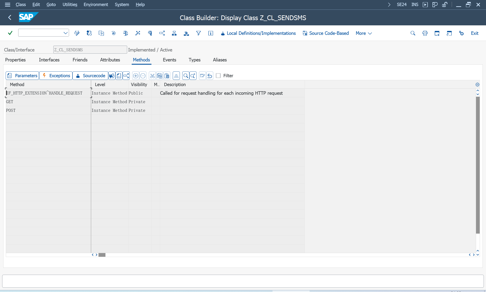
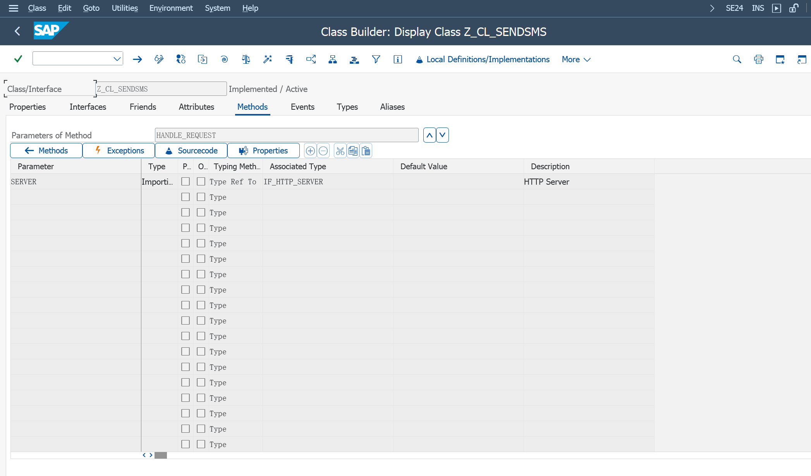
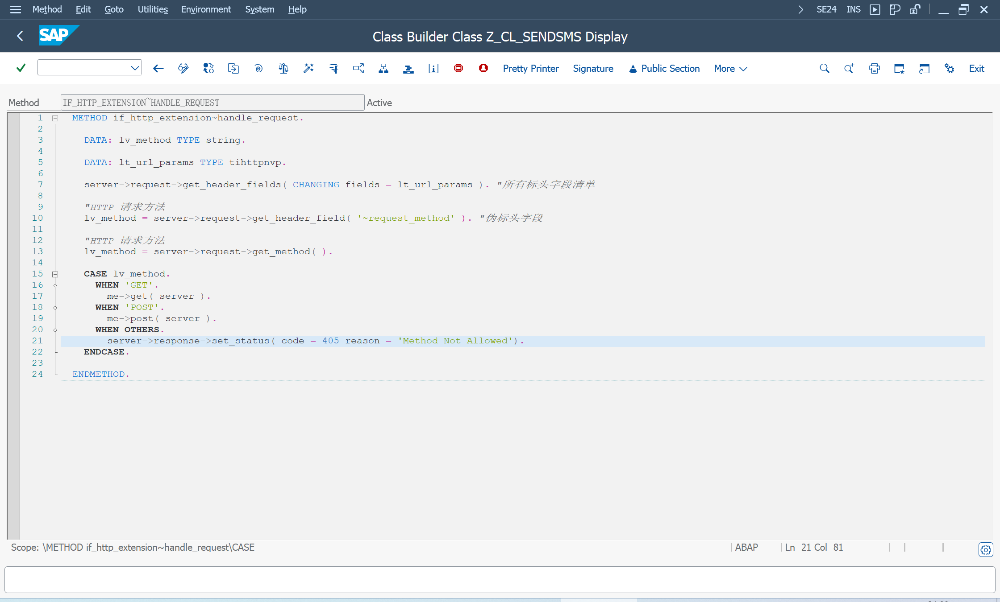
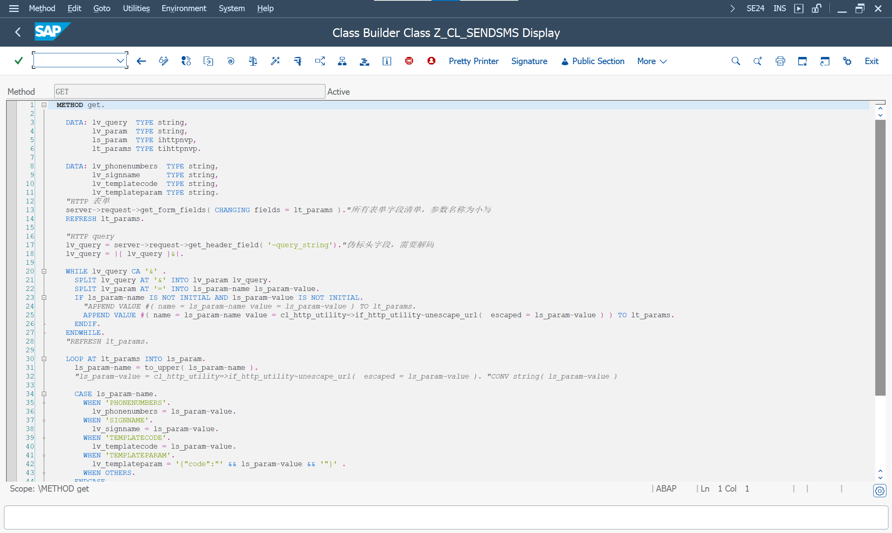
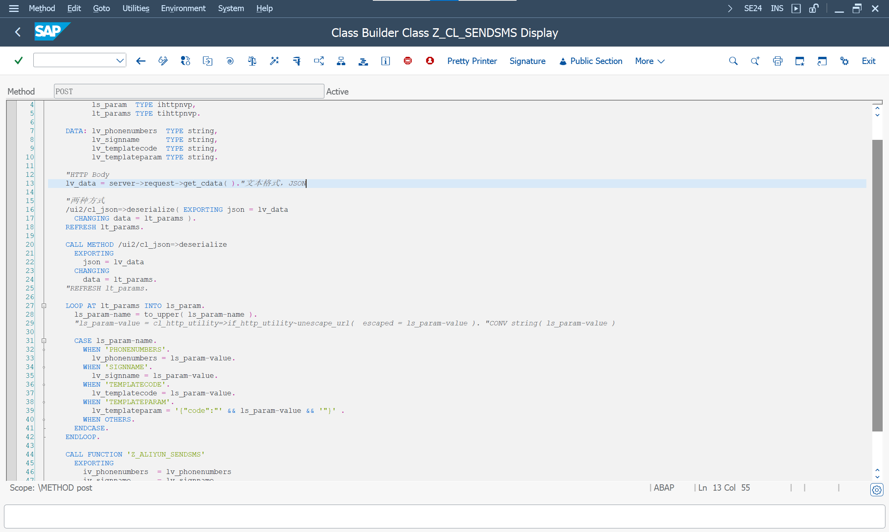
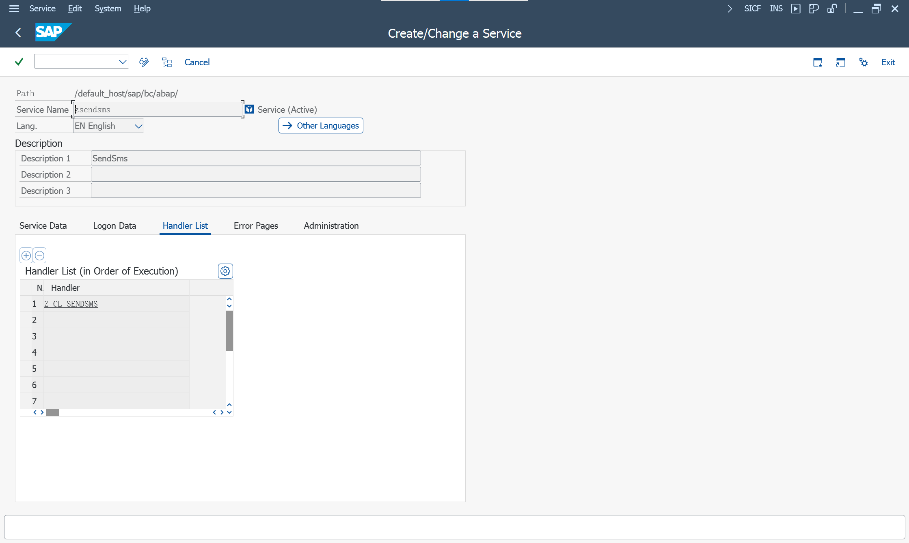
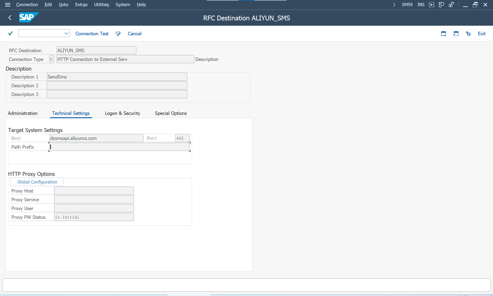
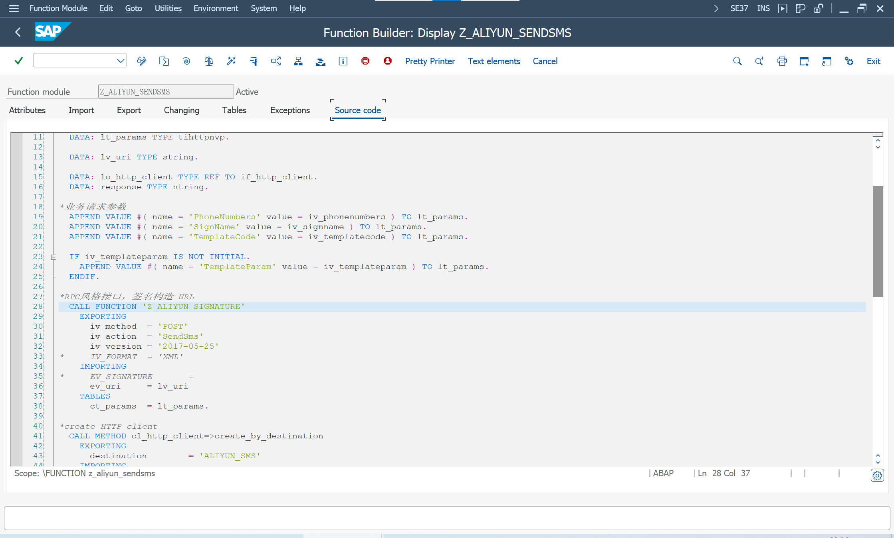
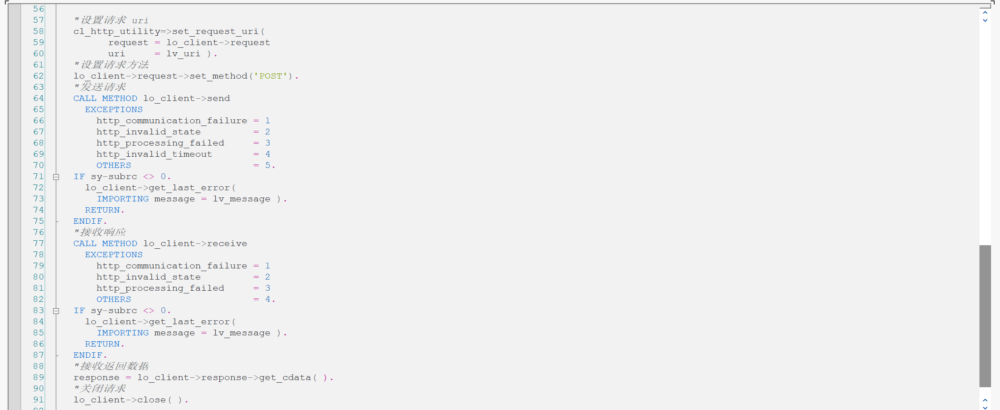

参考 [SAP Help Portal](https://help.sap.com/)
> Connectivity

实现一个 HTTP 服务端 'zsendsms', 可以在 SM59 维护 HTTP 目标服务路径

在 SCOT 维护了 HTTP 节点后, 可以在 SBWP 业务工作台, 发送短信

实现一个 HTTP 客户端 'z_aliyun_sendsms' , 访问阿里云短信接口

## HTTP 请求处理程序
> SE24 - ABAP Class Builder

创建一个 HTTP 请求处理程序的类

将接口 IF_HTTP_EXTENSION 分配给已创建的类

实现方法 HANDLE_REQUEST()

为了能够访问请求和响应数据, 使用接口 IF_HTTP_SERVER 作为方法 HANDLE_REQUEST() 的参数。

如果要更详细地处理传入请求, 使用属性 FLOW_RC 和 LIFETIME_RC

### 定义类
新建类 Z_CL_SENDSMS

分配接口 IF_HTTP_EXTENSION

在方法 IF_HTTP_EXTENSION~HANDLE_REQUEST 内, 处理访问请求和响应数据

方法的参数, 分配 IF_HTTP_SERVER

### 处理请求
获取请求方法
> request->get_method( )

使用伪标头, 获取请求方法
> request->get_header_field( '~request_method' )

标头字段清单, 可以看到伪标头 '~request_method', 请求的 Headers 数据都在里面
> request->get_header_fields( CHANGING fields = lt_url_params )

#### GET 请求
使用伪标头, 获取请求参数, 还需要使用 '&' 拆分多个参数, 每个参数还需要使用 '=' 拆分出参数名和参数值, 还需要解码
> request->get_header_field( '~query_string')
>
> cl_http_utility=>if_http_utility~unescape_url( escaped = ls_param-value )

也可以直接访问表单字段, Params 参数名称是小写, 请求的 Params, Body 的 form 数据都在里面
> request->get_form_fields( CHANGING fields = lt_params )

根据传入的参数, [执行 HTTP 请求](#执行-http-请求), 发送短信

#### POST 请求
通过 HTTP 的 SMS：新功能 [1917416](https://me.sap.com/notes/1917416)

访问正文数据, 作为字符数据返回
> request->get_cdata( )

数据格式为 JSON

[{"NAME":"PHONENUMBERS","VALUE":"<reci_addr>"},...]

JSON 处理

> /ui2/cl_json=>deserialize( EXPORTING json = lv_data CHANGING data = lt_params )

根据传入的参数, [执行 HTTP 请求](#执行-http-请求), 发送短信

## 创建和配置 ICF 服务
> SICF - HTTP Service Hierarchy Maintenance

新建服务, 在 Handler List 维护上面创建的类 Z_CL_SENDSMS

激活服务, 此时 'zsendsms' 服务实现完成

## 执行 HTTP 请求
访问阿里云 OpenAPI 短信发送接口 SendSms

采用 RPC 签名风格

业务请求参数
> PhoneNumbers, 接收短信的手机号码
>
> SignName, 短信签名名称, 需要申请
>
> TemplateCode, 短信模板 CODE, 需要申请
>
> TemplateParam, 短信模板变量对应的实际值, 发送验证码使用

### 创建目标
维护阿里云短信服务的 Host, 选择 SSL

STRUST 维护 SSL 证书

### 创建客户端
cl_http_client=>create_by_destination

### 设置请求 URI

cl_http_utility=>set_request_uri( )

使用 RPC 签名函数, 构造 uri

### 设置请求方法
client->request->set_method('POST')

### 发送请求
client->send

异常报错信息
client->get_last_error( )

### 接收响应
client->receive( )

异常报错信息
client->get_last_error( )

### 接收返回数据
client->response->get_cdata( )

### 关闭请求
client->close( )