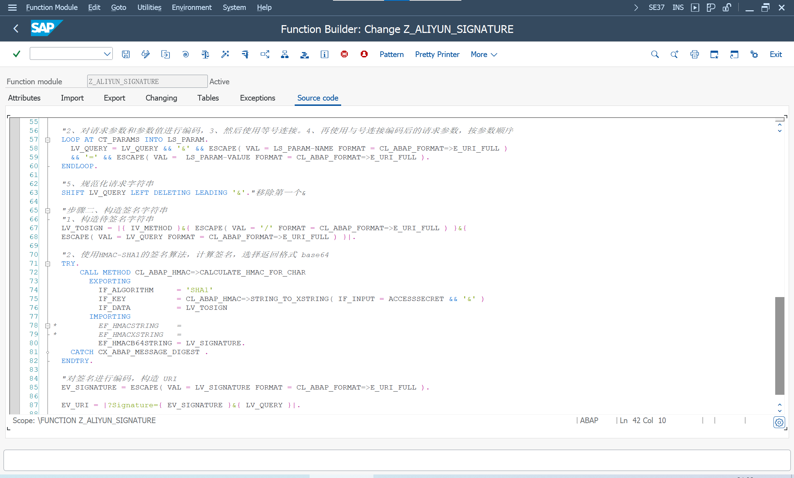

短信服务的 OpenAPI 采用 [RPC 风格接口](https://help.aliyun.com/zh/sdk/product-overview/rpc-mechanism)

生成 RPC 签名, 构造 URI, 作为 HTTP 客户端请求参数

## 请求参数
### 公共请求参数
阿里云 OpenAPI 的公共请求参数

> Action, API 的名称, 由业务请求传入
>
> Version, API 版本, 由业务请求传入
>
> Format, 返回数据的格式, 'XML','JSON'

> AccessKeyId, 阿里云访问密钥 ID, 对应的密钥在签名时使用
>
> SignatureNonce, 签名唯一随机数
>
> Timestamp, 当前时间戳, 格式 '\_\_\_\_-\_\_\-\_\_T\_\_:\_\_:\_\_Z'
>
> SignatureMethod, 签名方式, 固定 'HMAC-SHA1'
>
> SignatureVersion, 签名算法版本, 固定 '1.0'

> Signature, 请求签名, 根据签名机制计算的结果

随机数
> signaturenonce = cl_system_uuid=>create_uuid_c32_static( )

时间戳
> GET TIME STAMP FIELD lv_timestamp, 当前时间
>
> WRITE lv_timestamp TO timestamp USING EDIT MASK lv_timestampformat TIME ZONE '0', 指定格式

### 业务请求参数
每个 OpenAPI 自定义的请求参数

由业务请求传入

## 签名机制
为保证 API 的安全使用, 在调用 API 时阿里云会对每个 API 请求通过签名 'Signature' 进行身份验证

无论使用 HTTP 还是 HTTPS 协议提交请求, 都需要在请求中包含签名信息

### 构造规范化请求字符串
1, 参数排序
> SORT ct_params BY name

2, 对请求参数和参数值进行编码
> escape( val = ls_param-name format = cl_abap_format=>e_uri_full )
>
> escape( val = ls_param-value format = cl_abap_format=>e_uri_full )

3, 使用等号 '=' 连接, 编码后的请求参数和参数值

4, 使用与号 '&' 连接编码后的请求参数, 注意参数顺序

5, 得到规范化请求字符串 lv_query

### 构造签名字符串
1、构造待签名字符串 lv_tosign
> lv_tosign = |{ iv_method }&{ escape( val = '/' format = cl_abap_format=>e_uri_full ) }&{
escape( val = lv_query format = cl_abap_format=>e_uri_full ) }|

2、使用HMAC-SHA1的签名算法, 计算签名
> CL_ABAP_HMAC=>CALCULATE_HMAC_FOR_CHAR

需要 AccessKeyId 对应的密钥 AccessSecret

### 对签名进行编码，构造 URI
> ev_signature = escape( val = lv_signature format = cl_abap_format=>e_uri_full )

> ev_uri = |?Signature={ ev_signature }&{ lv_query }|

