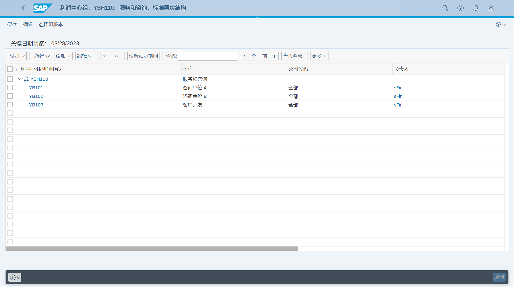
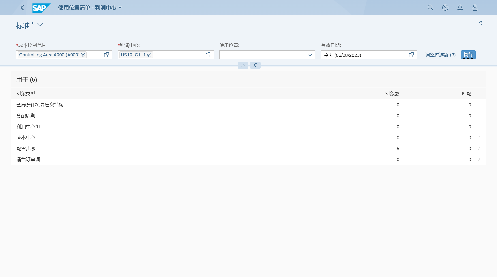
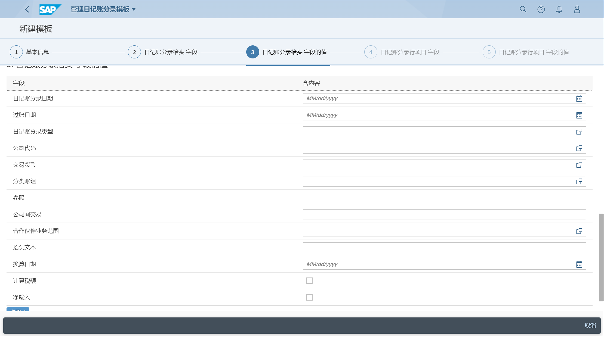
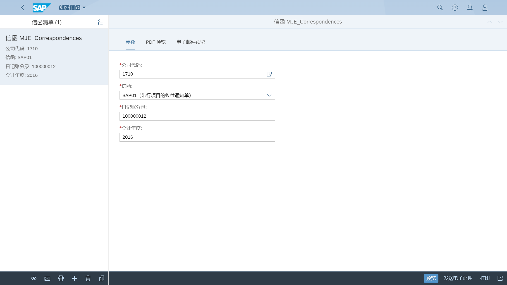
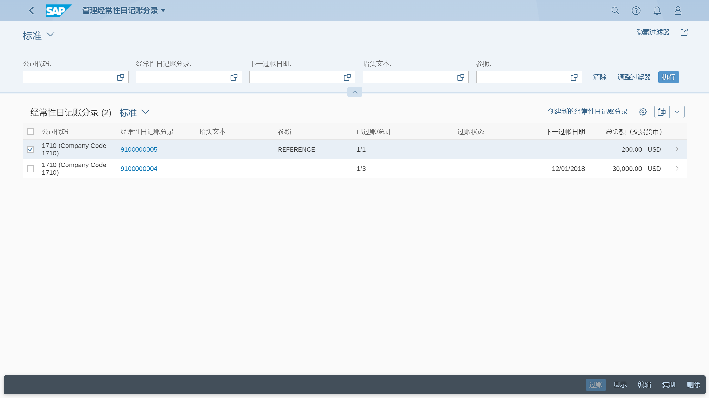
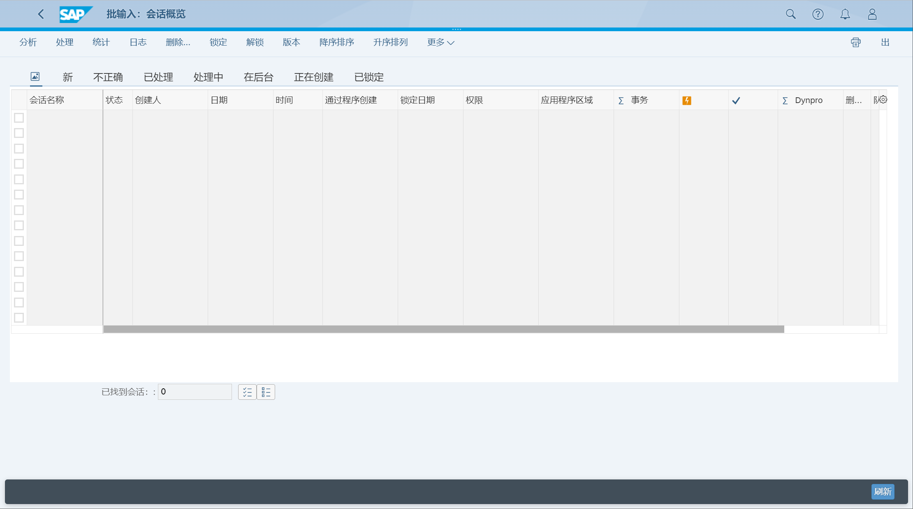
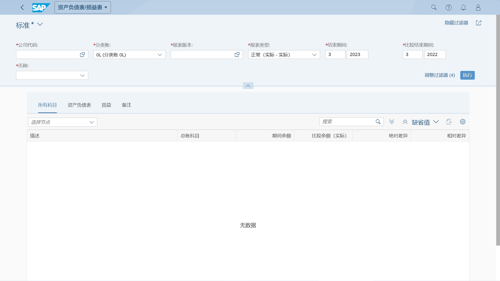

## 角色
> SAP_BR_GL_ACCOUNTANT
>
> SAP_BR_DIVISION_ACCOUNTANT
>
> SAP_BR_AP_ACCOUNTANT_CN
>
> SAP_BR_GL_ACCOUNTANT_CN
>
> SAP_BR_BUSINESS_PROCESS_SPEC
>
> SAP_BR_BPC_EXPERT
## App
> Manage G/L Account Master Data (F0731A), 管理总账科目主数据
>
> Manage Financial Statement Versions (OB58), 维护财务报表版本
>
> Manage Chart of Accounts (F0763A), 管理科目表
>
> Manage Operating Chart of Accounts (F0763B), 管理营业科目表
>
> G/L Account Changes (S_ALR_87012308), 总账科目更改
>
> Manage Profit Center Groups (FAC_PCG), 管理利润中心组
>
> Manage Profit Centers (F3516), 管理利润中心
>
> Edit Profit Centers - Collective (KE55), 编辑利润中心 - 集中
>
> Edit Company Code Assignment - Profit Centers (KE56), 编辑公司代码分配 - 利润中心
>
> Where-Used List - Profit Centers (F3751), 使用位置清单 - 利润中心
>
> Change Log - Profit Centers (F3810), 变更日志 - 利润中心
>
> Manage Journal Entry Templates (F3803), 管理日记账分录模板
>
> Post General Journal Entries (F0718), 过账一般日记账分录
>
> Schedule General Ledger Jobs (F1927), 计划总账作业
>
> Manage Journal Entries (F0717), 管理日记账分录
>
> Upload General Journal Entries (F2548), 上载一般日记账分录
>
> Manage Workflows for Journal Entry Verification - In General Ledger (F2720), 管理用于一般日记账分录验证的工作流
>
> Manage Teams and Responsibilities For Journal Entry Verification - In General Ledger (F3932), 管理团队和责任 - 常规日记账分录验证
>
> Verify General Journal Entries - For Requester (F2547), 验证一般日记账分录 - 针对申请人
>
> Verify Journal Entries in General Ledger - For Processor (Inbox) (F2728), 验证一般日记账分录 - 针对处理人（收件箱）
>
> Display Document Flow (F3665), 显示凭证流
>
> Display G/L Account Balances (F0707A), 显示总账科目余额
>
> Display G/L Account Balances - China (F2141), 显示总账科目余额 - 中国
>
> Display Line Items in General Ledger (F2217), 显示总账中的行项目
>
> Display Line Item Entry (F2218), 显示行项目条目
>
> Manage Recurring Journal Entries (F1598), 管理经常性日记账分录
>
> Display Changes of Recurring Entry (FBD4), 显示周期性分录变更
>
> Audit Journal (F0997), 审计日记账
>
> Journal Entry Analyzer (FIS_FPM_OVP_JEANA), 日记账分录分析器
>
> Clear G/L Accounts - Manual Clearing (F1579), 清账总账科目 - 手动清账
>
> Reset Cleared Items (F2223), 重置清账行项目
>
> Clear Open Items Automatically (F.13), 自动清算未清项目
>
> Currency Exchange Rates (F3616), 货币汇率
>
> Import Foreign Exchange Rates (F2092), 导入外汇汇率
>
> Repost GR/IR Clearing (F.19), 重过账收货/收发票清账
>
> Run Balance Interest Calculation (F.52), 运行余额利息计算
>
> Perform Foreign Currency Valuation (FAGL_FCV), 执行外币评估
>
> Post Currency Adjustments (F1606), 过账货币调整
>
> Verify Currency Adjustments - For Requester (F4670), 验证货币调整 - 针对申请人
>
> Verify Data Flow (ACC_ECS_MAINTAIN), 验证数据流
>
> Post Tax Payables (F1597), 过账应付税款
>
> Regroup Receivables / Payables (FAGLF101), 重新分组应收账款/应付账款
>
> Batch Input Sessions in My Area (SM35SA), 我的区域中的批输入会话
>
> Import Financial Plan Data (F1711), 导入财务计划数据
>
> Balance Sheet/Income Statement (F0708), 资产负债表/损益表
>
> Balance Sheet / Income Statement - Multidimensional (F3084), 资产负债表/损益表 - 多维度
>
> Cash Flow Statements - China (IDCNCASH), 现金流量表 - 中国
>
> Create Adjustment Documents - China (IDCN_ADJNEW), 创建调整凭证 - 中国
>
> Create Supplier Invoice (F0859), 创建供应商发票
>
> Determine Offsetting Accounts Manually - China (J3RKKRD), 手动确定抵消科目 - 中国
>
> Determine Offsetting Accounts Automatically - China (J3RKKRS), 自动确定抵消科目 - 中国
>
> Trial Balance (F0996), 试算平衡表
>
> Year-to-Date Balance (W0177), 年初至今余额
>
> Balance Carryforward Status (F4683), 余额结转状态
>
> Accounts Document Output - China (IDCNDOC_CLD), 科目凭证输出
>
> Display Journal Entries - In T-Account View (F3664), 显示日记账分录 - 丁字科目视图
>
> Statement of Changes in General Ledger (W0162), 总账变动表
>
> Manage Incoming VAT Invoices - China (F2325), 管理增值税进项发票 - 中国
## 管理总账科目主数据

## 维护财务报表版本

选择财务报表项目

分配科目

## 管理科目表

## 管理营业科目表
未找到 App
## 总账科目更改

## 管理利润中心组

## 管理利润中心

## 批量维护利润中心

## 编辑公司代码分配 - 利润中心

## 使用位置清单 - 利润中心

## 变更日志 - 利润中心

## 管理日记账分录模板

## 过账一般日记账分录

### 过帐具有自动冲销功能的

选择可自动冲销的模板, Post General Journal Entries with Auto-reverse

计划总账作业

管理日记账分录

## 上载一般日记账分录

## 验证一般日记账分录
### 管理用于一般日记账分录验证的工作流

### 管理团队和责任 - 常规日记账分录验证

### 验证一般日记账分录 - 针对申请人

## 验证一般日记账分录 - 针对处理人（收件箱）
选择批准、转发、拒绝

## 管理日记账分录
创建信函

选择信函格式

## 显示凭证流

## 显示总账科目余额

## 显示总账科目余额 - 中国
未找到 App
## 显示总账中的行项目

## 显示行项目条目

## 管理经常性日记账分录

## 显示周期性分录变更

## 审计日记账

## 日记账分录分析器

## 清账总账科目 - 手动清账

## 重置清账行项目

## 自动清算未清项目

## 货币汇率

## 导入外汇汇率

## 重过账收货/收发票清账

## 运行余额利息计算

## 执行外币评估

## 过账货币调整

## 验证货币调整 - 针对申请人
未找到 App

## 验证数据流
执行外币评估后验证

## 过账应付税款

## 重新分组应收账款/应付账款

## 我的区域中的批输入会话

## 导入财务计划数据

## 资产负债表/损益表

## 现金流量表 - 中国

## 创建调整凭证 - 中国

## 创建供应商发票

## 手动确定抵消科目 - 中国

## 自动确定抵消科目 - 中国

## 试算平衡表

## 年初至今余额
未找到 App
## 余额结转状态
未找到 App
## 科目凭证输出

## 显示日记账分录 - 丁字科目视图

## 总账变动表
未找到 App
## 管理增值税进项发票 - 中国

