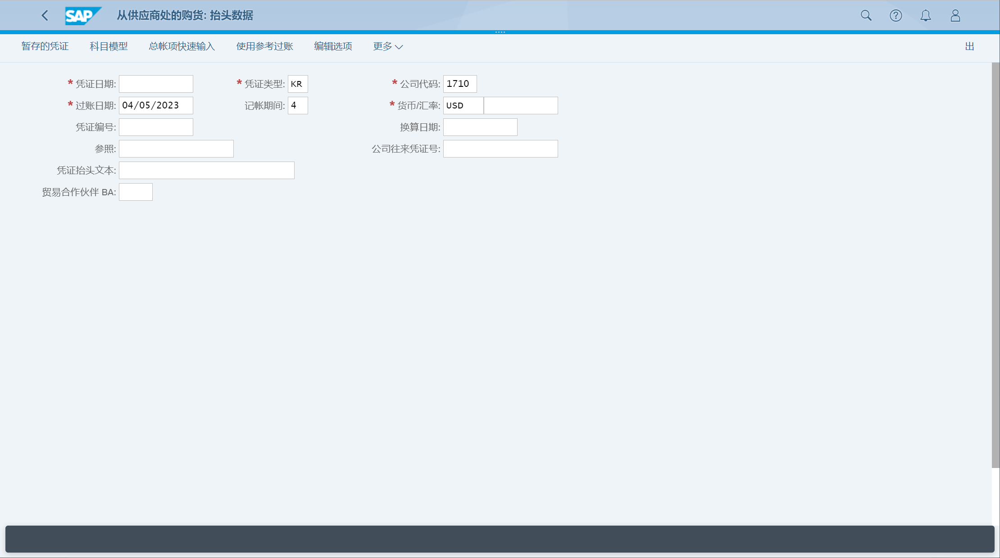

## 角色
> SAP_BR_AA_ACCOUNTANT
>
> SAP_BR_BPC_EXPERT
>
> SAP_BR_PURCHASER
>
> SAP_BR_PURCHASING_MANAGER
>
> SAP_BR_WAREHOUSE_CLERK
>
> SAP_BR_AP_ACCOUNTANT
>
> SAP_BR_GL_ACCOUNTANT
>
> SAP_BR_AP_ACCOUNTANT_PROCUREMT
>
> SAP_BR_MANAGER_PROCUREMENT
## App
> Create Purchase Requisition - Advanced (ME51N), 创建采购申请 - 高级
>
> Process Purchase Requisitions - Formerly Manage Purchase Requisitions (F1048), 管理采购申请
>
> Manage Purchase Orders (F0842A), 管理采购订单
>
> My Inbox - All Items (F0862), 我的收件箱 - 所有项目
>
> Post Goods Receipt for Purchasing Document (F0843), 过账采购订单的收货
>
> Create Supplier Invoice - Advanced (MIRO), 创建供应商发票 - 高级
>
> Manage Fixed Assets (F3425), 管理固定资产
>
> Post Acquisition (Integrated AP) - Without Purchase Order (F-90), 过账购置（集成应付账款）- 无采购订单 
>
> Post Acquisition (Non-Integrated) - With Automatic Offsetting Entry (ABZOL), 过账购置（非集成）- 含自动抵消条目 
>
> Post Credit Memo - In Year of Invoice (ABGLL), 过账贷项凭证 - 发票年度中
>
> Post Credit Memo - After Year of Invoice (ABGF), 过账贷项凭证 - 发票年度后
>
> Post Retirement (Integrated AR) - With Customer (F-92), 过账报废（集成应收账款）- 有客户
>
> Post Retirement (Non-Integrated) - Without Customer (ABAON), 过账报废（集成应收账款）- 无客户
>
> Post Retirement - By Scrapping (ABAVN), 过账报废 - 通过报废
>
> Post Transfer - Within Company Code (ABUMN), 过账转移 - 公司代码内
>
> Post Post-Capitalization (ABNAN), 过账后资本化
>
> Post Writeup (ABZU), 过账增记
>
> Post Depreciation Manually - Unplanned and Planned (ABAAL), 手动过账折旧 - 计划外和计划
>
> Post Asset Revaluation (ABAWL), 过账资产重估
>
> Schedule Asset Accounting Jobs (F1914), 计划资产会计作业
>
> Asset Balances, 资产余额
>
> Asset Transactions (F1614), 资产交易
>
> Depreciation Lists (F1616), 折旧清单
>
> Display Asset Master Worklist(F1592), 显示资产主数据工作清单
>
> Asset History Sheet, 资产历史数据表
>
> Make Company Code Settings - Asset Accounting-Specific (FAA_CMP), 对公司代码进行设置 - 特定于资产会计
## 主数据
[资产](/Database-and-Data-Management/Master-Data-Catalog/Asset/Asset.md "BNI")
### 创建资产主数据
### 变更、显示、冻结
### 创建子资产号
### 资产主数据更改记录
### 资产价值
## 通过直接资本化收购资产
### 创建采购申请
### 采购申请转换为采购订单
### 更改采购订单
### 批准采购订单
### 采购订单收货
### 按行项目的收发票
## 收购
### 过账购置（集成应付账款）- 无采购订单 

### 过账购置（非集成）- 含自动抵消条目 
### 过账贷项凭证 - 发票年度中
### 过账贷项凭证 - 发票年度后
## 报废
### 过账报废（集成应收账款）- 有客户
### 过账报废（集成应收账款）- 无客户
### 过账报废 - 通过报废
## 估值（转移和手动价值修正）
### 冲销日记账分录（特定于资产会计）
### 过账转移 - 公司代码内
### 过账后资本化
### 过账增记
### 手动过账折旧 - 计划外和计划
### 过账资产重估
## 月末结账
### 计划资产会计作业
### 资产余额
### 资产交易
### 折旧清单
### 资产价值
## 年末结账
### 资产历史数据表
### 折旧清单
### 年末结账
### 年末期末资产核算（跨公司代码和分类账）
### 撤销年末结账