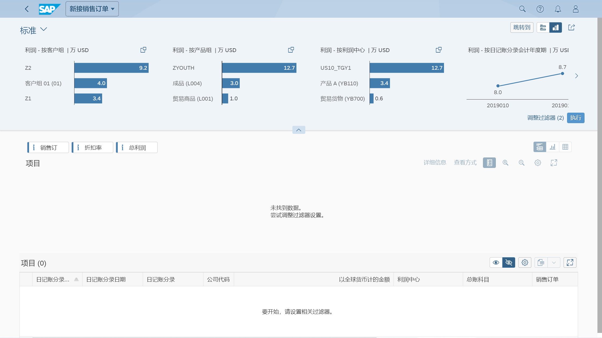

## 角色
> SAP_BR_SALES_ACCOUNTANT
>
> SAP_BR_BPC_EXPERT
## App
> Incoming Sales Orders - Predictive Accounting (F2964), 新接销售订单 - 预测会计核算
>
> Gross Margin - Presumed/Actual (F3417), 毛利率 - 假定/实际
## 新接销售订单 - 预测会计核算

## 毛利率 - 假定/实际
未找到 App