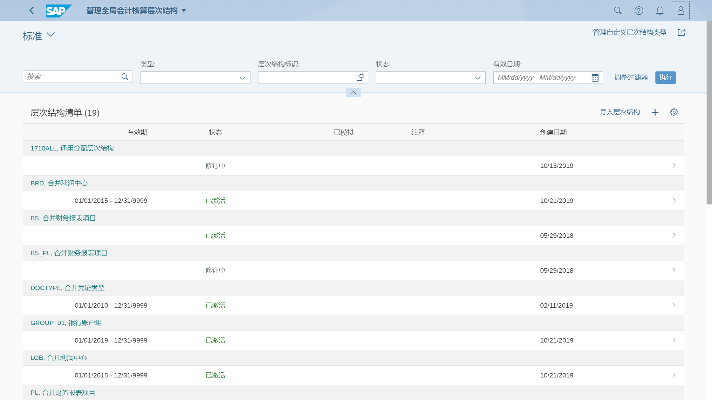
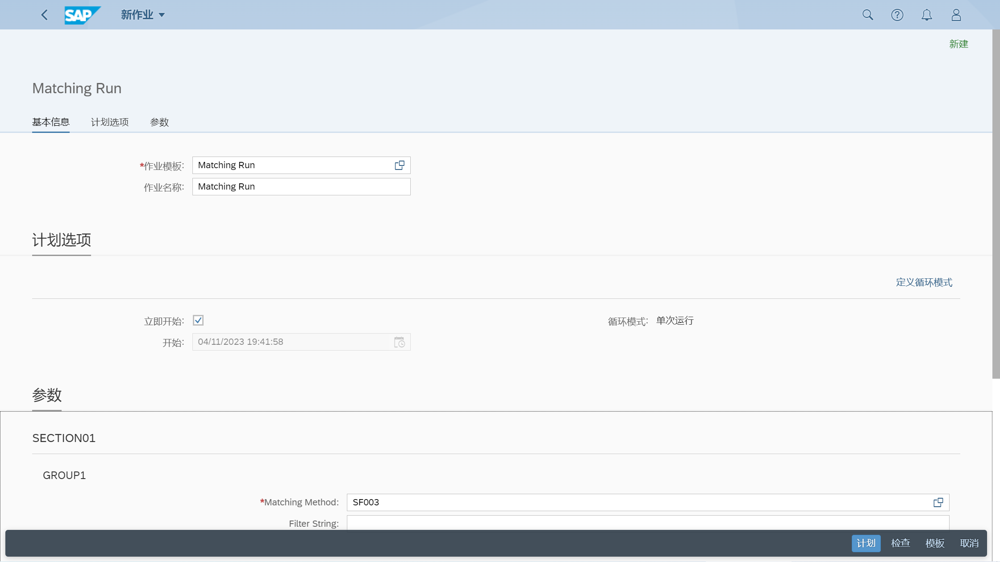
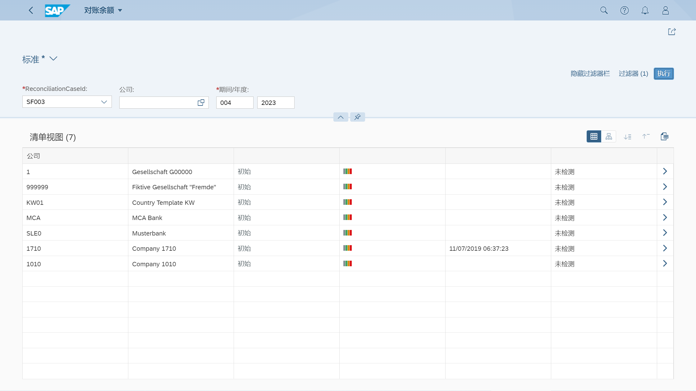
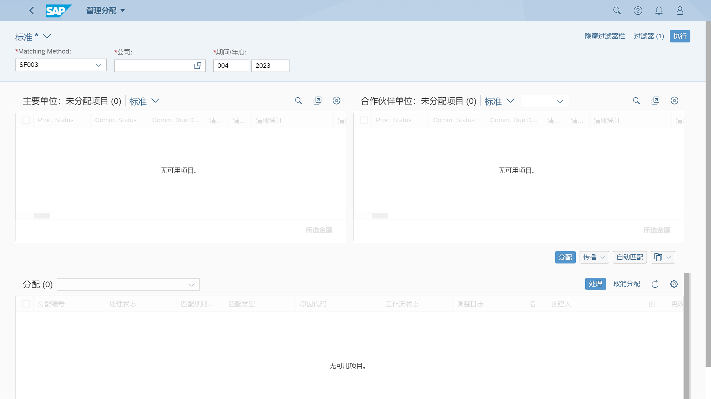
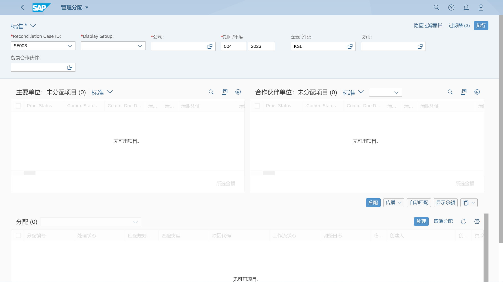

## 角色
> SAP_BR_RECON_ACCOUNTANT
>
> SAP_BR_GL_ACCOUNTANT
## App
> Manage Global Hierarchies (F2918), 管理全局会计核算层次结构
>
> Currency Exchange Rates (F3616), 货币汇率
>
> Define Matching Methods (F3862), 定义匹配方法
>
> Schedule Matching Run Jobs (F5011), 计划匹配运行作业
>
> Reconciliation Status Overview (F3865), 对账状态概览
>
> Reconciliation Balances (F3865), 对账余额
>
> Manage Assignments - By Reconciliation Case, 管理分配 - 按对账案例
>
> Display Matching Items - By Matching Method (F3869), 显示匹配项目 - 按匹配方法
>
> Manage Teams and Responsibilities (Intercompany), 管理团队和职责（公司间）
>
> Manage Assignments - By Matching Method (F3870), 管理分配 - 按匹配方法
>
> Manage Your Solution (F1241), 管理您的解决方案
>
> Define Matching Methods (F3862), 定义匹配方法
## 公司间对账准备
管理全局会计核算层次结构

维护货币汇率

## 计划匹配运行作业

## 对账状态概览

## 对账余额

## 管理分配
按匹配方法

按对账案例

