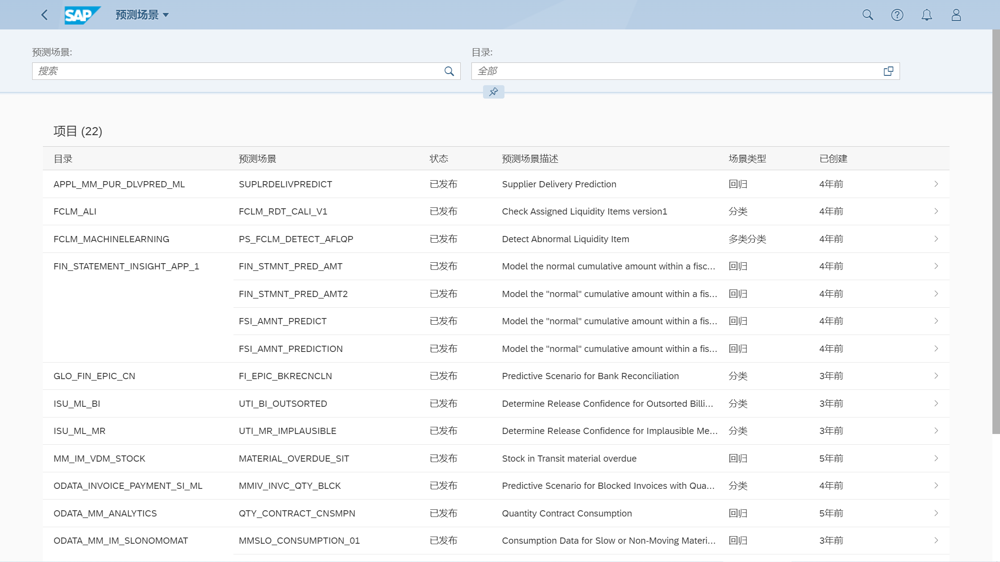
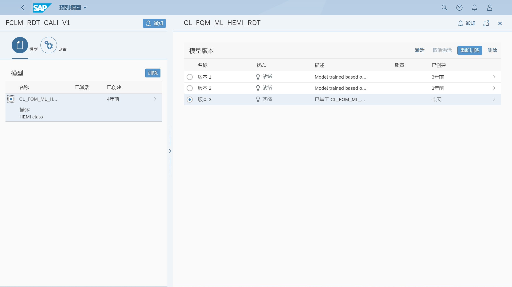

基于历史数据，检查分配的流动性项目

对已发布的预配制智能场景进行操作，训练、部署和激活
## 角色
> SAP_BR_ANALYTICS_SPECIALIST
## App
> Intelligent Scenario Management，预测场景
>
> Predictive Scenario，预测模型

## 训练模型
训练后，激活版本，点开详细版本查看报表

预测模型不显示时 [2764539](https://launchpad.support.sap.com/#/notes/2764539)

从 Client 000 复制到当前，RSANAUMMTRMODEL
> RSANA_UMM2_COPY_TR_MODELS