生成传出付款的付款文件, 然后上传到网上银行付款。也可以上传银行发送的电子银行对账单, 并进一步处理

由 SAP 生成可以上传到网银的文件, 参考各个银行不同的文件格式, 可体验:
[招行批量转账](https://dcec-ubank.paas.cmbchina.com/payment/mutiple-handling)
[建行批量转账](https://b2bstatic.ccb.com/V6/DemoV3/demo_login_account.html)
下载 Excel 模板, 填写内容, 可上传文件。

[农行批量转账](https://ebank.abchina.com/CorpServPlatStatic/EnterpriseBankDemoNew/#/logon)
提供了 Excel 模板和批量工具进行校验, 但是演示模式均无法下载

[中银批量转账](https://ebsnew.boc.cn/boccp/demo/index.html)下载批量工具（演示模式的下载链接是空的, 可从电子银行转到下载中心下载）, 使用工具生成特定格式的 TXT 文件, 上传
## 角色
> SAP_BR_CASH_SPECIALIST_CN
> SAP_BR_GL_ACCOUNTANT_CN
> SAP_BR_BPC_EXPERT
> SAP_BR_ADMINISTRATOR
## App
> Manage Payment Media (F1868), 管理付款媒介
> Manage Incoming Payment Files (F1680)
> Manage Bank Statements (F1564)
> Request Bank Statements - China
> Import Bank Statements - China
> Bank Reconciliation - China (F2382)
## 付款集成
在执行付款运行后, 如果支付方法使用 PMW 格式, 则会自动创建支付介质文件
### 定义付款文件格式
使用格式树维护工具, 定义付款文件格式, 可以点击测试查看效果
> DMEE1 - 数据介质引擎 格式树维护工具

选择树类型 PAYM 类型的 XML 树, 可以参考 EPIC_EXAMPLE_CN_BOC_PAYMENT 等示例并根据需要重新定义映射

输出的 XML 格式调整, 需要分配 XSLT 程序 STDEMO
> STRANS - 启动转换工具 创建

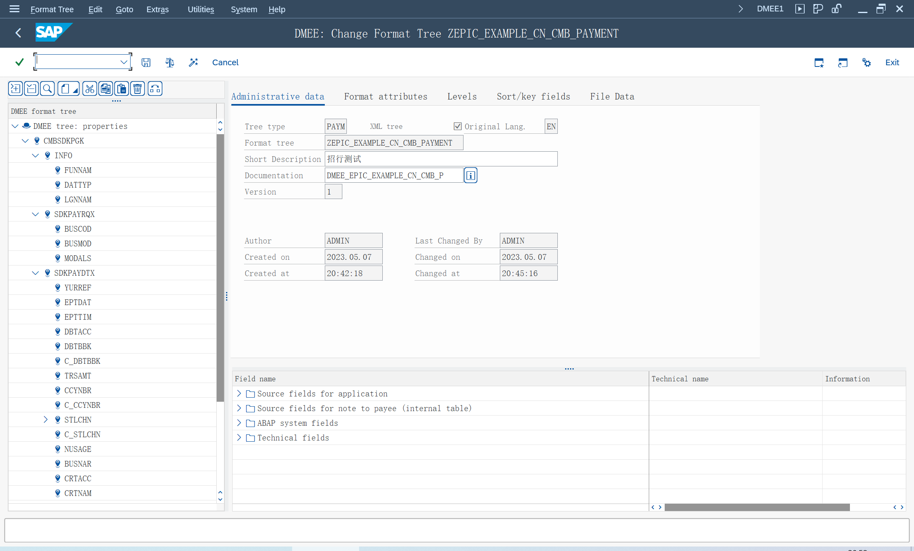

### 创建付款媒介
在标准设置, 选择输出文件类型 "01 文件", 选择 "使用 DME engine 映射"
> OBPM1 - 支付媒介格式的维护

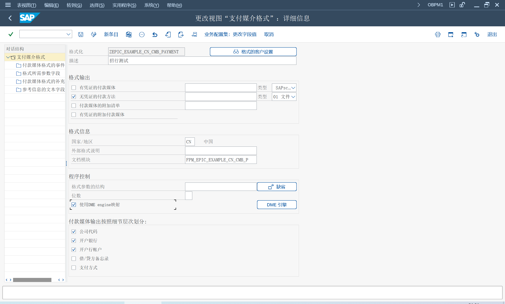

在客户设置, 维护代码页 "4110" Unicode UTF-8

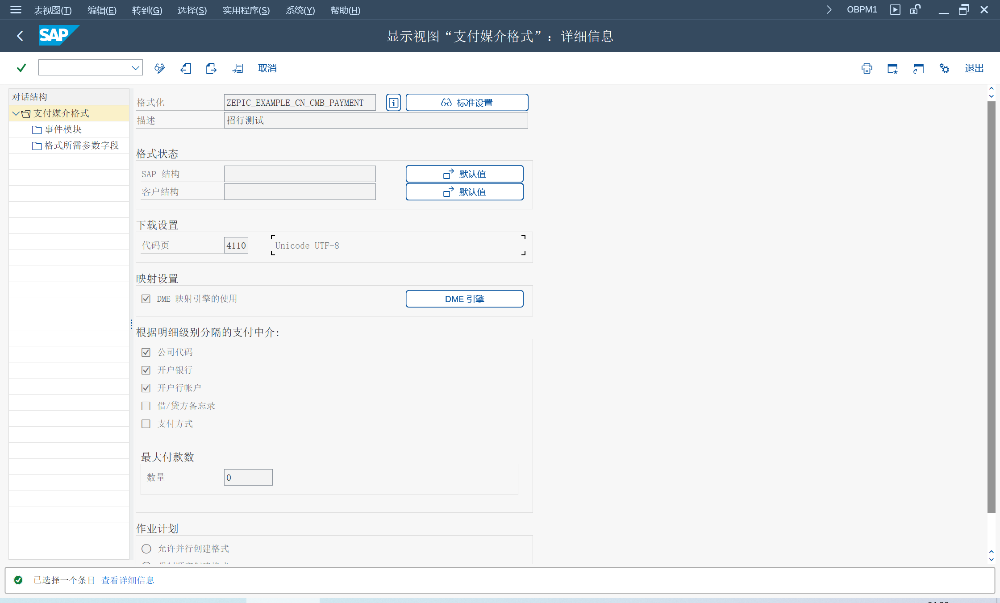

### 配置付款运行
财务会计（新）> 应收账款和应付账款 > 业务交易 > 付款 > 自动付款 > 支付程序的付款方式/银行选择
> FBZP - 维护收付程序设置

所有公司代码

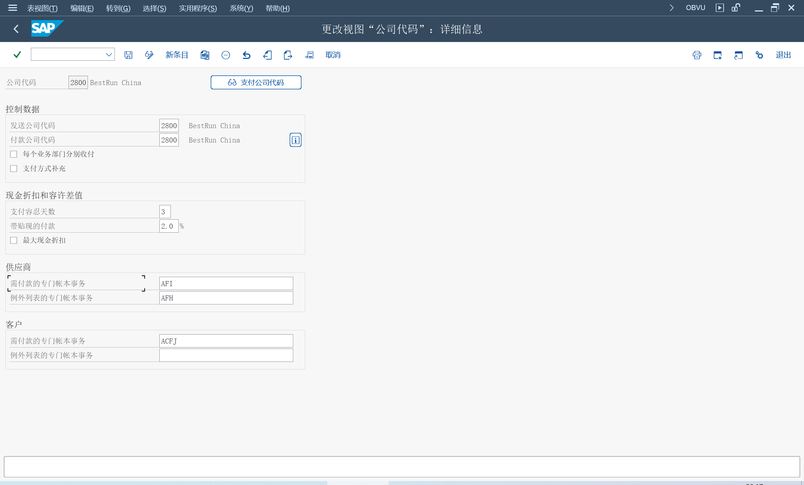

付款公司代码

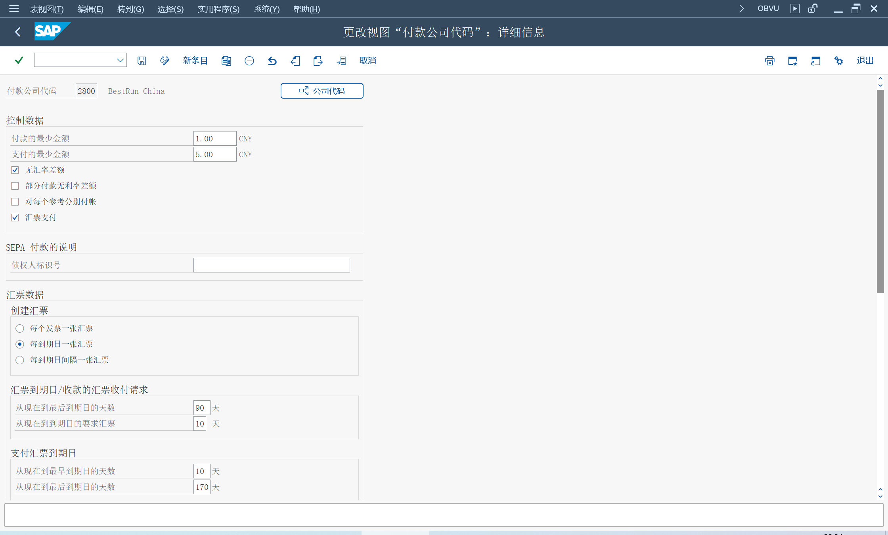

国家的支付方式, 分配支付媒介格式, 在格式设置中, 也可以维护代码页

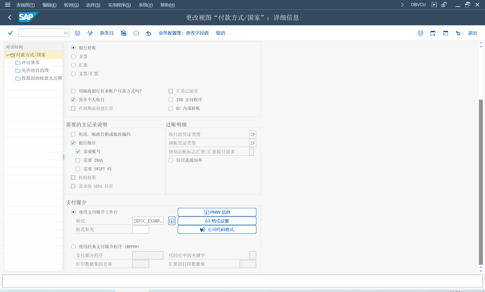

公司代码中的支付方式

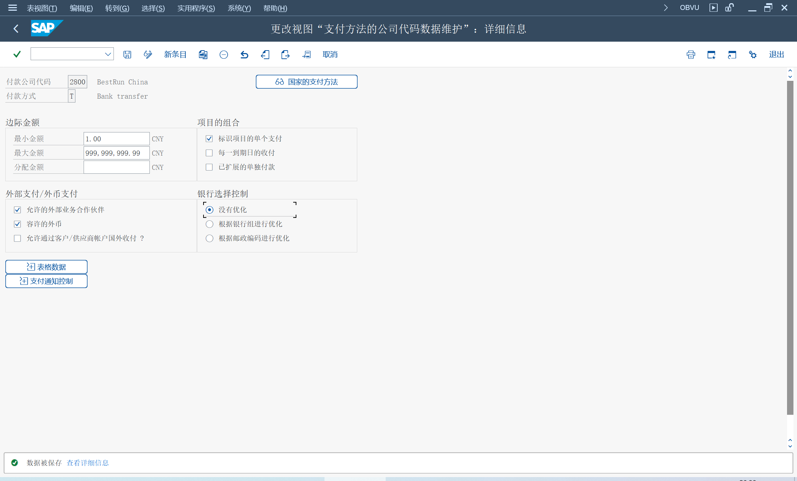

银行确定

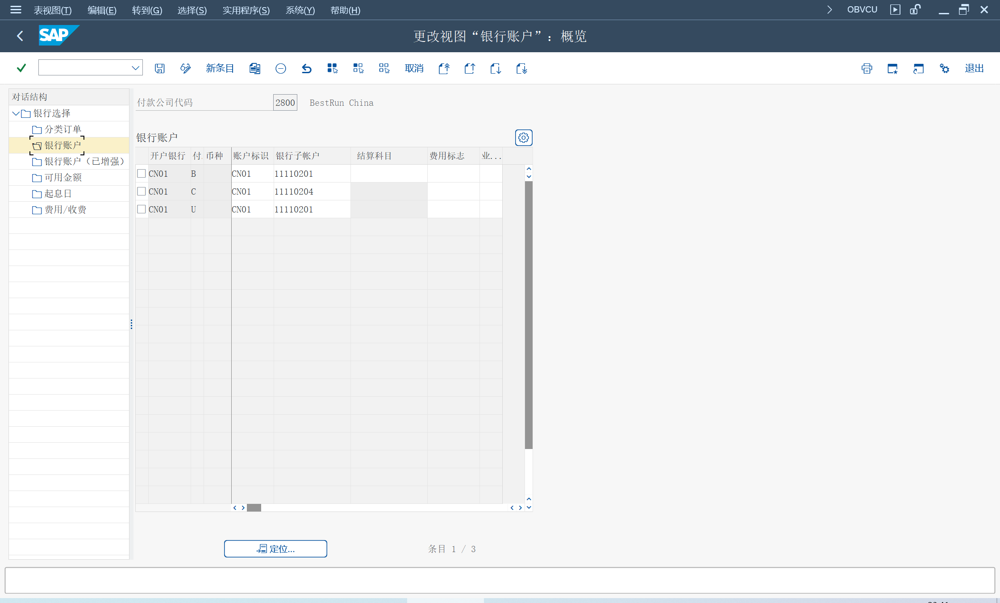

维护开户银行, 可以在数据媒介交换内容维护信息
> FI12 - 更改开户银行/银行帐户 

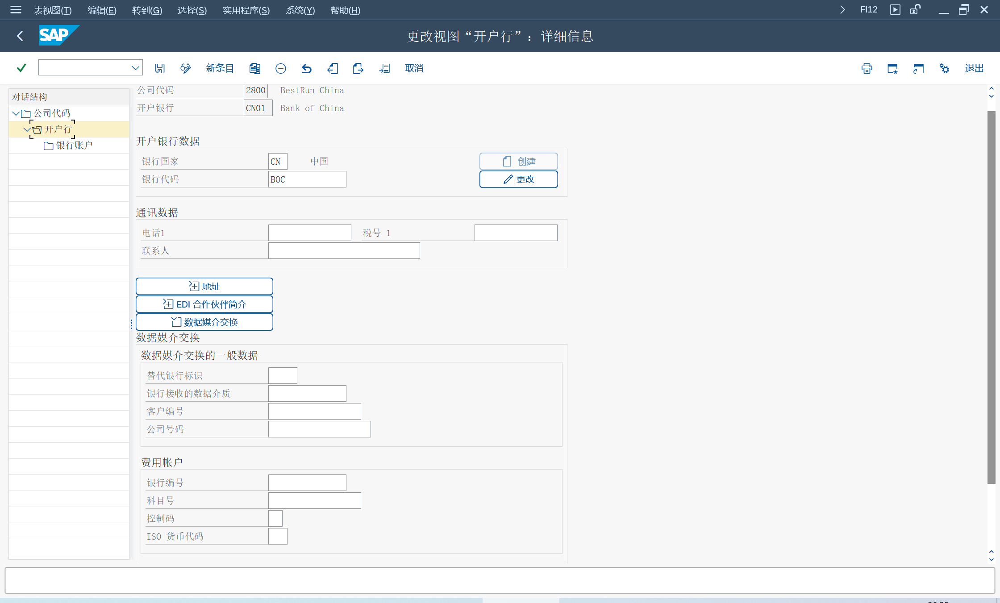

### 支付媒介程序变式
> FBPM - PMW 的支付媒介程序 

为每个付款格式, 保存变式

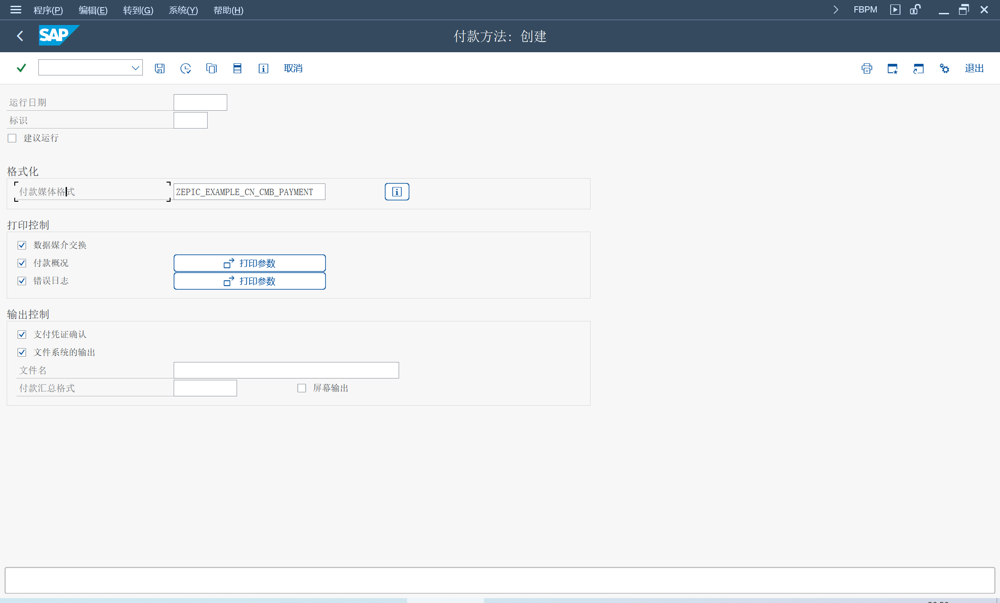

### 分配选择变式 
> OBPM4 - 支付媒介选择变式 

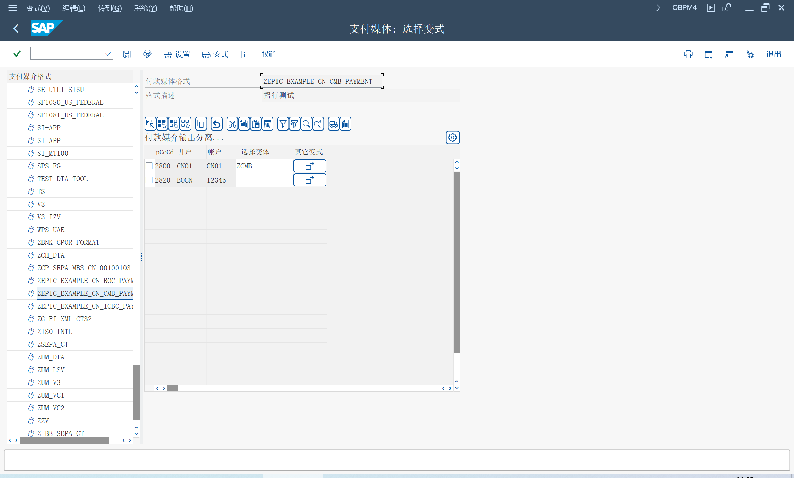

### 付款运行
使用 F-47 生成预付定金请求凭证, 选择上面设置的付款方式

选择付款参数

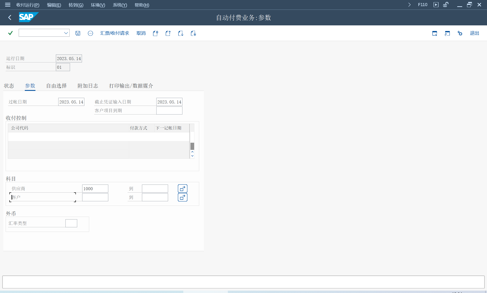

在状态页签, 运行付款建议, 建议付款银行

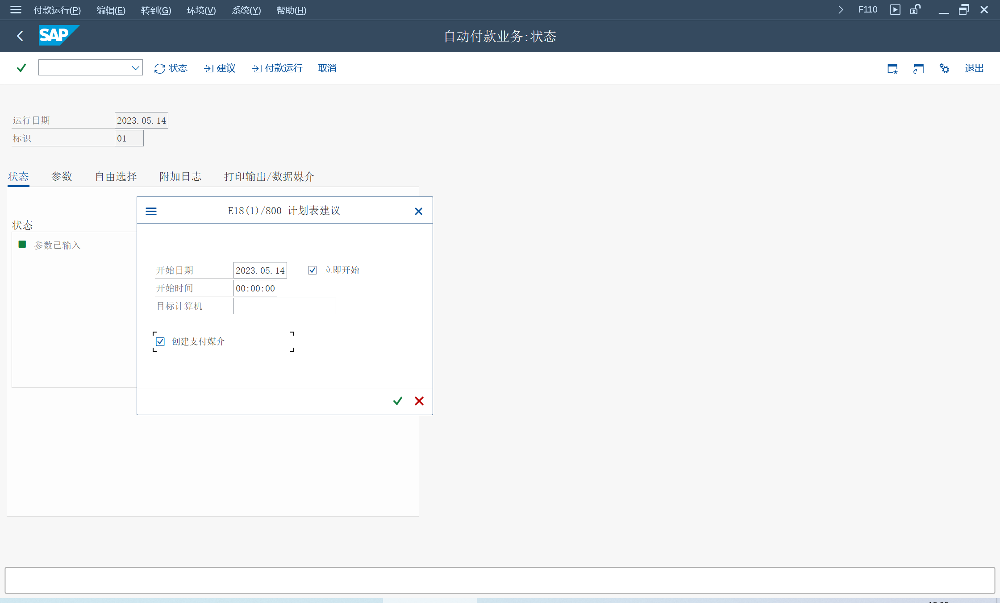

点击付款运行, 生成付款凭证

点击打印输出, 执行后台作业, 生成付款媒介文件

在环境 - 付款媒介 - 数据媒介交货管理, 选择下载文件
> FDTA - TemSe/REGUT数据管理 

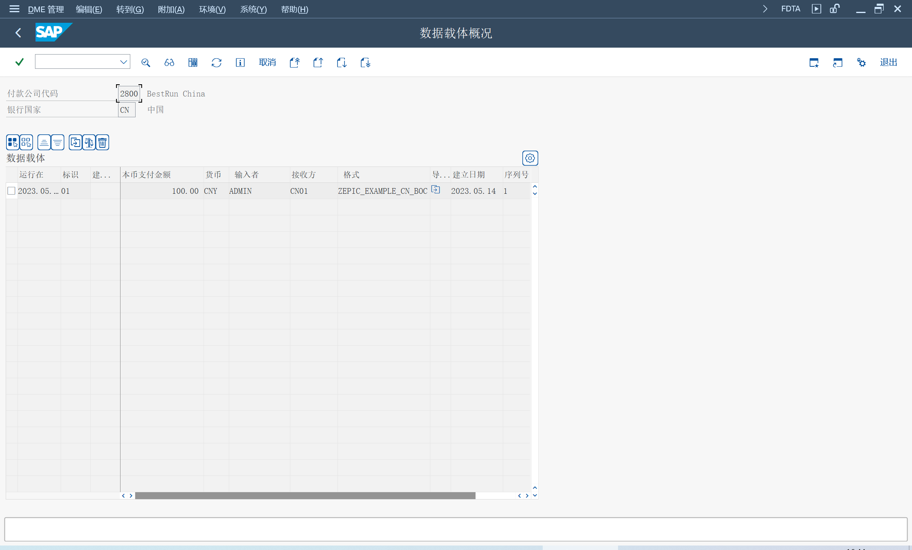

## 上传当日银行对账单
## 传入集成
### 上传银行对账单
### 导入电子银行对账单
## 显示银行对账单