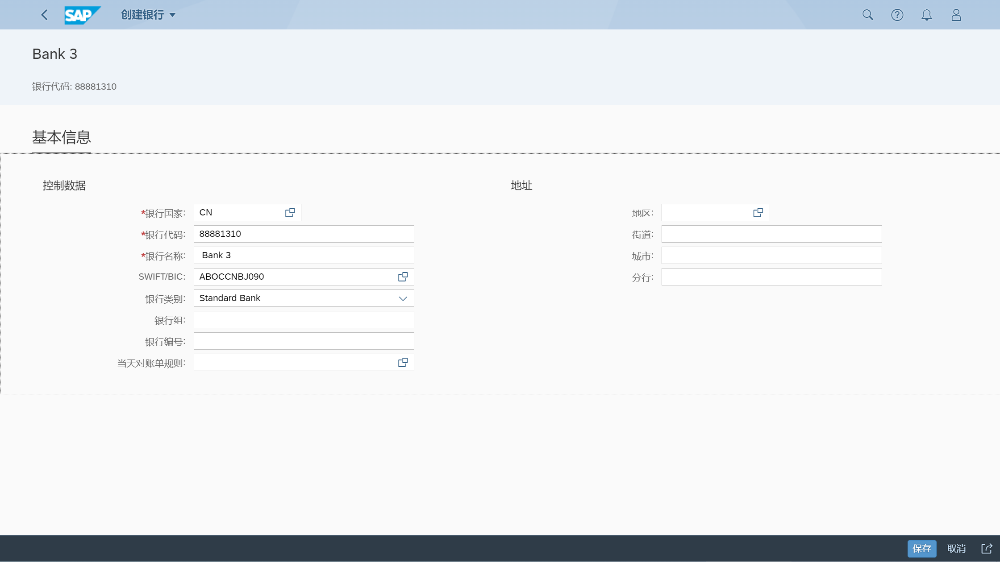
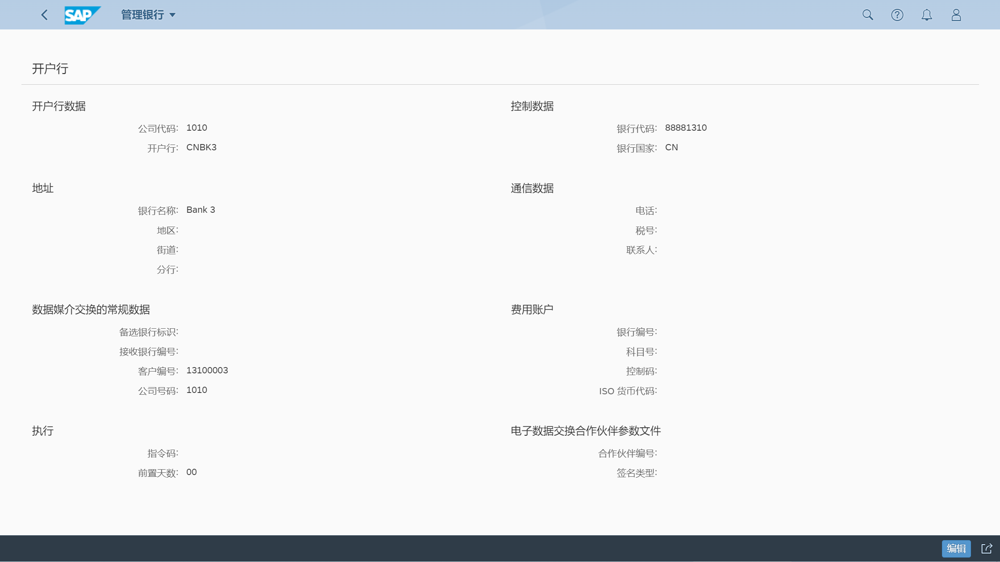
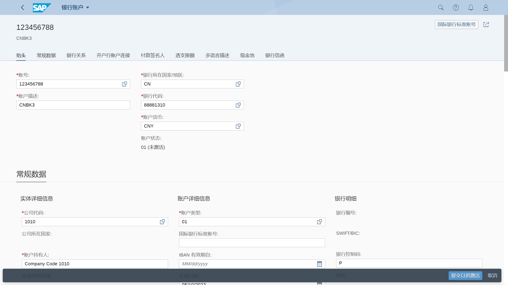

## 角色
> SAP_BR_CASH_SPECIALIST
>
> SAP_BR_GL_ACCOUNTANT
>
> SAP_BR_CASH_MANAGER
>
> SAP_BR_BPC_EXPERT
>
> SAP_BR_BUPA_MASTER_SPECIALIST
## App
> Manage Banks - Basic (F1574), 管理银行 - 基本
>
> Manage G/L Account Master Data (F0731A), 管理总账科目主数据
>
> Manage Bank Accounts (F1366A), 管理银行账户
>
> Transfer BIC Data (BIC2), 传输 BIC 数据
>
> Custom Logic (F1481)
>
> Manage Bank Chains (F4004), 管理银行链
>
> Maintain Business Partner (BP), 维护业务伙伴
>
> Schedule Bank Chain Jobs (F4503)
## 银行账户主数据
### 创建银行
> FI01 - 创建

### 创建开户行
> FI12 - 管理开户行和开户行账户

### 创建银行账户

分配总账科目

银行账户导入和导出

### 导入银行数据
> BIC2 - 传输 BIC 文件

[SWIFT_Sample_Data](https://support.sap.com/content/dam/SAAP/Sol_Pack/Library/Others/SWIFT_Sample_Data.txt)

## 维护银行链
FIBHS - 显示

通过开户行决定通过哪家银行付款, 加快交易速度, 降低手续费

银行主数据, 即银行营业网点, 国内涉及到 CNAPS（银行联行号）, 国外付款涉及 SWIFT code（国际汇款需要）和 IBAN (欧洲需要)、ABA(美国需要)；