# OS : WINDOWS SERVER 2022 64BIT
1Tb存储

8Gb 内存

24000Mb 虚拟内存, 安装后可取消, 偶尔会提示内存不足，也可能 SQL 启动不了

设置主机名 ERPEHP8, DNS 后缀: LAN.LAN

添加角色和功能, 选择 .NET Framework 3.5

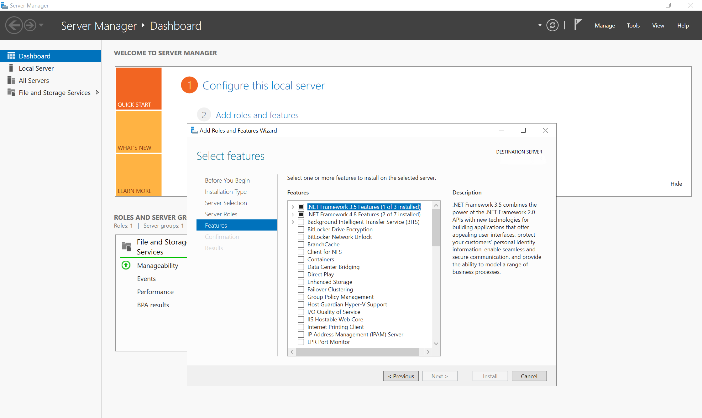

设置 Non-Unicode language: English, US

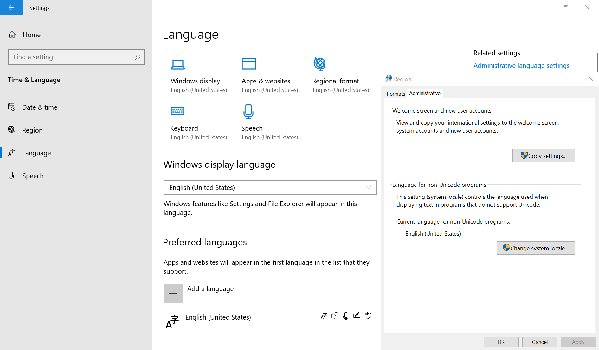

设置 Java Runtime 
[SapMachine](https://sap.github.io/SapMachine/)

# DB : MS SQL SERVER 2019/X86_64
Collation: SQL_Latin1_General_CP850_BIN2

安装后, 设置 Network configuration, TCP/IP Enabled, 127.0.0.1

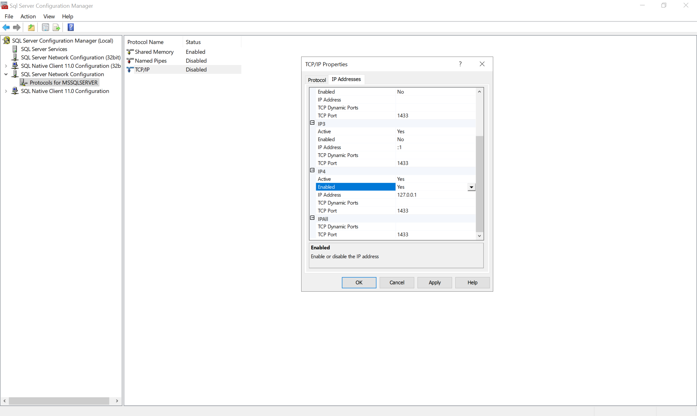

# 安装 EHP8 FOR SAP ERP 6.0

## 登录 [Maintenance Planner](https://support.sap.com/en/alm/solution-manager/processes-72/maintenance-planner.html)

登录后, 选择 **Plan a New System** 磁贴, 进入概览页面后, 选择 **Plan** , 进入目标系统选择画面。

选择目标系统的类型, 有 ABAP / JAVA 可供选择。选择不同的系统类型, 右侧的系统选择, 也会随着变化。安装 SAP ERP system, 需要选择 ABAP, 同时指定系统 SAPSID。

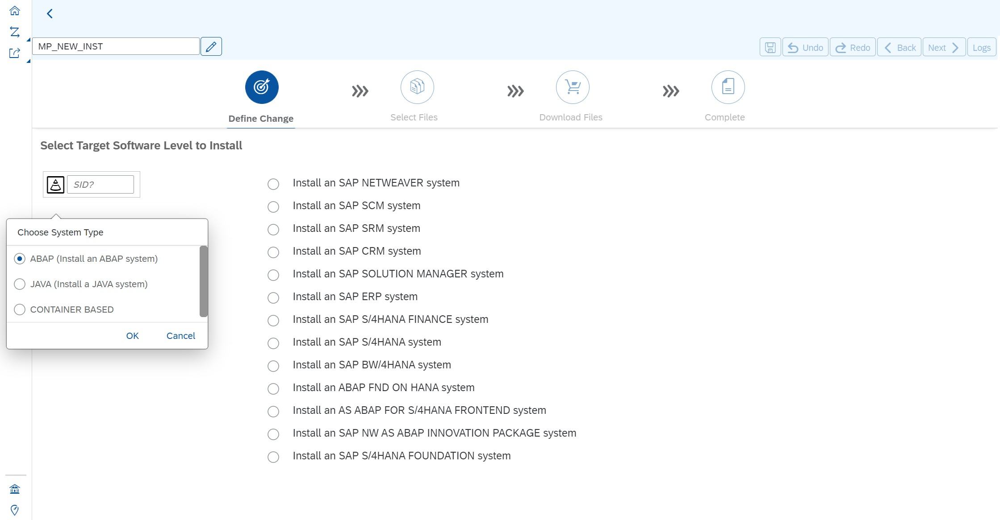

选择系统版本, 可以选择初始版本, 也可以选择指定的 SPS 版本。使用 **SWPM** 安装时, 只会安装初始版本, 需要通过 **SUM** 工具升级到指定的 SPS 版本。

SWPM使用XML参数安装时, 会自动升级到指定版本。

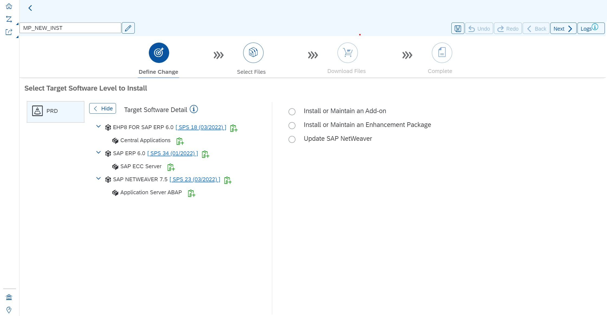

也可以同时选择 Add-on 组件, 也是需要通过 **SUM** 工具升级才会执行安装。

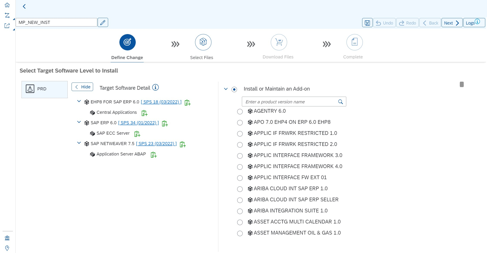

选择安装的 OS/DB 环境, ECC 6.0 可以在多种 DB上安装运行, 选择 DB 类型, 然后选择对应的 KERNEL 版本。选择了常见的 MS SQL SERVER , 和对应支持的最新版本 KERNEL 7.53 。

HOST AGENT 是一个主机代理工具, 用于监视和控制 SAP 和非 SAP 实例、操作系统和数据库。

IGS 用于从 SAP Web AS 生成基于 Web 的图形。

SOFTWARE PROVISIONING MANAGER 用于安装 SAP 软件。

SOFTWARE UPDATE MANAGER 用于升级 SAP 软件。

确认选择后, 会根据之前选择的软件版本, 及 Add-on 软件, 计算是否有冲突, 生成详细的组件清单。

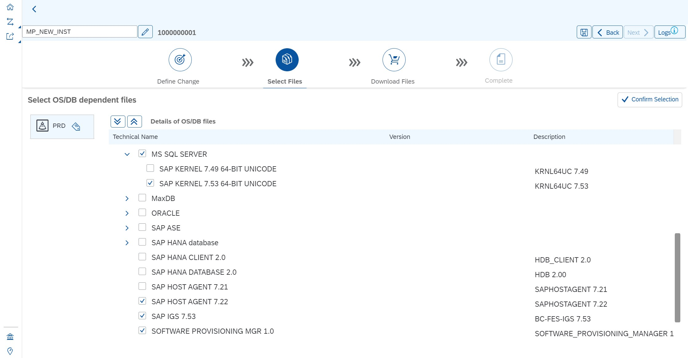

显示生成的组件清单, 及对应的文件。可以在此处 **Add HR Packages**, 由于HR组件更新比较频繁, 可以在此处选择最新的更新版本。

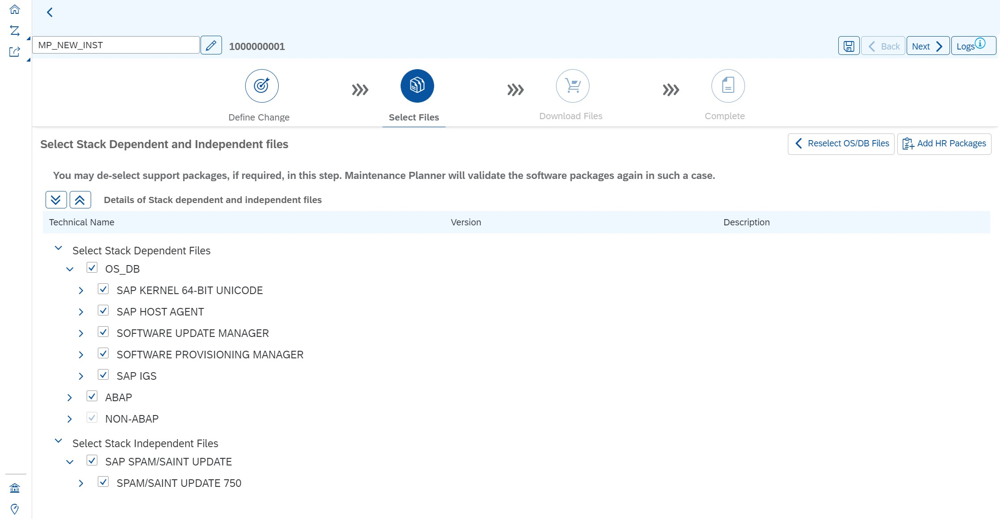

显示下载文件清单, 点击 **Download Stack XML** 下载堆栈文件, 在安装或升级时使用。点击 **Push to Download Basket** , 然后使用下载工具, 批量下载文件。文件清单内, 是不包含初始安装包的, 需要登录 **Software Center** 单独下载。

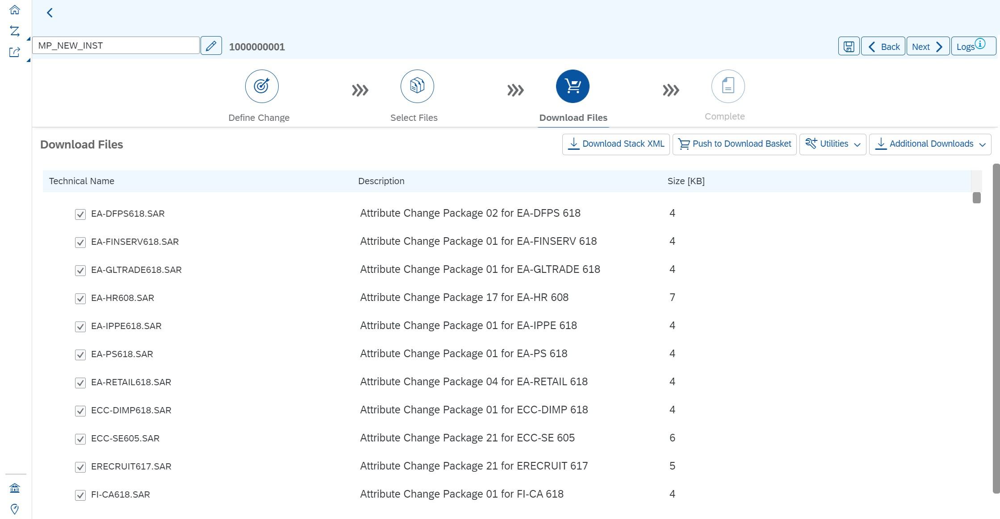

## 登录 [Software Center](https://launchpad.support.sap.com/#/softwarecenter)

登录后, 选择 INSTALLATIONS & UPGRADES 页签, 选择 By Alphabetical Index (A-Z) 排序, 在 E 目录下, 依次选择 
*SAP ERP / SAP ERP ENHANCE PACKAGE / EHP8 FOR SAP ERP 6.0 / INSTALLATION AND UPGRADE*

选择 MICROSOFT SQL-SERVER, SAP ERP 6.0 EHP8 Installation Export 加入 Download Basket

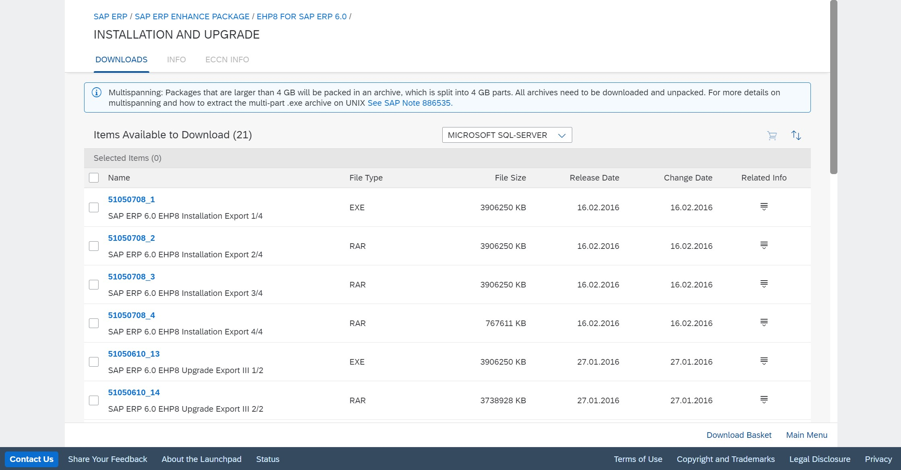

## 使用 SAP Download Manager 下载

下载 [SAP Download Manager](https://support.sap.com/en/my-support/software-downloads.html) 

解压文件 51053970.ZIP, 参考 [Download Manager Help](https://support.sap.com/content/dam/support/en_us/library/ssp/my-support/help-for-sap-support-applications/online_help-download_manager.html)

运行程序, 登录后, 批量依次下载 
> java -classpath DLManager.jar dlmanager.Application

## 安装 SAP
解压 SOFTWARE PROVISIONING MANAGER 软件, 到指定文件夹
> SAPCAR.EXE -xvf SWPM10SP*.SAR \swpm

直接执行安装程序
> sapinst.exe

或者使用参数安装, 指定堆栈文件
> sapinst.exe SAPINST_STACK_XML = <Absolute_Path_To_Stack_XML_File>swpm\Upgrades\MP*.XML

安装程序启动浏览器, 输入 OS 用户名、密码

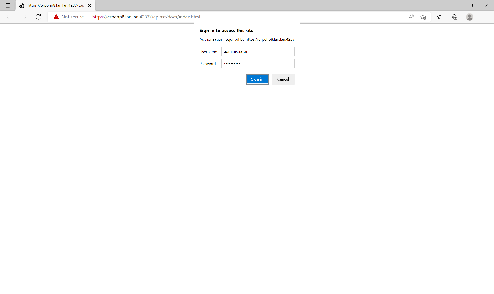

选择升级目标系统

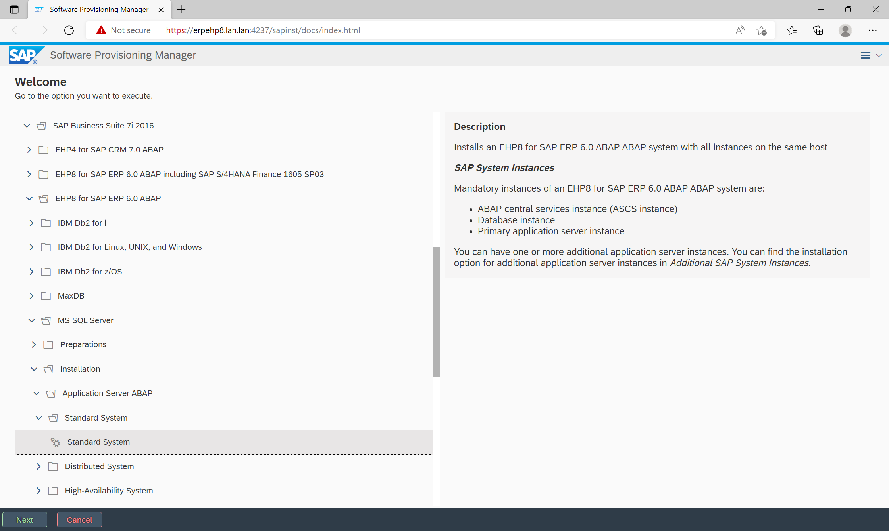

选择参数模式 Typical

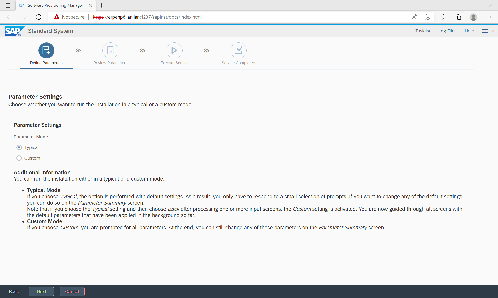

需要确认重启, 添加执行用户的账户管理员权限

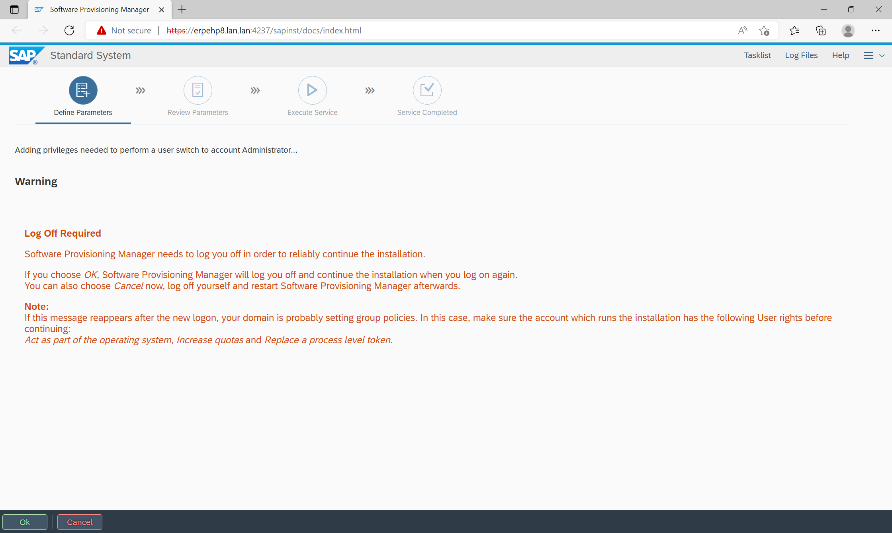

OS 重启后, 会自动执行安装程序, 需要输入 OS 用户名、密码。
输入 SAPSID

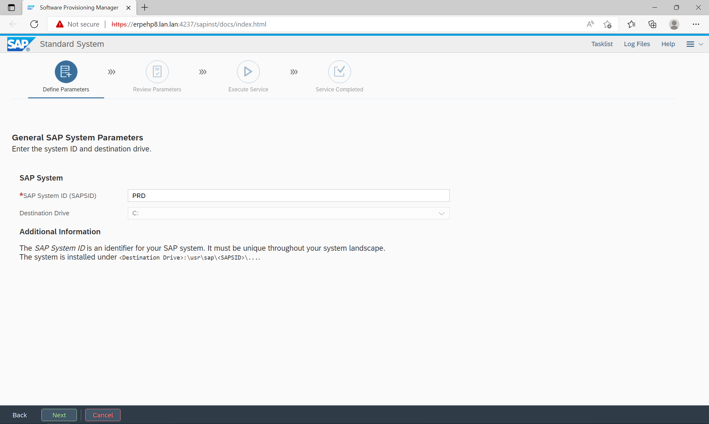

设置主密码, 建议 10 位字符, 字母大小写、数字

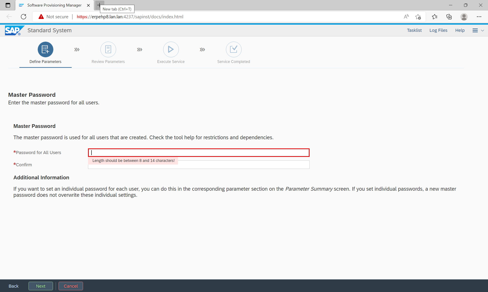

选择 KERNEL 相关文件路径

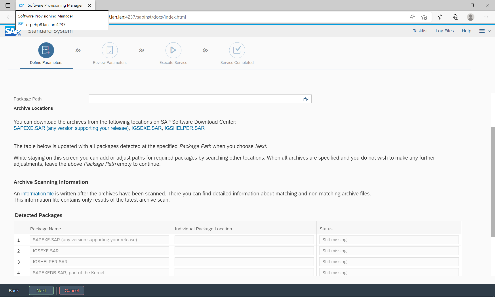

选择 HOST AGENT 文件路径

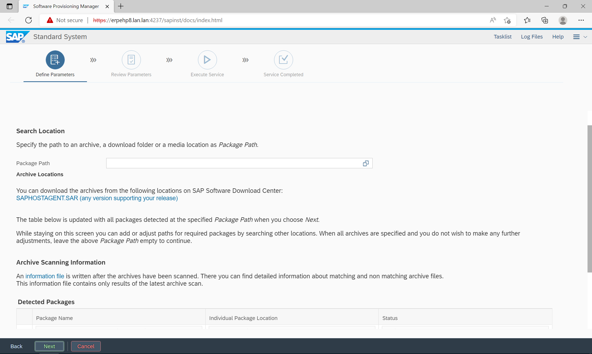

选择 SAP ERP 6.0 EHP8 安装包

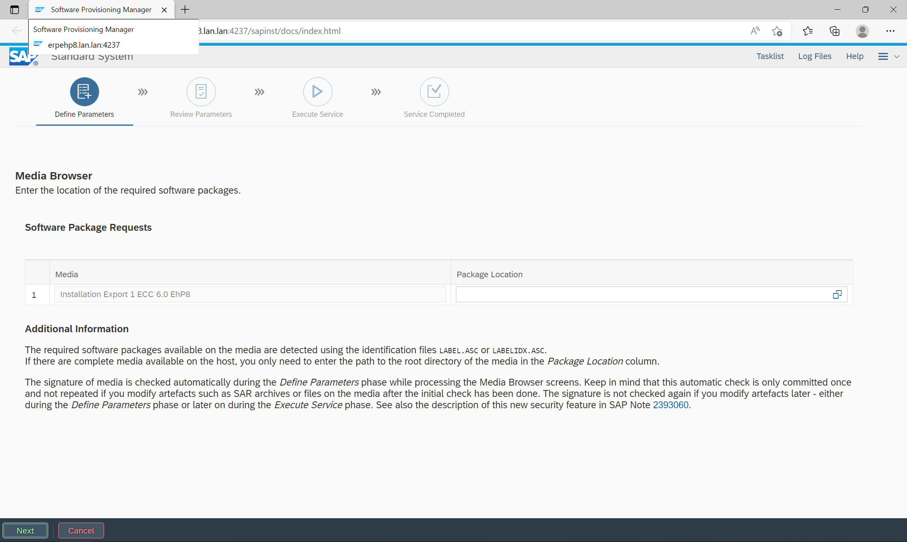

后续默认参数执行安装

在 client 000 和 001中, 可以使用在安装开始时定义的主密码, 登录 DDIC 和 SAP*。

## 升级到指定 SPS 版本

使用 \<SAPSID>adm 用户, 登录OS, 注册SUM
> cd C:\usr\sap\ \<SAPSID> \SUM
>
> SUMSTART.BAT confighostagent

根据提示的 web 网址, 登录, 执行更新程序

# 安装 IDES EHP8 FOR SAP ERP 6.0
## 登录 [Software Center](https://launchpad.support.sap.com/#/softwarecenter)

登录后, 选择 INSTALLATIONS & UPGRADES 页签, 选择 By Alphabetical Index (A-Z) 排序, 在 E 目录下, 依次选择 
*SAP ERP / SAP ERP ENHANCE PACKAGE / EHP8 FOR SAP ERP 6.0 / IDES VERSION*

选择 MICROSOFT SQL-SERVER, IDES EHP8 FOR SAP ERP 6.0 - INSTALL. EXP. (1/2)  加入 Download Basket

")

还需要下载 SAP Kernel, SAP HOST AGENT, SAP IGS。

## 安装 SAP
解压 SOFTWARE PROVISIONING MANAGER 软件, 到指定文件夹
> SAPCAR.EXE -xvf SWPM10SP*.SAR \swpm

直接执行安装程序
> sapinst.exe

# 后续活动
## 服务器端口
打开服务器防火墙端口, SAPSYSTEM 为系统实例编号
> 32$(SAPSYSTEM), GUI访问
>
> 5$(SAPSYSTEM)00, http访问
>
> 5$(SAPSYSTEM)01, https访问

## 客户端
IDES ERP 6.0 incl. EHP8[2432361](https://me.sap.com/notes/2432361)
IDES 模型公司的数据可在客户端 800 中找到, 客户端 810,811,812 包含 ALE 的示例场景, 非常小，2GB 左右数据量

系统登录, 新建管理员账号
> 在 client 000 和 001中, 可以使用在安装开始时定义的主密码, 登录 DDIC 和 SAP*
>
> 在 client 8xx 中, 使用用户名/密码: DDIC/19920706, SAP*/06071992

## 配置传输管理系统
使用新建的管理员账号, 登录 client 000

使用 STMS, 配置传输管理系统

## 初始设置
[1923064](https://me.sap.com/notes/1923064)
使用 STC01, 选择任务列表
> SAP_BASIS_SETUP_INITIAL_CONFIG

## 参数文件
login/system_client = 000, login/system_client

abap/buffersize = 1000000, 资源不足时缓冲区报错 PXA_NO_FREE_SPACE

zcsa/installed_languages, 已安装语言

login/no_automatic_user_sapstar = 1, 默认禁止 SAP* 账号, 新增客户端登录用

icm/host_name_full = $(SAPLOCALHOST).$(SAPFQDN)

icm/server_port_0 = PROT=HTTP,PORT=5$(SAPSYSTEM)00,TIMEOUT=60,PROCTIMEOUT=600 

icm/server_port_1 = PROT=HTTPS,PORT=5$(SAPSYSTEM)01,TIMEOUT=60,PROCTIMEOUT=600 

ssl/client_ciphersuites = 150:PFS:HIGH::EC_P256:EC_HIGH

## 配置在线帮助文档 
参考 [2149786](https://launchpad.support.sap.com/#/notes/2149786) 和 [2652009](https://launchpad.support.sap.com/#/notes/2652009) 将帮助连接到 SAP 帮助门户

使用 SR13 维护 PlainHtmlHttp

平台
> ITS, NONE, WN32

区域
> IWBHELP, XML_DOCU

服务器
> https://help.sap.com/http.svc/ahp2

路径
> SAP_ERP/6.18.latest

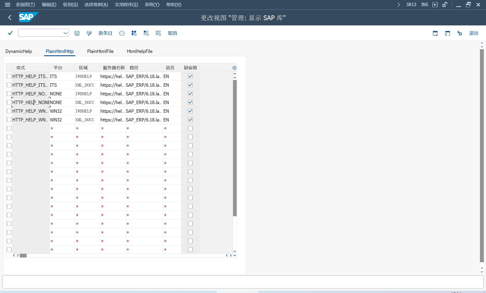