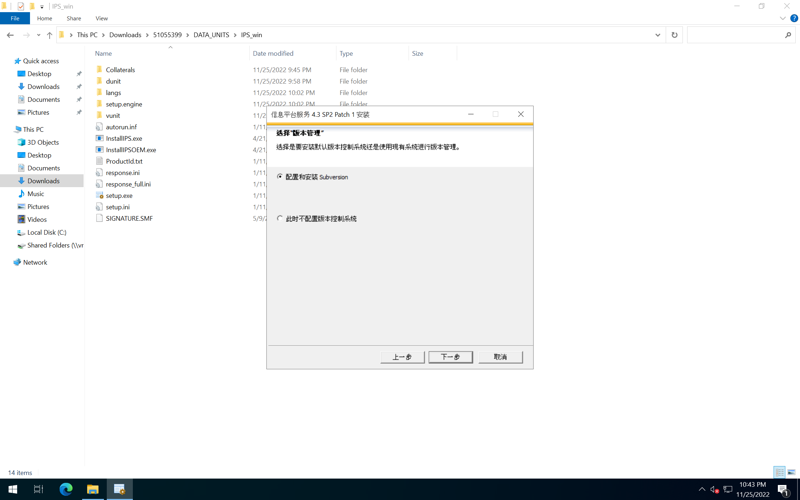
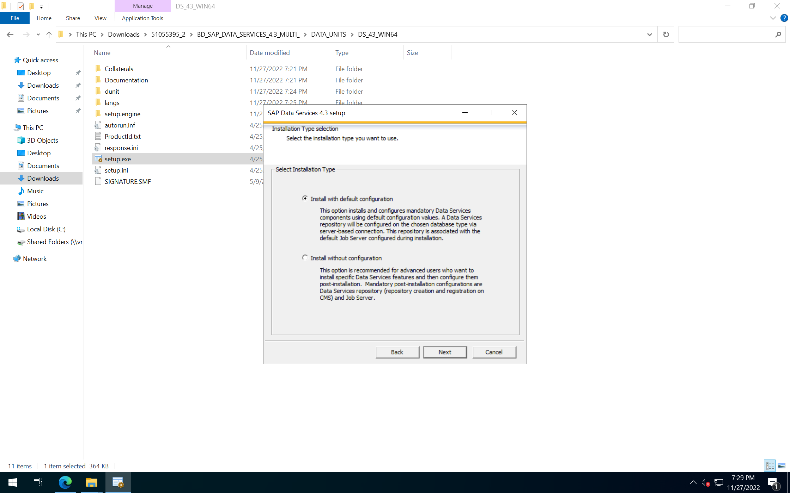

参考 [SAP Data Services](https://help.sap.com/docs/SAP_DATA_SERVICES?locale=en-US)
# OS : WINDOWS SERVER 2022 64BIT
设置主机名 WIN2022DS, DNS 后缀: LAN.LAN

添加角色和功能, 选择 .NET Framework 3.5
# 安装信息平台服务 IPS
数据服务需要 BI 平台组件, 可以使用 BI 的缩减版本
[Information platform services](https://help.sap.com/docs/SAP_INFORMATION_PLATFORM_SERVICES?locale=en-US)

IPS 安装文件 51055399.ZIP, license keys 已嵌入到安装文件中
> InstallIPS.exe

检查

选择语言包

选择配置并安装 Sybase SQL Anywhere 数据库, 也可以通过 ODBC 连接, 使用已有数据库

选择安装默认 Tomcat 服务

选择版本管理

服务器智能代理 SIA

中央管理服务器 CMS

设置 CMS 账户 Administrator 密码

设置 Sybase SQL Anywhere 账户 dba 密码

Tomcat 端口

设置 Subversion 账户 LCM 密码

不配置与 SMD 的连接

不配置 CA Introscope

开始安装后, 进入安装页面

等待安装完成

## 登录

可以完成初始配置和管理

# 安装 Data Services 4.3
安装需要 license [Request Keys](https://launchpad.support.sap.com/#/licensekey)

DS 安装文件 51055395_2.ZIP, 单独安装 Client 可使用 51055395_3.ZIP

尝试过安装 4.3.1, 但是安装后 IPS无法启动, 卸载后又恢复正常
> setup.exe

检查后, 输入 CMS 账号、密码

确认

选择默认配置

安装选项, Data Services Client 默认是选中状态, 选择中文语言

选择数据库类型

输入 CMS 连接信息

登录信息

开始安装后, 进入安装页面

等待安装完成

## 登录 
打开 Data Services Designer GUI, 登录 CMS 后, 显示存储库列表

选择存储库, 确认后, 输入密码, 将会打开 Data Services Designer

