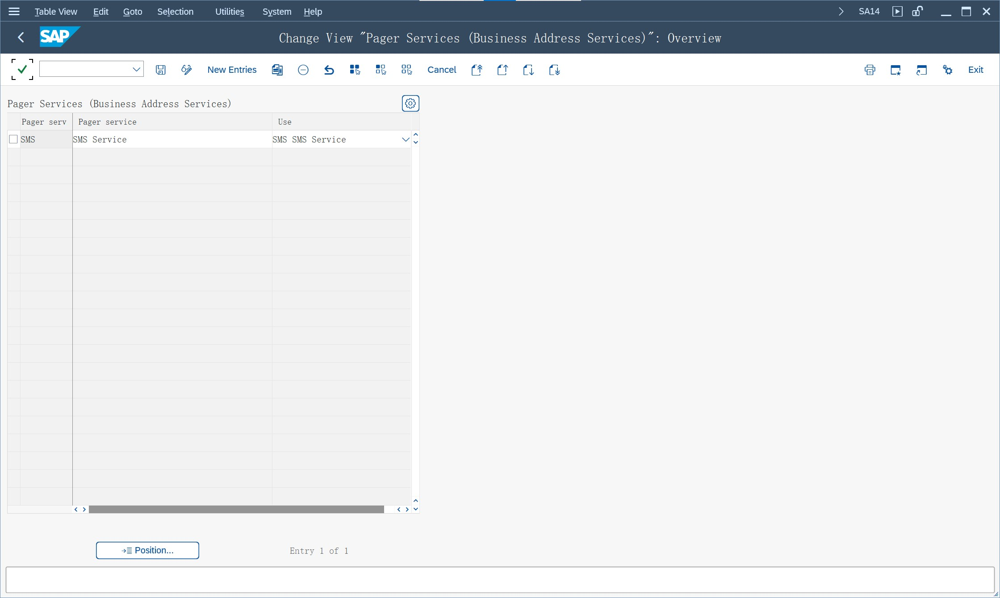

# SMTP 配置
参考 [SAP Help Portal](help.sap.com) 和 [455140](https://launchpad.support.sap.com/#/notes/455140)
> SAPconnect (BC-SRV-COM)
## 定义服务名称
使用 SA14 定义服务名称, 只发送 Mail 则不需要配置
> SMS Service

## 配置文件参数
使用 RZ10 设置参数, 序列号顺序编号, 重启后生效
> icm/server_port_2 = PROT=SMTP,PORT=25000,TIMEOUT=180
>
> icm/server_port_3 = PROT=SMTP,PORT=25001,TIMEOUT=180
>
> is/SMTP/virt_host_0 = *:25000
>
> is/SMTP/virt_host_1 = *:25001

## 用户维护
使用 SU01 维护用户, 作为发件人
> User Type : S Service
> 
> E-Mail Address : 
>
> Profiles : S_A.SCON , SAPconnect: All Auth

## 客户端设置
使用 SICF 分配 SMTP 服务器

激活 SMTP 服务器

Host Data 选择虚拟服务器的编号, Logon Data 维护通过虚拟服务器转发到的客户端, 可以不维护

处理程序列表, 系统已在位置 1 处, 维护 CL_SMTP_EXT_SAPCONNECT

## 出站连接管理
> SCOT - SAPconnect - 管理

### 配置默认 Domain
维护内部邮件服务器域地址, 使用域地址登录邮件服务器

在用户没有维护 E-Mail Address 时, 会生成由 SAP 用户名和此域组成的发件人地址。

如果没有邮件服务器, 使用个人邮箱, 也需要维护域地址。并且所有用户, 只能维护一个固定的发件人邮箱

邮件发送后, 如果没有报错, 则默认发送成功, 更新发送状态

参考 [2678278](https://launchpad.support.sap.com/#/notes/2678278)

### 配置 SMTP 节点
维护邮件服务器, 还需要个人邮箱的登录信息

### 配置邮件发送 Job
邮件首先存储在队列中, 需要后台作业执行发送, 保存时可以指定用户

### 查看邮件发送
> SOST - SAP连接发送请求

查看邮件发送队列, 也可以手动执行发送

## 假脱机文件发送
设置后台作业, 维护假脱机收件人, 可以直接将查询结果发送到邮箱

默认输出限制为 1000 行, 可以参考 [1540471](https://launchpad.support.sap.com/#/notes/1540471) 设置行数限制

使用 SE38 执行报表
> BTC_OPTIONS_SET

同时使用 SCOT 设置出站消息的大小

## 程序发送邮件
使用 SE38 参考示例程序, 也是发送到队列
> BCS_EXAMPLE_7

类/接口
> CL_BCS

> SO23 - SAPoffice：分配清单

SOID/SODM/SOUD/USR21

## 接收邮件
需要在邮件服务器设置路由规则, 将特定的邮件域转发到 SAP 的 is/SMTP/virt_host

没有测试过