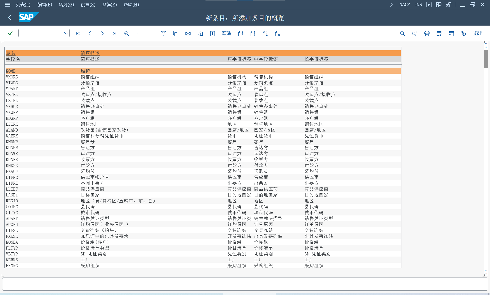
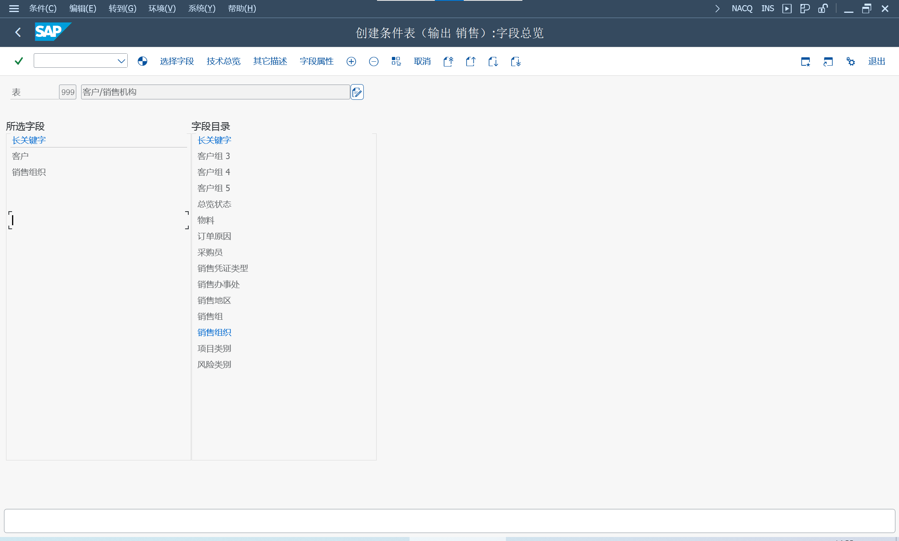
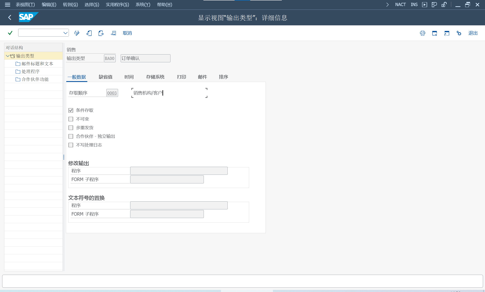

参考 [SAP Help Portal](help.sap.com)
> Message Control (CA-GTF-BS)

SD 和 MM 应用程序始终使用消息控制进行消息输出

## 消息控制结构
> NACE - 消息控制
### 条件组件和条件记录
条件技术
#### 应用程序代码
分配给使用消息控件的每个单独应用程序
#### 条件键的字段目录
包含可以选择作为消息控制条件表键的所有字段

创建条件表时, 选择关键字段, 用来表访问的消息确定

菜单 编辑, 字段目录, 新增字段选择, 存储表 T681F

拓展字段目录时, 查看 T681V, 消息输出对应的条件关键字的字段目录 KOMB

在字段目录 KOMB 新增后, 才能新增应用程序的字段目录选择

#### 过程
应用程序从当前文档类型中确定一个过程, 并将其传输到消息确定

#### 输出类型
输出类型分配给过程

#### 访问顺序
确定消息默认值的有效值的消息确定策略

#### 条件表
定义条件表, 维护条件记录

#### 条件访问
应用程序中的值, 填充通信结构, 使用关键字段读取条件表, 读取条件记录值

### 消息确定
根据定制中定义的与当前应用程序数据对应的规则, 在条件表中搜索条件记录

### 消息默认值和消息编辑
文档过帐后, 处理的消息默认值将作为消息控制记录存储在表 NAST 中。
### 消息处理
#### 消息状态记录
NAST - 消息状态

#### 后续处理
RSNAST00 - 为发送输出选择程序

#### 处理程序接口
可以定义自己的处理程序

#### 处理日志
NAST_PROTOCOL_UPDATE

## 消息控制定制
> NACE - 消息控制

### 创建条件表
菜单 编辑, 条件表, 创建

在字段目录里, 选择新条件表的关键字段

### 定义存取顺序
菜单 编辑, 存取顺序

定义访问条件表的顺序, 匹配通信结构表的字段

### 定义输出类型
菜单 编辑, 输出类型, 分配存取顺序

### 定义过程
菜单 编辑, 定义过程, 分配输出类型

## 应用程序中的消息定义
### 传输介质
#### 打印输出
在输出类型, 处理程序 "打印输出", 维护处理程序 , 表格过程

选择 Form 表格, 或 Smart form 表格

在条件记录, 选择传输介质 "打印输出", 维护通讯参数

输出设备的名称, 立即输出

#### 传真
在输出类型, 处理程序 "传真", 维护处理程序 , 表格过程

选择 Form 表格, 或 Smart form 表格

在条件记录, 选择传输介质 "传真", 维护通讯参数

地址编号, 传真号码根据合作伙伴数据确定

#### 外部发送
在输出类型, 处理程序 "外部发送", 维护处理程序 , 表格过程

选择 Form 表格, 或 Smart form 表格

在条件记录, 选择传输介质 "外部发送", 维护通讯参数

通讯策略, 输出设备的名称, 立即输出

IMG > SAP NetWeaver > 应用服务器 > 基础服务 > 消息控制 > 确定通讯策略

按照维护的通信方法顺序, 使用中央地址管理中存在地址的第一种通信方法

#### 简单邮件
在输出类型, 处理程序 "简单邮件", 维护处理程序 , 表格过程

使用 SWO1 创建的 MESSAGE 对象, 在消息对象中存储标准文本, 并在邮件处理中作为邮件发送

除了文本之外, 邮件还可以包含一个进程, 已不建议使用, SAP 建议使用工作流

#### 事件
在输出类型, 处理程序 "事件", 维护处理程序 , 表格过程

在条件记录, 选择传输介质 "事件", 维护通讯参数

维护对象类型, 事件

消息控制中触发一个事件, 通过该事件可以启动工作流

#### 任务
在输出类型, 处理程序 "任务", 维护处理程序 , 表格过程

在条件记录, 选择传输介质 "任务", 维护通讯参数

任务

在消息处理中生成由任务定义的工作项

### 合作伙伴确定
合作伙伴功能和合作伙伴编号的列表, 由应用程序传输到消息控制

## 与应用程序的消息控制连接
### 申请要求
在定制中为消息确定制定条件组件

调用消息确定

在特定时间处理消息

### 通信结构
KOMxByy, x = K (header) 或 P (Item), yy = 应用程序代码

调用消息控件时, 应用程序数据, 将填充到通信结构中

为了支持客户增强功能, 填充模块应包含用户出口通信结构

除了通信结构外, 还必须填充合作伙伴表

### 消息控制函数组
函数组 V61B

### 函数调用
#### 读取消息
RV_MESSAGES_READ, 现有消息默认值将从表 NAST 导入到 API 的内部表中

#### 消息确定
COMMUNICATION_AREA_KOMxByy, x = K (header) 或 P (Item), yy = 应用程序代码

KOMxByy_FILL, 使用应用程序数据进入, 填充通信结构 KOMxByy

如果通信结构字段有新增, 需要在增强出口里, 新增字段逻辑

如果是新增的通信结构, 需要在程序 KOMBSTRU 中更改数据声明, 以便在消息控制中声明新应用程序的通信结构

MESSAGING, 处理条件组件层次结构并执行条件访问

#### 编辑消息建议
COMMUNICATION_AREA_KOMxByy

MESSAGING, 处理条件组件层次结构并执行条件访问。

RV_MESSAGES_MAINTENANCE, 消息默认值已确定并显示在屏幕上

#### 消息处理

COMMUNICATION_AREA_KOMxByy

MESSAGING

RV_MESSAGES_RENAME, 申请文件的编号分配

RV_MESSAGES_UPDATE, 当前数据在通信结构中输入, 确定并发送消息默认值

NAST_PROTOCOL_UPDATE, 写入处理日志