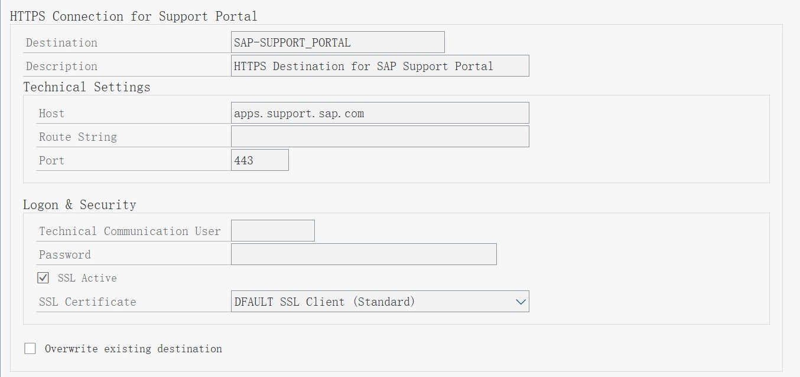

# 配置新的支持骨干通信
## 准备工作
参考 [2576306](https://me.sap.com/notes/2576306) [2827658](https://launchpad.support.sap.com/#/notes/2827658) 导入更正说明内对应版本的 TCI SAR 存档

导入 [2508268](https://me.sap.com/notes/2508268)

申请 [技术通信用户](https://launchpad.support.sap.com/#/techuser) 

## 执行自动配置任务
使用 STC01, 选择任务列表, 自动配置和检查 NEW OSS 的配置
> SAP_BASIS_CONFIG_OSS_COMM

任务包括：

- 检查通用加密库 \<SAPCRYPTOLIB> 版本 >= 8.4.48
- 检查 TLS 参数设置
- 检查 SSL 客户端的证书
- 配置 HTTPS 目标连接

## 手动配置 NEW OSS
### 检查通用加密库版本
使用 SE37, 直接执行 Function
> SSF_KRN_VERSION

若版本低于 8.4.48 则参考 [2450794](https://launchpad.support.sap.com/#/notes/2450794) , 在服务器上更新通用加密库。

### TLS 参数设置

使用 RZ10 / RZ11 设置参数
> ssl/client_ciphersuites  =  150:PFS:HIGH::EC_P256:EC_HIGH

 

### SSL 客户端的证书维护
参考 [2631190](https://launchpad.support.sap.com/#/notes/2631190) 下载 SSL certificates

使用 STRUST 维护 SSL 标准客户端证书。依次导入, 点击 **Add to Certificate List**

### 配置 HTTPS 目标连接
使用技术通信用户, 选择 SSL Certificate

SAP Support Portal (SAP-SUPPORT_PORTAL - Type H)
> apps.support.sap.com : 443

SAP Parcel Download (SAP-SUPPORT_PARCELBOX - Type G)
> documents.support.sap.com : 443 / parcel /

SAP Note Download (SAP-SUPPORT_NOTE_DOWNLOAD - Type G)
> notesdownloads.sap.com : 443

### 定义下载 SNOTE 的过程

### 选择 HTTP 协议
使用 CWB_SNOTE_DWNLD_PROC 选择 HTTP , 否则 SNOTE 仍然会使用老版本 OSS 

