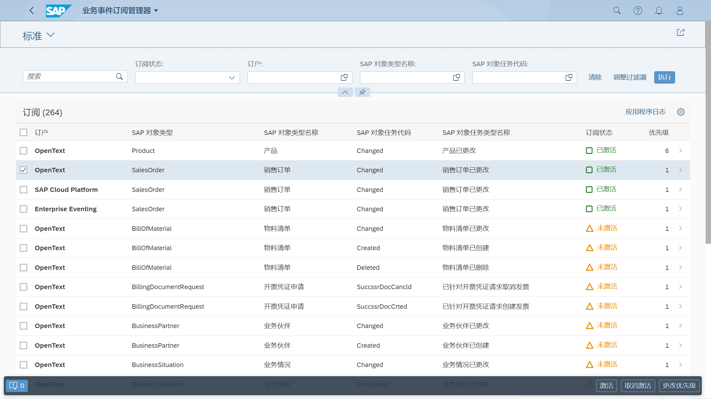
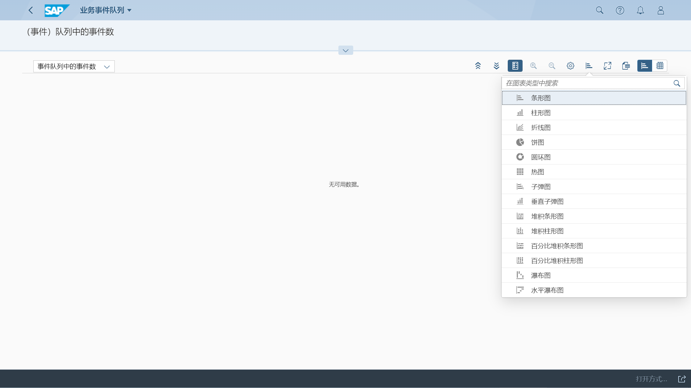
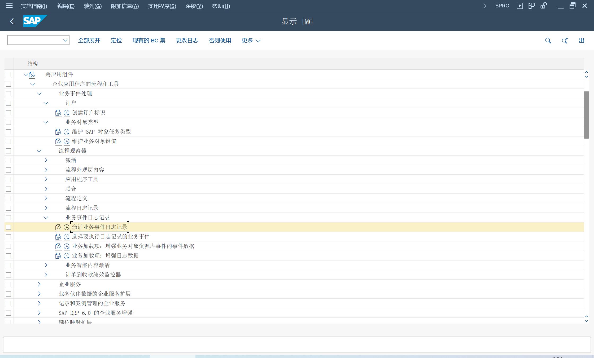

通过标准化的事件机制, 可以将消息传递到订阅者

## 角色
> SAP_BR_ADMINISTRATOR
## App
> Business Event Subscription - Subscription Manager, 业务事件订阅
>
> Business Event Queue, 业务事件队列

SM30
> V_SUBSCRBMAINT, 创建订户标识

BEH_CONFIG, 一致性检查

## 业务事件订阅
查看订阅列表

创建、更新或删除订阅

更改订阅的优先级

## 业务事件队列
通常队列保留 3 天, 删除队列的报表
> BEH_R_DELETE_QUEUE

## 配置选项

