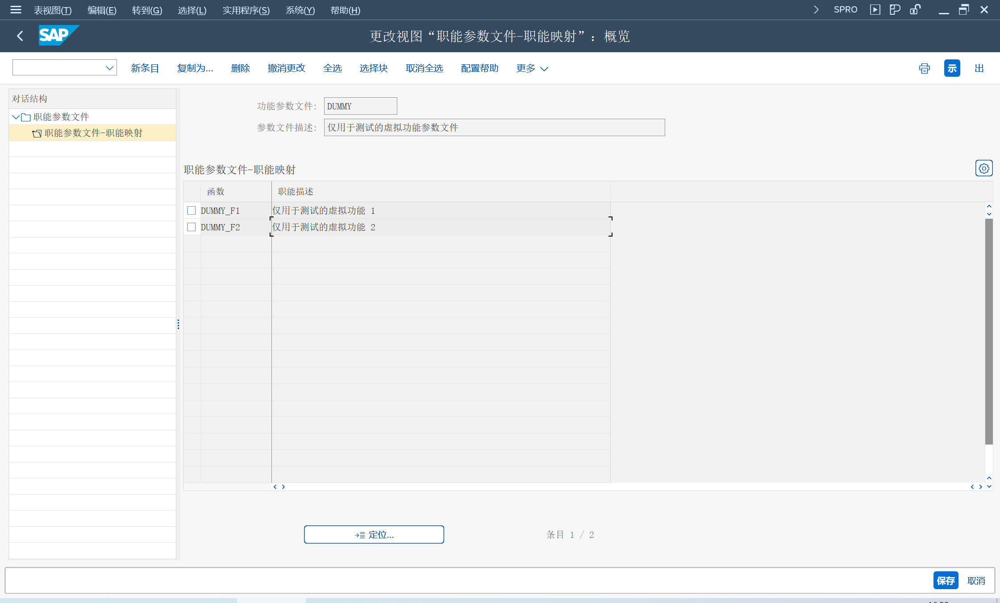

使用组织和职能确定职责矩阵, 实现任务管理
## 角色
> SAP_BR_BUSINESS_PROCESS_SPEC
>
> SAP_BR_ADMINISTRATOR
## App
> Manage Teams and Responsibilities - Procurement, 管理团队和职责
>
> Manage Responsibility Rules, 管理职责规则
>
> Manage Responsibility Contexts, 管理职责上下文

## 创建团队
创建团队, 选择类别后, 职责定义会显示所选团队类型的属性

指定团队成员, 并指定职能

## 维护团队间的层次结构
选择已创建层次结构的团队

## 管理职责规则
创建规则之前, 需要创建 BAdI

选择自定义创建, 输入规则 ID
## 扩展上下文和映射规则
## 配置选项
> 跨应用组件 > 一般应用功能 > 职责管理

定义函数、定义函数配置文件

定义自定义职责定义、将自定义责任定义映射到 CDS 视图

团队和责任

## 可扩展性
创建自定义规则

SE18, BAdI
> RSM_BADI_STATIC_RULE